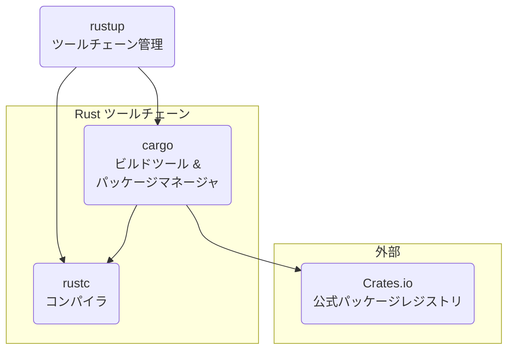

# 第 2 章：開発環境のセットアップ

## この章のゴール
- Rust のツールチェーン (`rustup`, `cargo`, `rustc`) の役割を理解する。
- `rustup` を使って Rust をインストールし、管理できる。
- `cargo` を使って新しいプロジェクトを作成・ビルド・実行できる。
- VS Code と `rust-analyzer` で快適なコーディング環境を構築する。

---

## 2.1 Python/Go ではこうやっていた

Python や Go に慣れ親しんだあなたは、それぞれの言語が持つエコシステムを使いこなしていることでしょう。

- Python: `pip` でライブラリをインストールし、`venv` や `conda` でプロジェクトごとに環境を分離していました。
- Go: `go get` で依存関係を管理し、`go build` や `go run` でコードをコンパイル・実行していました。`go.mod` ファイルがプロジェクトの依存関係を定義する中心的な役割を担っていました。

これらのツールと同様に、Rust にも強力で統一されたエコシステムが存在します。それが Cargo を中心としたツールチェーンです。

## 2.2 Rust のツールチェーン：すべては `rustup` から

Rust の開発ツールは非常によく統合されています。まずは全体像を把握しましょう。



- `rustup`: Rust のバージョンとツールチェーンそのものを管理するインストーラです。安定版 (stable)、ベータ版 (beta)、夜間ビルド版 (nightly) の切り替えや、アップデートを簡単に行えます。
- `rustc`: Rust のソースコードを機械語に変換するコンパイラ本体です。通常、直接 `rustc` を呼ぶことは少なく、`cargo` 経由で利用します。
- `cargo`: Rust のエコシステムの中心です。プロジェクトの作成、ビルド、テスト、依存関係の管理、ドキュメント生成など、開発に必要なほとんどの作業を `cargo` コマンド一つで実行できます。Python の `pip` + `venv`、Go の `go mod` の機能をすべて内包したようなツールだと考えてください。

## 2.3 Rust のインストール

それでは、`rustup` を使って Rust をインストールしましょう。ターミナル (Windows の場合は PowerShell かコマンドプロンプト) を開いて、以下のコマンドを実行してください。

```bash
# macOS / Linux / WSL
curl --proto '=https' --tlsv1.2 -sSf https://sh.rustup.rs | sh
```

Windows の場合は、[rustup.rs](https://rustup.rs/) のサイトから `rustup-init.exe` をダウンロードして実行してください。

インストーラーが起動したら、基本的にデフォルトの `1) Proceed with installation (default)` を選択して Enter キーを押せば問題ありません。

インストールが完了したら、ターミナルを再起動するか、以下のコマンドを実行して環境変数を読み込みます。

```bash
source "$HOME/.cargo/env"
```

最後に、正しくインストールされたか確認しましょう。

```bash
rustc --version
cargo --version
```

`rustc 1.xx.x ...` と `cargo 1.xx.x ...` のようにバージョン情報が表示されれば成功です。

## 2.4 "Hello, World!" プロジェクトの作成

`cargo` を使って、最初のプロジェクトを作成します。

```bash
# "hello_rust" という名前の新しいプロジェクトを作成
```sh
cargo new hello_rust
```

このコマンドは、`hello_rust` というディレクトリを作成し、その中に Rust プロジェクトの基本的な雛形を生成します。

```
hello_rust/
├── .gitignore
├── Cargo.toml
└── src/
    └── main.rs
```

- `Cargo.toml`: プロジェクトの設定ファイルです。Python の `requirements.txt` や Go の `go.mod` に相当し、プロジェクト名、バージョン、依存ライブラリ (クレートと呼びます) などを記述します。
- `src/main.rs`: ソースコード本体です。`main` 関数がプログラムのエントリーポイント (開始地点) となります。

`src/main.rs` の中身を見てみましょう。

```rust
fn main() {
    println!("Hello, world!");
}
```
[Rust Playgroundで試す](https://play.rust-lang.org/?version=stable&mode=debug&edition=2021&code=fn%20main%28%29%20%7B%0A%20%20%20%20println%21%28%22Hello%2C%20world%21%22%29%3B%0A%7D)

`println!` は、引数の文字列を画面に出力するマクロです (関数の最後に `!` が付いているものはマクロです。詳細は後の章で解説します)。

## 2.5 プロジェクトの実行

プロジェクトを実行するには、`cargo run` コマンドを使います。`hello_rust` ディレクトリの中で実行してください。

```bash
cd hello_rust
cargo run
```

すると、以下のような出力が得られるはずです。

```
   Compiling hello_rust v0.1.0 (/path/to/your/hello_rust)
    Finished dev [unoptimized + debuginfo] target(s) in 0.50s
     Running `target/debug/hello_rust`
Hello, world!
```

`cargo run` は内部的に 2 つのステップを実行しています。
1.  ビルド: `cargo build` を実行し、`src/main.rs` をコンパイルして実行可能ファイル (この例では `target/debug/hello_rust`) を生成します。
2.  実行: 生成された実行可能ファイルを実行します。

この
```sh
cargo new
```
でプロジェクトを作り、
```sh
cargo run
```
で実行するという流れが、本書を通して何度も実践する基本的な開発サイクルになります。

## 2.6 CLI REPL での対話的実行：`evcxr`

プロジェクト全体のビルドと実行には `cargo run` が適していますが、Python の対話モードや Jupyter Notebook のように、短いコード片を素早く試したい場面も多くあります。そのような場合に備えて、Rust の REPL (Read-Eval-Print Loop) 環境をセットアップしましょう。

`evcxr_repl` というツールが広く使われています。`cargo` を使ってインストールできます。

```bash
cargo install evcxr_repl
```

インストールが完了したら、ターミナルで `evcxr` と打ち込んでみてください。

```
>> 
```
このようにプロンプトが表示されれば成功です。ここに Rust のコードを直接打ち込んで実行できます。

```
>> let message = "Hello, REPL!";
>> println!("{}", message);
Hello, REPL!
>> 2 + 3
5
```

REPL を終了するには `:quit` と入力します。

本書では、この `evcxr` を使って、文法や関数の動作を気軽に確認することを推奨します。

### 本書における2つの学習サイクル

今後の学習では、目的応じて以下の2つのサイクルを使い分けていきます。

1.  しっかり学ぶサイクル:
    ```sh
    cargo new
    ```
    -> `src/main.rs` を編集 ->
    ```sh
    cargo run
    ```
    - 複数の関数やファイルにまたがるプログラムを作成する場合。
    - コンパイラのエラーメッセージをじっくり読み解きたい場合。
    - プロジェクトとしての構造を意識したい場合。

2.  さっと試すサイクル: ターミナルで `evcxr` を起動 -> コードを断片的に実行
    - 標準ライブラリの関数の動作を少しだけ確認したい場合。
    - 変数の型や値の変化を一行ずつ追いたい場合。
    - 本に載っている短いサンプルコードの意味を確かめたい場合。

この2つの「型」を身につけることが、効率的な学習の鍵となります。

## 2.7 エディタの設定：`rust-analyzer`

Rust のコーディング体験を劇的に向上させるために、`rust-analyzer` という Language Server Protocol (LSP) の実装を導入します。これにより、コード補完、定義ジャンプ、エラー表示などの機能がエディタで利用できるようになります。

VS Code を使用している場合、拡張機能マーケットプレイスで「rust-analyzer」を検索してインストールするだけです。


インストール後、`.rs` ファイルを開くと自動的に `rust-analyzer` が起動し、強力なサポートを提供してくれます。

## 2.8 まとめ

- ✓ Rust のツールチェーンは `rustup`, `rustc`, `cargo` で構成される。
- ✓ `rustup` で Rust のバージョンを管理し、インストールを行う。
- ✓ `cargo` はプロジェクト管理、ビルド、実行、依存関係の管理を担う中心的なツール。
- ✓
  ```sh
  cargo new
  ```
  でプロジェクトを作成し、
  ```sh
  cargo run
  ```
  で実行する。
- ✓ `evcxr` をインストールすることで、対話的な実行環境 (REPL) が手に入る。
- ✓ `rust-analyzer` をエディタに導入することで、快適な開発体験が得られる。

---

これで、あなたは Rust のコードを書き、実行するためのすべての準備が整いました。
次の章では、いよいよ Rust の基本的な構成要素である「変数」と、Rust の最大の特徴の一つである「型システム」について学んでいきましょう。

