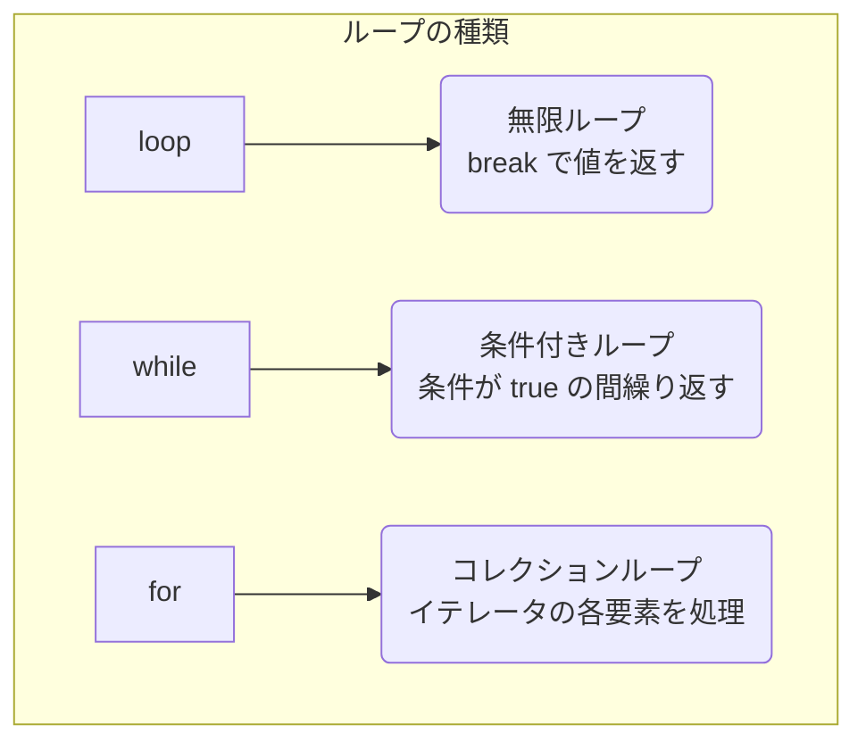

# 第 4 章：制御構文とパターンマッチング

## この章のゴール
- `if` が文ではなく式であることを理解し、`let` と組み合わせて使える。
- `loop`, `while`, `for` の基本的な使い方と、それぞれの使い分けを説明できる。
- `match` を使った網羅的なパターンマッチングを実装できる。
- `if let` を使って、特定のパターンにのみ一致する場合の処理を簡潔に書ける。

---

## 4.1 Python/Go ではこうやっていた

Python や Go における制御構文は、主に 文 (Statement) として機能しました。

- Python: `if`/`elif`/`else` 文や `for`/`while` ループを使って、プログラムの流れを制御していました。これらが値を返すことはありませんでした。
- Go: `if`/`else` 文、`switch` 文、そして `for` 文 (Go には `while` がありません) を使っていました。Go の `if` 文は、条件式の前に簡単な文を置けるという特徴がありました。

Rust の制御構文も見た目は似ていますが、一つ大きな違いがあります。それは、`if` や `match` が 式 (Expression) である、ということです。

## 4.2 すべてが式：`if` 式

式 (Expression) は値を評価し、結果を返します。Rust では、`if` も値を返すことができます。これにより、`let` 文と組み合わせて非常に簡潔なコードを書くことが可能です。

```rust
fn main() {
    let condition = true;
    let number = if condition { 5 } else { 6 };

    println!("The value of number is: {}", number); // => 5
}
```

これは、Python や Go で三項演算子 (Python: `5 if condition else 6`) や冗長な `if`/`else` ブロックを使っていた処理を、より直感的に記述できることを意味します。

重要な注意点: `if` 式の各ブロックが返す値は、同じ型でなければなりません。

```rust
// ❌ コンパイルエラー！
// `if` と `else` が異なる型の値を返しているため
let number = if condition { 5 } else { "six" };
```

この制約により、Rust はコンパイル時に変数 `number` の型を確定させることができ、型安全性を保証しています。

## 4.3 3 つのループ：`loop`, `while`, `for`

Rust には 3 種類のループがあります。それぞれの目的と使い分けを理解することが重要です。



### 1. `loop`: 無限ループ
意図的に無限ループを作りたい場合や、ループからの脱出条件が複雑な場合に使用します。`break` キーワードでループを抜け、値を返すこともできます。

```rust
fn main() {
    let mut counter = 0;

    let result = loop {
        counter += 1;

        if counter == 10 {
            break counter * 2; // ループを抜け、値を返す
        }
    };

    println!("The result is {}", result); // => 20
}
```

### 2. `while`: 条件付きループ
特定の条件が `true` である間、ループを継続します。Go には `while` がありませんでしたが、Python 経験者にはお馴染みでしょう。

```rust
fn main() {
    let mut number = 3;

    while number != 0 {
        println!("{}!", number);
        number -= 1;
    }

    println!("LIFTOFF!!!");
}
```

### 3. `for`: コレクションループ
Python の `for item in collection:` のように、配列やベクタなどのコレクションの各要素を順番に処理するのに最も適しています。安全でエラーが起きにくいため、最も一般的に使われるループです。

```rust
fn main() {
    let a = [10, 20, 30, 40, 50];

    for element in a {
        println!("the value is: {}", element);
    }
}
```

`for` ループは、`.rev()` メソッドを使って逆順にイテレートすることもできます。

```rust
// 3, 2, 1, LIFTOFF!!! と出力
for number in (1..4).rev() {
    println!("{}!", number);
}
```

## 4.4 Rust のスーパーパワー：`match` によるパターンマッチング

`match` は、Go の `switch` 文を遥かに強力にしたような機能です。値を取り、その値が成り立ちうる一連の パターン と比較し、一致したパターンのコードブロックを実行します。

```rust
enum Coin {
    Penny,
    Nickel,
    Dime,
    Quarter,
}

fn value_in_cents(coin: Coin) -> u8 {
    match coin {
        Coin::Penny => 1,
        Coin::Nickel => 5,
        Coin::Dime => 10,
        Coin::Quarter => 25,
    }
}
```

`match` の最も重要な性質は、網羅性チェック (Exhaustiveness Checking) です。コンパイラは、ありとあらゆる可能性が `match` のアーム (各 `=>` の分岐) で網羅されているかを確認します。もし漏れがあれば、コンパイルエラーになります。

これにより、Go の `switch` で `default` を書き忘れたり、Python の `if`/`elif` で条件分岐が漏れたりするようなバグを、コンパイル段階で完全に防ぐことができます。

## 4.5 `if let`：たった一つのパターンに注目する

`match` は網羅的で強力ですが、たくさんの可能性のうち、たった一つのパターンにだけ興味がある場合には、少し冗長になることがあります。

```rust
let config_max = Some(3u8);

// match を使った場合
match config_max {
    Some(max) => println!("The maximum is configured to be {}", max),
    _ => (), // 他のケースは何もしない
}
```
`_ => ()` は「その他のすべてのケースにマッチし、何もしない」という意味ですが、少し回りくどいですね。

このような場合に、`if let` 構文が役立ちます。`if let` は、`if` と `let` を組み合わせた糖衣構文 (シンタックスシュガー) で、値が特定のパターンに一致した場合にのみコードブロックを実行します。

```rust
// if let を使った場合
if let Some(max) = config_max {
    println!("The maximum is configured to be {}", max);
}
```

`match` で行っていた処理を、より簡潔に記述できました。`else` を組み合わせることも可能です。

## 4.6 まとめ

- ✓ Rust の `if` は 式 であり、値を返すことができる。各分岐の戻り値は同じ型でなければならない。
- ✓ ループには `loop` (無限)、`while` (条件付き)、`for` (コレクション) の 3 種類があり、目的に応じて使い分ける。
- ✓ `match` は、網羅性チェックを備えた非常に強力なパターンマッチング機能。
- ✓ `if let` は、単一のパターンにのみマッチさせたい場合に `match` を簡潔に書くための構文。

---

Rust の制御構文、特に `if` や `match` が式であるという性質は、関数型プログラミングから影響を受けており、より宣言的でバグの少ないコードを書くのに役立ちます。

次の章では、これらの制御構文を使ってロジックをカプセル化する「関数」と、さらに柔軟な処理を可能にする「クロージャ」について学びます。
