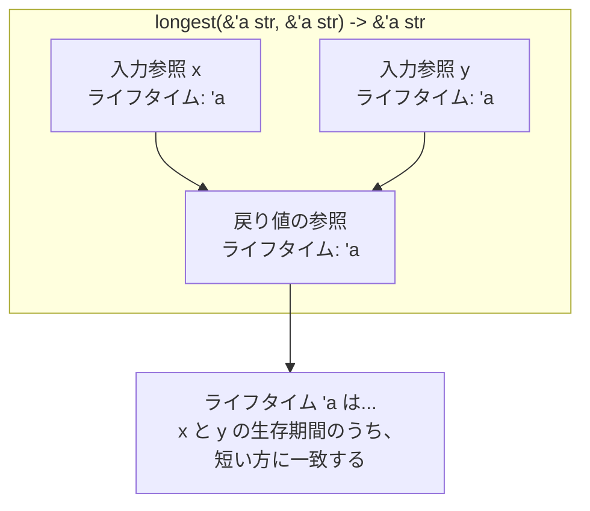

# 第 8 章：ライフタイムの理解

## この章のゴール
- ライフタイムが、ダングリング参照を防ぐためにコンパイラが参照を検証する仕組みであることを説明できる。
- ライフタイムアノテーション (`'a` など) の基本的な構文を読み書きできる。
- 参照を返す関数において、なぜライフタイムアノテーションが必要になるかを説明できる。
- ライフタイム省略規則の 3 つのルールを理解し、どのような場合にアノテーションを省略できるか判断できる。
- `'static` ライフタイムが何を意味するかを説明できる。

---

## 8.1 ライフタイムとは何か？

前の章で、Rust のコンパイラがダングリング参照 (無効なメモリを指す参照) を検知してコンパイルエラーにしてくれることを見ました。

```rust
// 再掲：コンパイルできないコード
fn dangle() -> &String {
    let s = String::from("hello");
    &s
} // `s` はここでドロップされる
```

では、コンパイラは どのようにして 参照が常に有効であることを保証しているのでしょうか？その答えが ライフタイム (Lifetime) です。

ライフタイムは、参照が有効である スコープ (生存期間) をコンパイラに伝えるための構文です。ライフタイムは、プログラムの実行時間を長くしたり短くしたりするものではありません。むしろ、ボローチェッカー (Borrow Checker) というコンパイラの一部が、参照の有効範囲を分析し、すべての借用が有効であることを検証するための「目印」のようなものです。

ほとんどの場合、ライフタイムは暗黙的であり、推論されます。しかし、参照の生存期間が複数の方法で関連しうるような曖昧な状況では、プログラマが明示的にライフタイムを注釈 (アノテーション) する必要があります。

## 8.2 ライフタイムアノテーション構文

ライフタイムアノテーションは、アポストロフィ (`'`) で始まり、小文字の短い名前 (慣習的に `'a`, `'b` など) が続きます。

- `&i32` : 参照
- `&'a i32` : 明示的なライフタイム `'a` を持つ参照
- `&'a mut i32` : 明示的なライフタイム `'a` を持つ可変参照

ライフタイムアノテーションは、それ単体では何の意味も持ちません。複数の参照のライフタイムを関連付けることで、初めて意味を持ちます。

## 8.3 関数におけるライフタイム

参照を返す関数は、ライフタイムアノテーションが必要になる最も一般的なケースです。

```rust
fn main() {
    let string1 = String::from("abcd");
    let string2 = "xyz";

    let result = longest(string1.as_str(), string2);
    println!("The longest string is {}", result);
}

// ❌ このコードはコンパイルできない！
fn longest(x: &str, y: &str) -> &str {
    if x.len() > y.len() {
        x
    } else {
        y
    }
}
```

この `longest` 関数をコンパイルしようとすると、コンパイラは `missing lifetime specifier` (ライフタイム指定子が見つかりません) というエラーを出します。

なぜエラーになるのか？
コンパイラは、戻り値の参照が `x` と `y` の どちら から借用されたものなのかを知ることができません。戻り値の参照の有効期間は、`x` の有効期間と同じなのか、`y` の有効期間と同じなのか？この曖昧さを解決するために、ライフタイムアノテーションで関係性を明示する必要があります。

```rust
// ✅ コンパイルできるコード
fn longest<'a>(x: &'a str, y: &'a str) -> &'a str {
    if x.len() > y.len() {
        x
    } else {
        y
    }
}
```

このシグネチャは、コンパイラに以下のように伝えます。
「ジェネリックライフタイムパラメータ `'a` が存在する。引数 `x` と `y` は、少なくともライフタイム `'a` と同じ期間だけ生存する文字列スライスである。そして、この関数が返す文字列スライスも、少なくともライフタイム `'a` と同じ期間だけ生存する。」

これにより、戻り値の参照のライフタイムが、引数の参照のライフタイムのうち 短い方 に束縛されます。結果として、`longest` 関数がダングリング参照を返す可能性がないことをコンパイラが保証できるのです。



## 8.4 ライフタイム省略規則

歴史的に、Rust ではすべての参照にライフタイムアノテーションが必要でした。しかし、多くの一般的なケースでは決まったパターンがあるため、Rust チームはコンパイラに ライフタイム省略規則 (Lifetime Elision Rules) を組み込みました。コンパイラがこれらのルールに合致するコードを検知した場合、プログラマが明示的にアノテーションを書く必要はありません。

省略規則は以下の 3 つです。
1.  入力ライフタイム: 参照である各引数に、それぞれ異なるライフタイムパラメータが割り当てられる。
    - `fn foo(x: &str)` -> `fn foo<'a>(x: &'a str)`
    - `fn foo(x: &str, y: &str)` -> `fn foo<'a, 'b>(x: &'a str, y: &'b str)`
2.  単一の入力ライフタイム: 入力ライフタイムパラメータが一つだけの場合、そのライフタイムが出力ライフタイムすべてに割り当てられる。
    - `fn foo(x: &str) -> &str` -> `fn foo<'a>(x: &'a str) -> &'a str`
3.  メソッドの `self`: 入力ライフタイムパラメータに `&self` や `&mut self` がある場合、`self` のライフタイムが出力ライフタイムすべてに割り当てられる。(メソッドについては後の章で学びます)

これらのルールにより、`fn first_word(s: &str) -> &str` のような多くの関数では、ライフタイムアノテーションを省略できるのです。

## 8.5 `static` ライフタイム

`'static` は特別なライフタイムで、プログラム全体の実行期間中ずっと生存することを示します。文字列リテラルは、プログラムのバイナリに直接格納されるため、`'static` ライフタイムを持ちます。

```rust
let s: &'static str = "I have a static lifetime.";
```

`'static` ライフタイムをエラーメッセージで見かけた場合は、参照が期待よりも長く生存することを要求されているか、ダングリング参照を作ろうとしている可能性が高いです。

## 8.6 まとめ

- ✓ ライフタイム は、参照が有効なスコープをコンパイラが検証するための仕組み。
- ✓ ライフタイムアノテーション (`'a`) は、複数の参照の生存期間の関係性を明示するために使う。
- ✓ 参照を返す関数など、コンパイラがライフタイムを推論できない曖昧な状況では、アノテーションが必須となる。
- ✓ ライフタイム省略規則 のおかげで、多くの一般的なケースではアノテーションを省略できる。
- ✓ `'static` は、プログラムの全実行期間を表す特別なライフタイム。

---

ライフタイムは、ボローチェッカーの仕組みを垣間見るための窓のようなものです。最初は難しく感じるかもしれませんが、ほとんどの場合はコンパイラがうまく処理してくれます。エラーが出たときに、コンパイラが何を伝えようとしているのかを理解するための概念だと捉えてください。

これで、Rust の所有権システムの 3 つの柱 (所有権、借用、ライフタイム) すべてを学び終えました。第 1 部の基礎編はこれで完了です。お疲れ様でした！

次の第 2 部では、これらの基礎の上に、より複雑で実践的なデータ構造を構築していきます。最初のテーマは「構造体とメソッド」です。
