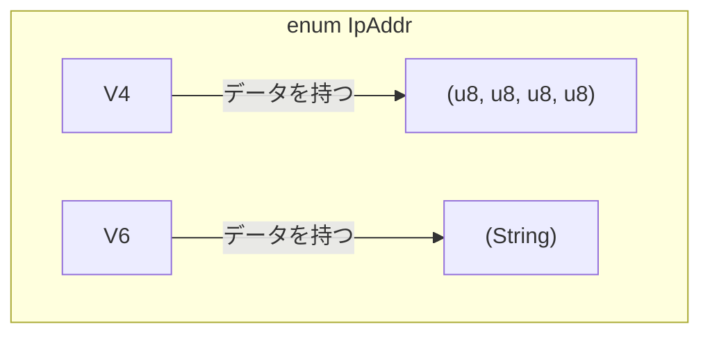

# 第 10 章：列挙型と Option

## この章のゴール
- `enum` キーワードを使って、とりうる値を列挙したカスタムデータ型を定義できる。
- `enum` の各バリアントにデータを格納できることを理解する。
- `null` や `None` に代わる Rust の `Option<T>` 列挙型の目的と使い方を説明できる。
- `match` 式を使って `Option<T>` を安全に処理できる。

---

## 10.1 Python/Go ではこうやっていた

Python や Go にも、複数の定数をグループ化する仕組みはありました。

- Python: `Enum` クラスを継承して、列挙型を定義していました。しかし、列挙型の各メンバーが異なるデータを持つことはできませんでした。値が存在しない可能性を示す場合は、特別な値 `None` を使っていました。
- Go: `iota` を使って連続した整数値を定数として定義するパターンが一般的でした。こちらも、各メンバーが異なるデータを持つことはできませんでした。値が存在しない可能性を示す場合は、`nil` を使っていました。

Python の `None` や Go の `nil` は非常に便利ですが、「`null` ポインタ」という長年のバグの源泉でもあります。ある値が `None`/`nil` である可能性を忘れて操作しようとすると、実行時エラー (`AttributeError` や `nil pointer dereference`) が発生します。

Rust は、この問題を型システムレベルで解決します。その中心となるのが 列挙型 (`enum`) と `Option<T>` です。

## 10.2 列挙型の定義

列挙型 (`enum`) は、ある型がとりうる値をすべて列挙して定義する方法です。これにより、不正な値が存在できなくなり、コードの堅牢性が向上します。

```rust
enum IpAddrKind {
    V4,
    V6,
}

let four = IpAddrKind::V4;
let six = IpAddrKind::V6;
```
ここまでは Python や Go の Enum と似ていますが、Rust の `enum` の真価は、各バリアントがデータを持てる ことにあります。

```rust
enum IpAddr {
    V4(u8, u8, u8, u8),
    V6(String),
}

let home = IpAddr::V4(127, 0, 0, 1);
let loopback = IpAddr::V6(String::from("::1"));
```
このように、同じ `IpAddr` という型でありながら、`V4` バリアントは 4 つの `u8` を、`V6` バリアントは 1 つの `String` を持つことができます。これは、他の多くの言語にはない非常に強力な機能です。



## 10.3 `Option<T>` 列挙型：`null` のない世界

Rust には `null` がありません。では、値が存在しないかもしれない状況はどのように扱うのでしょうか？その答えが、標準ライブラリで定義されている `Option<T>` 列挙型です。

```rust
enum Option<T> {
    None, // 値が存在しないことを示す
    Some(T), // T 型の値が存在することを示す
}
```
`<T>` はジェネリック型パラメータで、`Some` バリアントが任意の型の値を保持できることを意味します。

`Option<T>` を使うことで、コンパイラは値が存在しない可能性を常に認識できます。ある値が `i32` ではなく `Option<i32>` 型である場合、それは `None` である可能性があり、`Some` の中の値を取り出す前に、その可能性を 必ず 処理しなければなりません。

```rust
fn main() {
    let some_number = Some(5);
    let some_string = Some("a string");
    
    let absent_number: Option<i32> = None;
}
```

`Option<i32>` と `i32` は全く異なる型です。`Option<i32>` 型の変数に対して、`i32` 型の値であるかのように直接算術演算を行うことはできません。

```rust
let x: i8 = 5;
let y: Option<i8> = Some(5);

let sum = x + y; // ❌ コンパイルエラー！
```
このエラーは、`null` である可能性を忘れて発生するバグを、コンパイル時に完全に防いでくれることを意味します。

## 10.4 `Option<T>` の扱い方

では、`Option<T>` の中身を安全に取り出すにはどうすればよいのでしょうか？その答えは、前の章で学んだ `match` 式です。

```rust
fn plus_one(x: Option<i32>) -> Option<i32> {
    match x {
        None => return None, // `None` の場合は何もしない
        Some(i) => return Some(i + 1), // `Some` の場合は中の値を取り出して 1 を足す
    }
}

fn main() {
    let five = Some(5);
    let six = plus_one(five);
    let none = plus_one(None);
}
```
`match` 式は網羅的であるため、`None` のケースを処理し忘れるとコンパイルエラーになります。これにより、`null` チェックのし忘れというよくあるミスを型システムが防いでくれます。

## 10.5 まとめ

- ✓ 列挙型 (`enum`) は、型がとりうる値をすべて列挙することで、コードの堅牢性を高める。
- ✓ Rust の `enum` のバリアントは、それぞれ異なる型のデータを持つことができる。
- ✓ Rust には `null` がなく、代わりに `Option<T>`