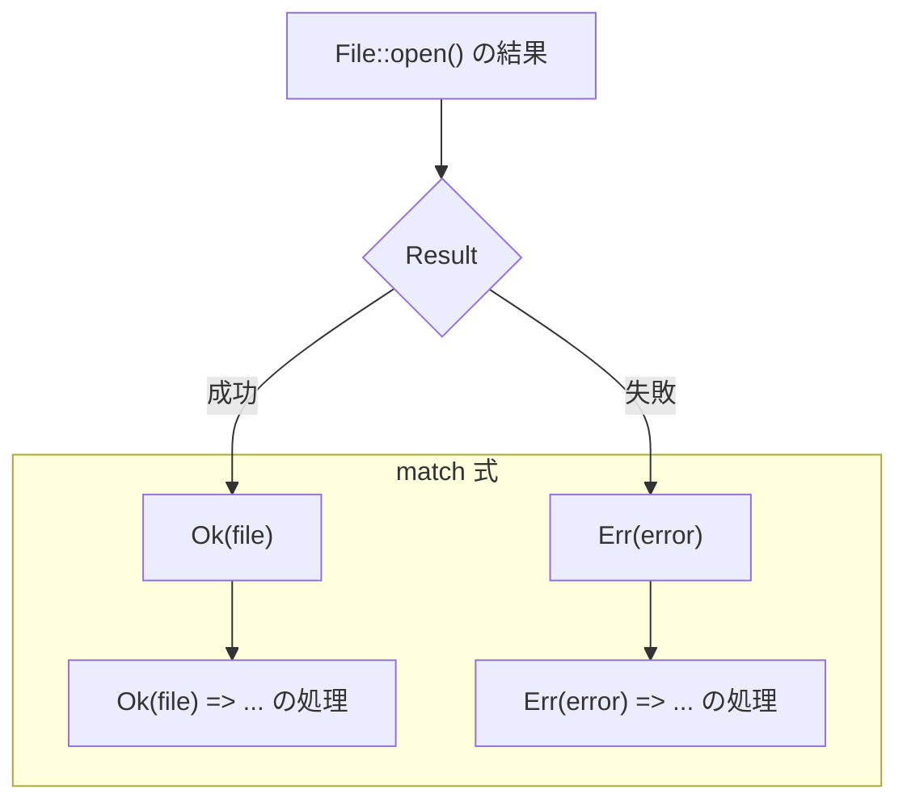

# 第 11 章：Result 型とエラーハンドリング

## この章のゴール
- 回復可能なエラーと、回復不能なエラーの違いを説明できる。
- `Result<T, E>` 列挙型を使って、処理が失敗する可能性のある関数を定義できる。
- `match` 式を使って `Result<T, E>` を安全に処理し、成功時と失敗時の両方のケースを記述できる。
- Python の `try-except` や Go の `if err != nil` と、Rust の `Result` の思想的な違いを理解する。

---

## 11.1 Python/Go ではこうやっていた

Python と Go では、エラーの扱い方が大きく異なりました。

- Python: `try...except` ブロックを使って、エラーが発生する可能性のある処理を囲み、例外を捕捉していました。関数が成功したかどうかは、例外が発生したかどうかで判断していました。
- Go: 関数が複数の値を返すことができる特性を活かし、戻り値の最後に `error` 型を添えるのが一般的でした (`value, err`)。呼び出し側は、`if err != nil` でエラーの有無を都度チェックする必要がありました。

Rust のアプローチは、Go のように戻り値でエラーを表現しつつも、`Option<T>` のように型システムと `match` 式を使って、エラー処理のし忘れをコンパイル時に防ぐ、という両者の良い点を組み合わせたような仕組みになっています。

## 11.2 回復可能なエラーと `Result<T, E>`

Rust のエラーハンドリングは、大きく 2 種類に分類されます。

1.  回復不能なエラー (Unrecoverable Errors): プログラムの続行が不可能な致命的なエラー。`panic!` マクロで処理を中断します。(例: 配列の範囲外アクセス)
2.  回復可能なエラー (Recoverable Errors): ファイルが見つからないなど、プログラムが対処して処理を続行できる可能性のあるエラー。これを扱うのが `Result<T, E>` です。

`Result<T, E>` は、`Option<T>` と同様に標準ライブラリで定義された列挙型です。

```rust
enum Result<T, E> {
    Ok(T),    // 処理が成功した場合、T 型の値を保持
    Err(E),   // 処理が失敗した場合、E 型のエラー値を保持
}
```

`<T>` と `<E>` はジェネリック型パラメータで、`T` は成功時の値の型 (Type)、`E` は失敗時のエラーの型 (Error) を表します。

## 11.3 `Result<T, E>` の実践例

ファイルを開く、という失敗する可能性のある一般的な操作を例に見てみましょう。`File::open` 関数は `Result<std::fs::File, std::io::Error>` を返します。

```rust
use std::fs::File;

fn main() {
    let f = File::open("hello.txt");
}
```

この変数 `f` の型は、`File` ハンドルそのものではなく、`Result<File, Error>` です。ファイルが開けたかもしれないし (`Ok(File)`)、開けなかったかもしれない (`Err(Error)`) という可能性を、型が表現しています。

`Option<T>` の時と同様に、`Result` を直接ファイルハンドルとして使うことはできません。中身を取り出すには、`Ok` と `Err` の両方の可能性を処理する必要があります。

## 11.4 `match` で `Result` を処理する

`Result` を安全に処理する最も基本的な方法は、`match` 式を使うことです。



```rust
use std::fs::File;

fn main() {
    let f = File::open("hello.txt");

    let f = match f {
        Ok(file) => {
            println!("ファイルが開きました。");
            file // file ハンドルを返す
        },
        Err(error) => {
            panic!("ファイルを開けませんでした: {:?}", error);
        },
    };
}
```
`match` を使うことで、成功した場合 (`Ok`) と失敗した場合 (`Err`) の両方の処理を記述することをコンパイラが強制します。これにより、「エラーケースの考慮漏れ」というバグを未然に防ぐことができます。

Go の `if err != nil` はプログラマの規律に依存しますが、Rust の `match` はコンパイラが規律を強制してくれるのです。

## 11.5 まとめ

- ✓ Rust のエラーは、`panic!` で処理する「回復不能なエラー」と、`Result` で処理する「回復可能なエラー」に大別される。
- ✓ `Result<T, E>` は、成功 (`Ok(T)`) と失敗 (`Err(E)`) の 2 つの状態を表す列挙型。
- ✓ 失敗する可能性のある関数は、戻り値の型として `Result` を使うことで、エラー処理を呼び出し元に強制できる。
- ✓ `match` 式は、`Result` の `Ok` と `Err` の両方を網羅的に処理するための最も基本的で安全な方法。

---

`Result<T, E>` は、Rust の堅牢なアプリケーションを支えるエラーハンドリングの根幹です。`match` を使ってエラーを丁寧に処理する習慣は、信頼性の高いソフトウェアを作るための第一歩です。

次の章では、`Vec` や `HashMap` といった、より実践的なデータを扱うためのコレクション型について学びます。
