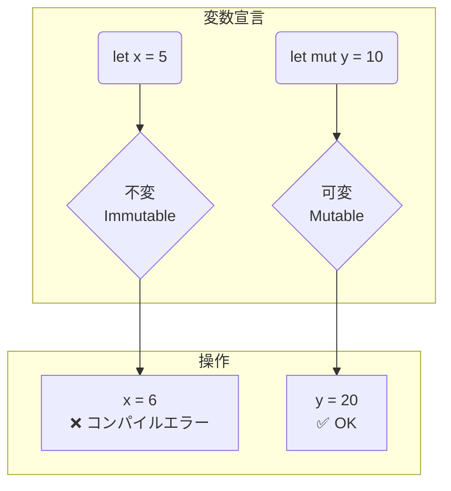

# 第 3 章：変数と型システム

## この章のゴール
- `let` と `mut` を使った変数の宣言と、不変性 (Immutability) の重要性を理解する。
- Rust の基本的なスカラ型 (整数、浮動小数点数、論理値、文字) を使いこなせる。
- 型推論と型アノテーションの違いを理解し、適切に使い分けられる。
- シャドーイングの概念と、通常の変数再代入との違いを説明できる。

---

## 3.1 Python/Go ではこうやっていた

Python や Go では、変数の扱いは比較的シンプルでした。

- **Python**: 変数は動的型付けで、いつでも好きな値を再代入できました。型ヒントで型を明示することはできましたが、これはあくまでヒントであり、強制力はありませんでした。
  ```python
  x = 10      # 整数
  x = "hello" # 文字列を再代入できる
  ```
- **Go**: `:=` 演算子による型推論を伴う初期化や、`var` キーワードによる明示的な型宣言がありました。一度宣言した変数の型は変更できませんが、値の再代入は可能でした。
  ```go
  x := 10 // x は int 型
  x = 20  // 再代入は OK
  // x = "hello" // コンパイルエラー
  ```

## 3.2 Rust の哲学：デフォルトで不変 (Immutable by Default)

Rust の変数に関する最も大きな特徴は、デフォルトで不変 (Immutable) であることです。これは、安全性を最優先する Rust の設計思想の表れです。

```rust
fn main() {
    let x = 5;
    println!("The value of x is: {}", x);
    x = 6; // <-- コンパイルエラー！
    println!("The value of x is: {}", x);
}
```

このコードをコンパイルしようとすると、コンパイラは `cannot assign twice to immutable variable x` というエラーを出力します。一度値に束縛された不変変数を変更しようとしたためです。

なぜ不変性がデフォルトなのか？
大規模なコードベースや並行処理において、意図しない場所で変数の値が変更されてしまうことは、追跡が困難なバグの温床となります。Rust は、変数をデフォルトで不変にすることで、「値が変更される可能性がある場所」をプログラマに明示的に意識させ、コードの可読性と安全性を高めているのです。

値の変更を許可したい場合は、`mut` キーワードを使って変数を 可変 (Mutable) にする必要があります。

```rust
fn main() {
    let mut x = 5; // mut キーワードを追加
    println!("The value of x is: {}", x);
    x = 6; // OK!
    println!("The value of x is: {}", x);
}
```

この「オプトイン (明示的に選択する)」方式により、コードを読む人は `mut` という印がついている変数だけを注意すればよくなります。



## 3.3 基本的なスカラ型

Rust は静的型付け言語であり、コンパイル時にすべての変数の型がわかっている必要があります。Rust には 4 つの主要なスカラ型があります。

- 整数型:
  - 符号付き: `i8`, `i16`, `i32`, `i64`, `i128`, `isize` (アーキテクチャ依存)
  - 符号なし: `u8`, `u16`, `u32`, `u64`, `u128`, `usize` (アーキテクチャ依存)
  - デフォルトは `i32` です。
- 浮動小数点数型:
  - `f32` (単精度), `f64` (倍精度)
  - デフォルトは `f64` です。
- 論理値型:
  - `bool` (`true` または `false`)
- 文字型:
  - `char` (4 バイトの Unicode スカラ値)

Python や Go と違い、Rust は 暗黙的な型変換を行いません。

```rust
fn main() {
    let x: i32 = 10;
    let y: i64 = 20;
    // if x == y { } // コンパイルエラー！ 型が違うため比較できない
}
```

これにより、意図しない型変換によるバグを防いでいます。

## 3.4 型推論と型アノテーション

多くの場合、コンパイラは初期値から変数の型を推論できるため、型を明示的に書く必要はありません。

```rust
fn main() {
    let x = 2.0; // コンパイラは f64 と推論
    let y: f32 = 3.0; // 型を明示的に指定 (型アノテーション)
}
```

しかし、コンパイラが型を判断できない場合や、特定の型を強制したい場合には、型アノテーション (`: 型名`) を使います。

```rust
fn main() {
    // 文字列から数値への変換など、複数の型になりうる場合
    let guess: u32 = "42".parse().expect("Not a number!");
}
```

この例では、`.parse()` は様々な数値型に変換できる可能性があるため、`u32` 型であることを明示的に指定しています。

## 3.5 シャドーイング (Shadowing)

Rust には、シャドーイング というユニークな機能があります。これは、同じスコープ内で同じ変数名を再宣言することを許可するものです。

```rust
fn main() {
    let x = 5;

    let x = x + 1; // ここで x をシャドーイング

    {
        let x = x * 2; // 内側のスコープでさらにシャドーイング
        println!("The value of x in the inner scope is: {}", x); // => 12
    }

    println!("The value of x is: {}", x); // => 6
}
```

`mut` を使った変数の再代入との主な違いは以下の通りです。

- 型の変更が可能: シャドーイングでは、新しい変数を宣言しているため、型を変更することができます。
- 不変性の維持: シャドーイング後の変数も、`mut` を付けない限り不変です。

```rust
// 型を変更する例
let spaces = "   ";
let spaces = spaces.len(); // "spaces" は文字列から数値になる
```

この機能は、値の変換を行う際に一時的な変数名 (例: `spaces_str`, `spaces_num`) を作らずに済み、コードを簡潔に保つのに役立ちます。

### なぜシャドーイングが存在するのか？

`mut` による再代入を厳しく制限する Rust の設計思想の中で、なぜシャドーイングのような機能が許されているのでしょうか。「一時的な変数を増やさなくて済む」という利点は、その核心的な理由を説明するには少し表層的です。

シャドーイングの真の目的は、「**不変性 (Immutability) を基本とする設計を、より実用的で安全なものにするため**」にあります。

`mut` は同じ型の値を書き換えるための機能ですが、シャドーイングは全く新しい変数を宣言する行為です。これにより、型の変更が可能になりますが、それ以上に重要な利点があります。

```rust
let value = "5"; // &str 型
let value: u32 = value.trim().parse().unwrap(); // u32 型にシャドーイング
```

このコードの 2 行目以降、`value` という名前は `u32` 型の新しい変数を指すようになります。そして、**元の `&str` 型の `value` にはアクセスできなくなります。**

これがシャドーイングがもたらす本質的な安全性です。

1.  **偶発的なバグの防止**: 値の変換後、変換前の古い変数にアクセスできなくすることで、「古い値を使ってしまう」という種類のバグをコンパイルレベルで防ぎます。これは、Rust の安全性へのこだわりに合致する重要な特徴です。
2.  **論理的な「進化」の表現**: 変数が単に「変わる」のではなく、ある処理を経て「別の性質のものに進化した」という論理的な流れを、同じ名前で表現できます。`value` という概念の一貫性を保ちつつ、その表現形式 (型) が変わったことを明確に示せます。
3.  **不変性の維持**: シャドーイングによって作られた新しい変数も、`mut` を付けない限り不変です。意図しない変更が入り込む余地を最小限に抑えるという原則は、ここでも一貫しています。

Rust は OCaml や Haskell といった関数型言語から多くの影響を受けており、これらの言語ではシャドーイングはごく自然な機能です。状態の変更を避け、データ変換の連鎖としてプログラムを構築するスタイルと非常に相性が良いためです。

シャドーイングは、単なる便利なシンタックスシュガーではなく、Rust の安全性と表現力を支える、考え抜かれた設計の一部なのです。

## 3.6 まとめ

- ✓ Rust の変数はデフォルトで 不変。変更するには `mut` キーワードが必要。
- ✓ Rust は強い静的型付け言語で、`i32`, `f64`, `bool`, `char` などの基本型がある。
- ✓ コンパイラは型を推論できるが、必要に応じて 型アノテーション で明示的に指定する。
- ✓ シャドーイング を使うと、同じ変数名で再宣言でき、型を変更することも可能。

---

不変性という概念に最初は戸惑うかもしれませんが、これが Rust の安全性を支える重要な柱の一つです。この章で学んだ変数の基本は、今後のすべての章の基礎となります。

次の章では、これらの変数を使ってプログラムの流れを制御する「制御構文」について学びます。

