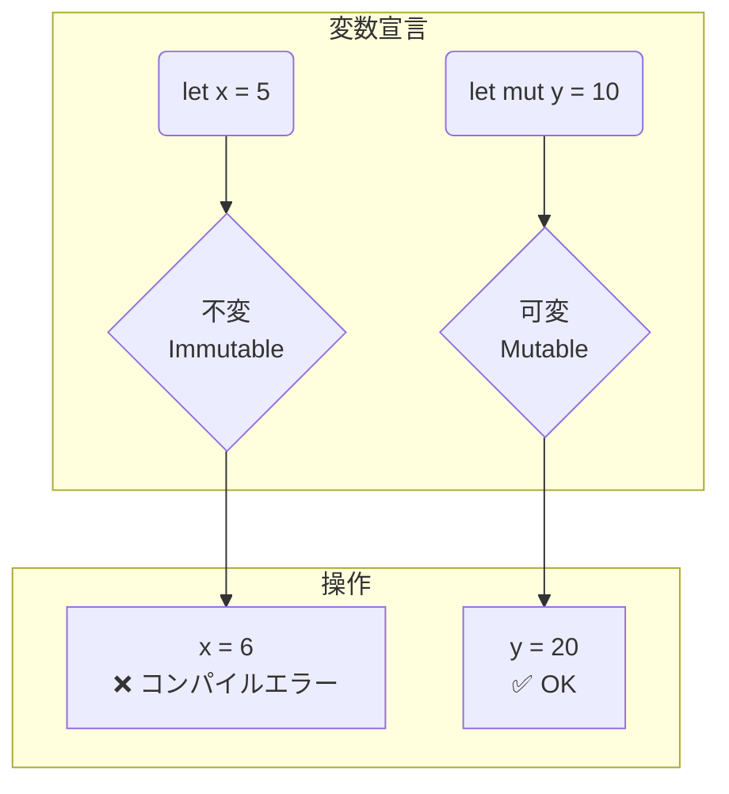

# 第 3 章：変数と型システム

## この章のゴール
- `let` と `mut` を使った変数の宣言と、不変性 (Immutability) の重要性を理解する。
- Rust の基本的なスカラ型 (整数、浮動小数点数、論理値、文字) を使いこなせる。
- 型推論と型アノテーションの違いを理解し、適切に使い分けられる。
- シャドーイングの概念と、通常の変数再代入との違いを説明できる。

---

## 3.1 Python/Go ではこうやっていた

Python や Go では、変数の扱いは比較的シンプルでした。

- **Python**: 変数は動的型付けで、いつでも好きな値を再代入できました。型ヒントで型を明示することはできましたが、これはあくまでヒントであり、強制力はありませんでした。
  ```python
  x = 10      # 整数
  x = "hello" # 文字列を再代入できる
  ```
- **Go**: `:=` 演算子による型推論を伴う初期化や、`var` キーワードによる明示的な型宣言がありました。一度宣言した変数の型は変更できませんが、値の再代入は可能でした。
  ```go
  x := 10 // x は int 型
  x = 20  // 再代入は OK
  // x = "hello" // コンパイルエラー
  ```

## 3.2 Rust の哲学：デフォルトで不変 (Immutable by Default)

Rust の変数に関する最も大きな特徴は、デフォルトで不変 (Immutable) であることです。これは、安全性を最優先する Rust の設計思想の表れです。

言葉で説明するよりも、まずは体験してみましょう。

### まずは動かして、エラーを体験する

まずは
```sh
cargo new variables
```
で新しいプロジェクトを作り、`src/main.rs` に以下のコードを貼り付けて
```sh
cargo run
```
で実行してみましょう。これが本書における基本的な学習サイクルになります。

(第2章でセットアップした `evcxr` のようなREPLツールや、手軽な [Rust Playground](https://play.rust-lang.org/) を使って試しても構いません)

```rust
fn main() {
    let x = 5;
    println!("The value of x is: {}", x);
    x = 6;
    println!("The value of x is: {}", x);
}
```
[Rust Playgroundで試す](https://play.rust-lang.org/?version=stable&mode=debug&edition=2021&code=fn%20main()%20%7B%0A%20%20%20%20let%20x%20%3D%205%3B%0A%20%20%20%20println!(%22The%20value%20of%20x%20is%3A%20%7B%7D%22%2C%20x)%3B%0A%20%20%20%20x%20%3D%206%3B%0A%20%20%20%20println!(%22The%20value%20of%20x%20is%3A%20%7B%7D%22%2C%20x)%3B%0A%7D)

どうなりましたか？おそらく、あなたの画面には `Run` ボタンの代わりに `Compiling` という表示が出て、その下に赤文字でエラーメッセージが表示されたはずです。

```text
error[E0384]: cannot assign twice to immutable variable `x`
 --> src/main.rs:4:5
  |
2 |     let x = 5;
  |         -
  |         |
  |         first assignment to `x`
  |         help: consider making this binding mutable: `mut x`
3 |     println!("The value of x is: {}", x);
4 |     x = 6;
  |     ^^^^^ cannot assign twice to immutable variable

For more information about this error, try `rustc --explain E0384`.
```

このエラーこそが、Rust の安全性を支える最初の門番です。メッセージを詳しく見てみましょう。

- `cannot assign twice to immutable variable x`: 「不変の変数 `x` に 2 回代入することはできません」と書かれています。`immutable` が「不変」を意味します。
- `help: consider making this binding mutable: mut x`: コンパイラは親切にも「この束縛を可変にすることを検討してください: `mut x`」と解決策まで提案してくれています。

### なぜ不変性がデフォルトなのか？

Python や Go を経験してきた方にとって、この挙動は少し奇妙に感じるかもしれません。なぜ Rust は、一手間かけて `mut` と書かない限り、変数を変更できないようにしているのでしょうか。

その理由は、大規模なコードベースや、複数のスレッドが同時に変数を読み書きする並行処理において、意図しない場所で変数の値が変更されてしまうことが、追跡が非常に困難なバグの温床となるからです。

Rust は、変数をデフォルトで不変にすることで、「値が変更される可能性がある場所」をプログラマに `mut` というキーワードで明示的に意識させます。これにより、コードを読む人は `mut` という印がついている変数だけを注意すればよくなり、コードの可読性と安全性が劇的に向上するのです。

### `mut` で可変にする

エラーメッセージの指示に従って、コードを修正してみましょう。`let x = 5;` を `let mut x = 5;` に変更して、もう一度実行してみてください。

```rust
fn main() {
    let mut x = 5; // mut キーワードを追加
    println!("The value of x is: {}", x);
    x = 6; // OK!
    println!("The value of x is: {}", x);
}
```
[Rust Playgroundで試す](https://play.rust-lang.org/?version=stable&mode=debug&edition=2021&code=fn%20main()%20%7B%0A%20%20%20%20let%20mut%20x%20%3D%205%3B%20%2F%2F%20mut%20%E3%82%AD%E3%83%BC%E3%83%AF%E3%83%BC%E3%83%89%E3%82%92%E8%BF%BD%E5%8A%A0%0A%20%20%20%20println!(%22The%20value%20of%20x%20is%3A%20%7B%7D%22%2C%20x)%3B%0A%20%20%20%20x%20%3D%206%3B%20%2F%2F%20OK!%0A%20%20%20%20println!(%22The%20value%20of%20x%20is%3A%20%7B%7D%22%2C%20x)%3B%0A%7D)

今度は成功し、以下のように表示されるはずです。

```text
The value of x is: 5
The value of x is: 6
```

この「オプトイン (Opt-in: 明示的に選択する)」方式により、安全性がデフォルトで提供され、必要な場所だけを限定的に可変にすることができます。



## 3.3 基本的なスカラ型と、あふれるバケツ

Rust は静的型付け言語 (statically typed language) です。これは、コンパイル時にすべての変数の型が決定している必要がある、という意味です。コンパイラが私たちの書いたコードを機械語に翻訳する時点で、「この `x` という変数は 32 ビットの整数だな」「この `message` は文字列だな」と完全に理解している必要があります。

これにより、Go のように実行してみたら型が違ってパニックになったり、Python のように意図せず数値が文字列になってしまったり、といった実行時エラーをコンパイル時に防ぐことができます。

Rust には 4 つの主要なスカラ型 (単一の値を表現する型) があります。
- 整数
- 浮動小数点数
- 論理値
- 文字

一つずつ、手を動かしながら見ていきましょう。

### 整数型：サイズの決まったバケツ

整数型は、その名の通り整数を扱う型です。Rust の整数型は、符号 (プラスかマイナスか) とサイズ (何ビットか) によって、たくさんの種類があります。

| 長さ | 符号付き | 符号なし |
| --- | --- | --- |
| 8-bit | `i8` | `u8` |
| 16-bit | `i16` | `u16` |
| 32-bit | `i32` | `u32` |
| 64-bit | `i64` | `u64` |
| 128-bit | `i128` | `u128` |
| arch | `isize` | `usize` |

`i` は integer (整数) の `i` で、符号付き (マイナスの値も扱える) を意味します。`u` は unsigned (符号なし) で、0 とプラスの値だけを扱えます。数字はビット数を表します。

例えば `u8` は、8 ビットの符号なし整数です。これは、2 の 8 乗、つまり 256 個の数値を表現できます。具体的には 0 から 255 までの整数です。

#### 試してみよう：バケツから水をあふれさせる

`u8` というバケツには、最大で 255 の値が入ると考えてみてください。では、256 を入れようとするとどうなるでしょうか？

以下のコードを、先ほど作成した `src/main.rs` に上書きして `cargo run` で実行してみましょう。

```rust
fn main() {
    let bucket: u8 = 256;
    println!("Bucket contains: {}", bucket);
}
```
[Rust Playgroundで試す](https://play.rust-lang.org/?version=stable&mode=debug&edition=2021&code=fn%20main()%20%7B%0A%20%20%20%20let%20bucket%3A%20u8%20%3D%20256%3B%0A%20%20%20%20println!(%22Bucket%20contains%3A%20%7B%7D%22%2C%20bucket)%3B%0A%7D)

これを実行すると、コンパイルエラーが発生します。

```text
error: literal out of range for `u8`
 --> src/main.rs:2:22
  |
2 |     let bucket: u8 = 256;
  |                      ^^^
  |
  = note: the literal `256` does not fit into the type `u8` whose range is `0..=255`
```
コンパイラが「`u8` の範囲 (0..=255) に収まりません」と、バケツのサイズオーバーを教えてくれました。

では、実行時にオーバーフローさせるとどうなるでしょう？ デバッグビルド (`cargo run` のデフォルト) で以下のコードを実行してみてください。

```rust
fn main() {
    let mut bucket: u8 = 255;
    println!("Bucket starts with: {}", bucket);
    
    bucket = bucket + 1;
    println!("Bucket now contains: {}", bucket);
}
```
[Rust Playgroundで試す](https://play.rust-lang.org/?version=stable&mode=debug&edition=2021&code=fn%20main()%20%7B%0A%20%20%20%20let%20mut%20bucket%3A%20u8%20%3D%20255%3B%0A%20%20%20%20println!(%22Bucket%20starts%20with%3A%20%7B%7D%22%2C%20bucket)%3B%0A%20%20%20%20%0A%20%20%20%20bucket%20%3D%20bucket%20%2B%201%3B%0A%20%20%20%20println!(%22Bucket%20now%20contains%3A%20%7B%7D%22%2C%20bucket)%3B%0A%7D)

今度はプログラムが **パニック (panic!)** を起こして終了しました。

```text
thread 'main' panicked at 'attempt to add with overflow', src/main.rs:5:14
```

Rust は、開発中 (Debug モード) はオーバーフローが起きると即座にプログラムを停止させて、バグの存在を教えてくれます。一方、本番環境向け (Release モード) でビルドすると、パフォーマンスを優先してこのチェックを省略し、値がラップアラウンド (一周して 0 に戻る) するようになっています。

このように、Rust では整数を扱う際に、その「サイズ」を常に意識する必要があります。Python のように数がどこまでも大きくなるわけではないのです。

### その他のスカラ型

- **浮動小数点数型**: `f32` (単精度) と `f64` (倍精度) があります。デフォルトは `f64` です。
- **論理値型**: `bool` 型で、`true` または `false` のどちらかの値をとります。
- **文字型**: `char` 型で、シングルクォーテーション (`'`) で囲みます。`'a'`、`'あ'`、`'🦀'` など、1 文字の Unicode スカラ値を表現します。

### 型の厳密さ：暗黙的な変換は行われない

Python や Go と違い、Rust は非常に厳格で、異なる型同士の計算で暗黙的な型変換を行いません。

#### 試してみよう：異なる型の足し算

以下のコードを実行するとどうなるでしょうか？ `src/main.rs` を書き換えて試してみましょう。

```rust
fn main() {
    let x: i32 = 10;
    let y: i64 = 20;

    let z = x + y;
    println!("The value of z is: {}", z);
}
```
[Rust Playgroundで試す](https://play.rust-lang.org/?version=stable&mode=debug&edition=2021&code=fn%20main()%20%7B%0A%20%20%20%20let%20x%3A%20i32%20%3D%2010%3B%0A%20%20%20%20let%20y%3A%20i64%20%3D%2020%3B%0A%0A%20%20%20%20let%20z%20%3D%20x%20%2B%20y%3B%0A%20%20%20%20println!(%22The%20value%20of%20z%20is%3A%20%7B%7D%22%2C%20z)%3B%0A%7D)

やはりコンパイルエラーです。

```text
error[E0308]: mismatched types
 --> src/main.rs:5:17
  |
5 |     let z = x + y;
  |                 ^ expected `i32`, found `i64`
```

「`i32` を期待したのに `i64` が見つかった」と言われています。たとえ同じ整数型でも、サイズが違えば Rust は別の型として扱います。計算を行うには、`as` キーワードを使って明示的に型を変換 (キャスト) する必要があります。

```rust
fn main() {
    let x: i32 = 10;
    let y: i64 = 20;

    let z = (x as i64) + y; // x を i64 に変換
    println!("The value of z is: {}", z);
}
```
[Rust Playgroundで試す](https://play.rust-lang.org/?version=stable&mode=debug&edition=2021&code=fn%20main()%20%7B%0A%20%20%20%20let%20x%3A%20i32%20%3D%2010%3B%0A%20%20%20%20let%20y%3A%20i64%20%3D%2020%3B%0A%0A%20%20%20%20let%20z%20%3D%20(x%20as%20i64)%20%2B%20y%3B%20%2F%2F%20x%20%E3%82%92%20i64%20%E3%81%AB%E5%A4%89%E6%8F%9B%0A%20%20%20%20println!(%22The%20value%20of%20z%20is%3A%20%7B%7D%22%2C%20z)%3B%0A%7D)

これならコンパイルが通り、`30` と表示されます。この一手間が、意図しない型変換によるバグを未然に防いでくれるのです。

### キャストが使われる様々な場面

`as`キーワードによるキャストは、異なる数値型を計算する場面以外にも、様々な状況で利用されます。いくつかの典型的な例を見てみましょう。

#### 1. 異なるサイズの整数型間の変換

これは先ほどの例でも見た、最も一般的なキャストの使われ方です。`i32` を `i64` に変換したり、その逆を行ったりします。

```rust
fn main() {
    let a: i32 = 10;
    let b: i64 = a as i64; // i32からi64へキャスト

    println!("a: {}, b: {}", a, b);

    let c: i64 = 100;
    // より大きな型から小さな型へキャストする場合、値が収まらない可能性があるため注意が必要です。
    // この例では100はi32に収まるので問題ありません。
    let d: i32 = c as i32;

    println!("c: {}, d: {}", c, d);
}
```
[Rust Playgroundで試す](https://play.rust-lang.org/?version=stable&mode=debug&edition=2021&code=fn%20main()%20%7B%0A%20%20%20%20let%20a%3A%20i32%20%3D%2010%3B%0A%20%20%20%20let%20b%3A%20i64%20%3D%20a%20as%20i64%3B%0A%20%20%20%20println!(%22a%3A%20%7B%7D%2C%20b%3A%20%7B%7D%22%2C%20a%2C%20b)%3B%0A%0A%20%20%20%20let%20c%3A%20i64%20%3D%20100%3B%0A%20%20%20%20let%20d%3A%20i32%20%3D%20c%20as%20i32%3B%0A%20%20%20%20println!(%22c%3A%20%7B%7D%2C%20d%3A%20%7B%7D%22%2C%20c%2C%20d)%3B%0A%7D)

注意点: 大きなサイズの型から小さなサイズの型へキャストする場合（例: `i64` -> `i32`）、元の値が変換先の型の範囲に収まらないと、オーバーフローが発生し、予期しない値になる可能性があります。

#### 2. 整数型と浮動小数点数型間の変換

計算の過程で、整数を浮動小数点数として扱いたい場合や、その逆の場合にキャストを使用します。

```rust
fn main() {
    let integer_value: i32 = 5;
    let float_value: f64 = integer_value as f64; // i32からf64へ

    println!("integer: {}, float: {}", integer_value, float_value);

    let float_value_2: f64 = 3.14;
    // 浮動小数点数から整数へキャストすると、小数点以下は切り捨てられます。
    let integer_value_2: i32 = float_value_2 as i32;

    println!("float: {}, integer: {}", float_value_2, integer_value_2); // 結果は3になります
}
```
[Rust Playgroundで試す](https://play.rust-lang.org/?version=stable&mode=debug&edition=2021&code=fn%20main()%20%7B%0A%20%20%20%20let%20integer_value%3A%20i32%20%3D%205%3B%0A%20%20%20%20let%20float_value%3A%20f64%20%3D%20integer_value%20as%20f64%3B%0A%0A%20%20%20%20println!(%22integer%3A%20%7B%7D%2C%20float%3A%20%7B%7D%22%2C%20integer_value%2C%20float_value)%3B%0A%0A%20%20%20%20let%20float_value_2%3A%20f64%20%3D%203.14%3B%0A%20%20%20%20let%20integer_value_2%3A%20i32%20%3D%20float_value_2%20as%20i32%3B%0A%0A%20%20%20%20println!(%22float%3A%20%7B%7D%2C%20integer%3A%20%7B%7D%22%2C%20float_value_2%2C%20integer_value_2)%3B%0A%7D)

#### 3. 数値型と文字型 (`char`) の変換

`u8` 型の数値を `char` 型に変換して、対応する文字を取得することができます。これは ASCII コードなどを扱う際に便利です。

```rust
fn main() {
    let number: u8 = 65; // ASCIIコードで 'A'
    let character: char = number as char;

    println!("number: {}, character: '{}'", number, character);
}
```
[Rust Playgroundで試す](https://play.rust-lang.org/?version=stable&mode=debug&edition=2021&code=fn%20main()%20%7B%0A%20%20%20%20let%20number%3A%20u8%20%3D%2065%3B%0A%20%20%20%20let%20character%3A%20char%20%3D%20number%20as%20char%3B%0A%0A%20%20%20%20println!(%22number%3A%20%7B%7D%2C%20character%3A%20%27%7B%7D%27%22%2C%20number%2C%20character)%3B%0A%7D)

注意点: `u8` から `char` へのキャストは有効な UTF-8 シーケンスである場合にのみ正しく機能します。

## 3.4 型推論と型アノテーション

これまでの例で、`let x = 5;` のように書いたり `let bucket: u8 = 255;` のように書いたりしましたね。この `: u8` の部分を **型アノテーション (type annotation)** と呼びます。

多くの場合、コンパイラは初期値から変数の型を賢く推論 (inference) してくれます。

```rust
fn main() {
    // この x は 5 という値から、コンパイラが「i32 が妥当だろう」と推論してくれる
    let x = 5; 

    // この y は 2.0 という値から、「f64 が妥当だろう」と推論してくれる
    let y = 2.0;
}
```
[Rust Playgroundで試す](https://play.rust-lang.org/?version=stable&mode=debug&edition=2021&code=fn%20main()%20%7B%0A%20%20%20%20%2F%2F%20%E3%81%93%E3%81%AE%20x%20%E3%81%AF%205%20%E3%81%A8%E3%81%84%E3%81%86%E5%80%A4%E3%81%8B%E3%82%89%E3%80%81%E3%82%B3%E3%83%B3%E3%83%91%E3%82%A4%E3%83%A9%E3%81%8C%E3%80%8Ci32%20%E3%81%8C%E5%A6%A5%E5%BD%93%E3%81%A0%E3%82%8D%E3%81%86%E3%80%8D%E3%81%A8%E6%8E%A8%E8%AB%96%E3%81%97%E3%81%A6%E3%81%8F%E3%82%8C%E3%82%8B%0A%20%20%20%20let%20x%20%3D%205%3B%20%0A%0A%20%20%20%20%2F%2F%20%E3%81%93%E3%81%AE%20y%20%E3%81%AF%202.0%20%E3%81%A8%E3%81%84%E3%81%86%E5%80%A4%E3%81%8B%E3%82%89%E3%80%81%E3%80%8Cf64%20%E3%81%8C%E5%A6%A5%E5%BD%93%E3%81%A0%E3%82%8D%E3%81%86%E3%80%8D%E3%81%A8%E6%8E%A8%E8%AB%96%E3%81%97%E3%81%A6%E3%81%8F%E3%82%8C%E3%82%8B%0A%20%20%20%20let%20y%20%3D%202.0%3B%0A%7D)

しかし、コンパイラが型を判断できない場合や、私たちが特定の型を強制したい場合には、型アノテーションが必要になります。

### 試してみよう：型アノテーションが必要なとき

最も代表的な例が、文字列から数値への変換です。`.parse()` というメソッドは、様々な数値型 (例えば `i32`, `u64`, `f64` など) に変換する能力を持っています。そのため、どの型に変換したいのかをコンパイラに教えてあげる必要があります。

`src/main.rs` に以下を書いて `cargo run` してみましょう。

```rust
fn main() {
    let guess = "42".parse().expect("Not a number!");
    println!("The guess is: {}", guess);
}
```
[Rust Playgroundで試す](https://play.rust-lang.org/?version=stable&mode=debug&edition=2021&code=fn%20main()%20%7B%0A%20%20%20%20let%20guess%20%3D%20%2242%22.parse().expect(%22Not%20a%20number!%22)%3B%0A%20%20%20%20println!(%22The%20guess%20is%3A%20%7B%7D%22%2C%20guess)%3B%0A%7D)

これはコンパイルエラーになります。

```text
error[E0282]: type annotations needed
 --> src/main.rs:2:9
  |
2 |     let guess = "42".parse().expect("Not a number!");
  |         ^^^^^
  |
help: consider giving `guess` an explicit type, where the type for type parameter `F` is specified
  |
2 |     let guess: F = "42".parse().expect("Not a number!");
  |              +++
```

コンパイラは「型アノテーションが必要です (`type annotations needed`)」と訴えています。`"42"` をどの数値型に `parse` すればいいか分からないのです。

そこで、私たちが型を明示的に指定してあげます。

```rust
fn main() {
    let guess: u32 = "42".parse().expect("Not a number!");
    println!("The guess is: {}", guess);
}
```
[Rust Playgroundで試す](https://play.rust-lang.org/?version=stable&mode=debug&edition=2021&code=fn%20main()%20%7B%0A%20%20%20%20let%20guess%3A%20u32%20%3D%20%2242%22.parse().expect(%22Not%20a%20number!%22)%3B%0A%20%20%20%20println!(%22The%20guess%20is%3A%20%7B%7D%22%2C%20guess)%3B%0A%7D)

これでコンパイルが通り、`42` と表示されます。

#### ちょっと寄り道：turbofish 構文

もう一つの書き方として、`::<>` という少し奇妙な構文 (愛情を込めて **turbofish** と呼ばれます) を使って型を指定することもできます。

```rust
fn main() {
    let guess = "42".parse::<u32>().expect("Not a number!");
    println!("The guess is: {}", guess);
}
```
[Rust Playgroundで試す](https://play.rust-lang.org/?version=stable&mode=debug&edition=2021&code=fn%20main()%20%7B%0A%20%20%20%20let%20guess%20%3D%20%2242%22.parse%3A%3A%3Cu32%3E().expect(%22Not%20a%20number!%22)%3B%0A%20%20%20%20println!(%22The%20guess%20is%3A%20%7B%7D%22%2C%20guess)%3B%0A%7D)

どちらの書き方でも意味は同じです。現時点では、読みやすいと感じる方を使えば大丈夫です。

## 3.5 シャドーイング：変数の再定義

Rust には、**シャドーイング (shadowing)** というユニークな機能があります。これは、`let` キーワードを使って、同じスコープ内で同じ変数名を再宣言することを許可するものです。

```rust
fn main() {
    let x = 5;

    // ここで新しく let を使って x を宣言している
    let x = x + 1;

    {
        // このブロック内でも、さらに x をシャドーイングできる
        let x = x * 2;
        println!("The value of x in the inner scope is: {}", x); // => 12
    }

    println!("The value of x is: {}", x); // => 6
}
```
[Rust Playgroundで試す](https://play.rust-lang.org/?version=stable&mode=debug&edition=2021&code=fn%20main()%20%7B%0A%20%20%20%20let%20x%20%3D%205%3B%0A%0A%20%20%20%20%2F%2F%20%E3%81%93%E3%81%93%E3%81%A7%E6%96%B0%E3%81%97%E3%81%8F%20let%20%E3%82%92%E4%BD%BF%E3%81%A3%E3%81%A6%20x%20%E3%82%92%E5%AE%A3%E8%A8%80%E3%81%97%E3%81%A6%E3%81%84%E3%82%8B%0A%20%20%20%20let%20x%20%3D%20x%20%2B%201%3B%0A%0A%20%20%20%20%7B%0A%20%20%20%20%20%20%20%20%2F%2F%20%E3%81%93%E3%81%AE%E3%83%96%E3%83%AD%E3%83%83%E3%82%AF%E5%86%85%E3%81%A7%E3%82%82%E3%80%81%E3%81%95%E3%82%89%E3%81%AB%20x%20%E3%82%92%E3%82%B7%E3%83%A3%E3%83%89%E3%83%BC%E3%82%A4%E3%83%B3%E3%82%B0%E3%81%A7%E3%81%8D%E3%82%8B%0A%20%20%20%20%20%20%20%20let%20x%20%3D%20x%20*%202%3B%0A%20%20%20%20%20%20%20%20println!(%22The%20value%20of%20x%20in%20the%20inner%20scope%20is%3A%20%7B%7D%22%2C%20x)%3B%20%2F%2F%20%3D%3E%2012%0A%20%20%20%20%7D%0A%0A%20%20%20%20println!(%22The%20value%20of%20x%20is%3A%20%7B%7D%22%2C%20x)%3B%20%2F%2F%20%3D%3E%206%0A%7D)

### `mut` とシャドーイングの違いを体験する

「`let mut x = 5; x = 6;` と何が違うの？」と思われるかもしれません。これは非常に重要な違いであり、シャドーイングの存在意義に関わります。

最大の違いは、シャドーイングでは型を変更できる点です。

#### 試してみよう：mut ではできないこと

`mut` を使って変数の型を変えようとするとどうなるか、試してみましょう。

```rust
fn main() {
    let mut spaces = "   "; // spaces は文字列型 (&str)
    spaces = spaces.len();  // 文字列の長さを代入しようとする (これは数値型)
}
```
[Rust Playgroundで試す](https://play.rust-lang.org/?version=stable&mode=debug&edition=2021&code=fn%20main()%20%7B%0A%20%20%20%20let%20mut%20spaces%20%3D%20%22%20%20%20%22%3B%20%2F%2F%20spaces%20%E3%81%AF%E6%96%87%E5%AD%97%E5%88%97%E5%9E%8B%20(%26str)%0A%20%20%20%20spaces%20%3D%20spaces.len()%3B%20%20%2F%2F%20%E6%96%87%E5%AD%97%E5%88%97%E3%81%AE%E9%95%B7%E3%81%95%E3%82%92%E4%BB%A3%E5%85%A5%E3%81%97%E3%82%88%E3%81%86%E3%81%A8%E3%81%99%E3%82%8B%20(%E3%81%93%E3%82%8C%E3%81%AF%E6%95%B0%E5%80%A4%E5%9E%8B)%0A%7D)

これを実行すると、`mismatched types` エラーが出ます。文字列型の変数に、数値型の値を再代入することはできません。

#### シャドーイングならできること

次に、`let` を使ったシャドーイングで同じことをやってみましょう。

```rust
fn main() {
    let spaces = "   "; // spaces は &str 型
    let spaces = spaces.len(); // 新しい spaces 変数を宣言。今度は usize 型
    
    println!("The number of spaces is: {}", spaces);
}
```
[Rust Playgroundで試す](https://play.rust-lang.org/?version=stable&mode=debug&edition=2021&code=fn%20main()%20%7B%0A%20%20%20%20let%20spaces%20%3D%20%22%20%20%20%22%3B%20%2F%2F%20spaces%20%E3%81%AF%20%26str%20%E5%9E%8B%0A%20%20%20%20let%20spaces%20%3D%20spaces.len()%3B%20%2F%2F%20%E6%96%B0%E3%81%97%E3%81%84%20spaces%20%E5%A4%89%E6%95%B0%E3%82%92%E5%AE%A3%E8%A8%80%E3%80%82%E4%BB%8A%E5%BA%A6%E3%81%AF%20usize%20%E5%9E%8B%0A%20%20%20%20%0A%20%20%20%20println!(%22The%20number%20of%20spaces%20is%3A%20%7B%7D%22%2C%20spaces)%3B%0A%7D)

今度はコンパイルが通り、`3` と表示されます。

最初の `spaces` は文字列でしたが、2 行目でその長さを計算した結果 (数値) を、同名の新しい変数 `spaces` に束縛しています。この時点で、最初の文字列の `spaces` は「隠され (shadowed)」、以降 `spaces` という名前は数値型として扱われます。

### なぜシャドーイングが存在するのか？

`mut` による再代入を厳しく制限する Rust の設計思想の中で、なぜシャドーイングのような機能が許されているのでしょうか。「一時的な変数を増やさなくて済む」という利点は、その核心的な理由を説明するには少し表層的です。

シャドーイングの真の目的は、「**不変性 (Immutability) を基本とする設計を、より実用的で安全なものにするため**」にあります。

`let value = "5";` を `let value: u32 = ...` に変換する例を考えてみましょう。シャドーイングを使うと、変換後の `u32` 型の `value` が宣言された瞬間から、**元の `&str` 型の `value` にはアクセスできなくなります**。

これがシャドーイングがもたらす本質的な安全性です。

1.  **偶発的なバグの防止**: 値の変換後、変換前の古い変数にアクセスできなくすることで、「古い値を使ってしまう」という種類のバグをコンパイルレベルで防ぎます。
2.  **論理的な「進化」の表現**: 変数が単に「変わる」のではなく、ある処理を経て「別の性質のものに進化した」という論理的な流れを、同じ名前で表現できます。
3.  **不変性の維持**: シャドーイングによって作られた新しい変数も、`mut` を付けない限り不変です。

シャドーイングは、単なる便利な機能ではなく、Rust の安全性と表現力を支える、考え抜かれた設計の一部なのです。

## 3.6 まとめ

- ✓ Rust の変数はデフォルトで 不変。変更するには `mut` キーワードが必要。
- ✓ Rust は強い静的型付け言語で、`i32`, `f64`, `bool`, `char` などの基本型がある。
- ✓ コンパイラは型を推論できるが、必要に応じて 型アノテーション で明示的に指定する。
- ✓ シャドーイング を使うと、同じ変数名で再宣言でき、型を変更することも可能。

---

不変性という概念に最初は戸惑うかもしれませんが、これが Rust の安全性を支える重要な柱の一つです。この章で学んだ変数の基本は、今後のすべての章の基礎となります。

次の章では、これらの変数を使ってプログラムの流れを制御する「制御構文」について学びます。

