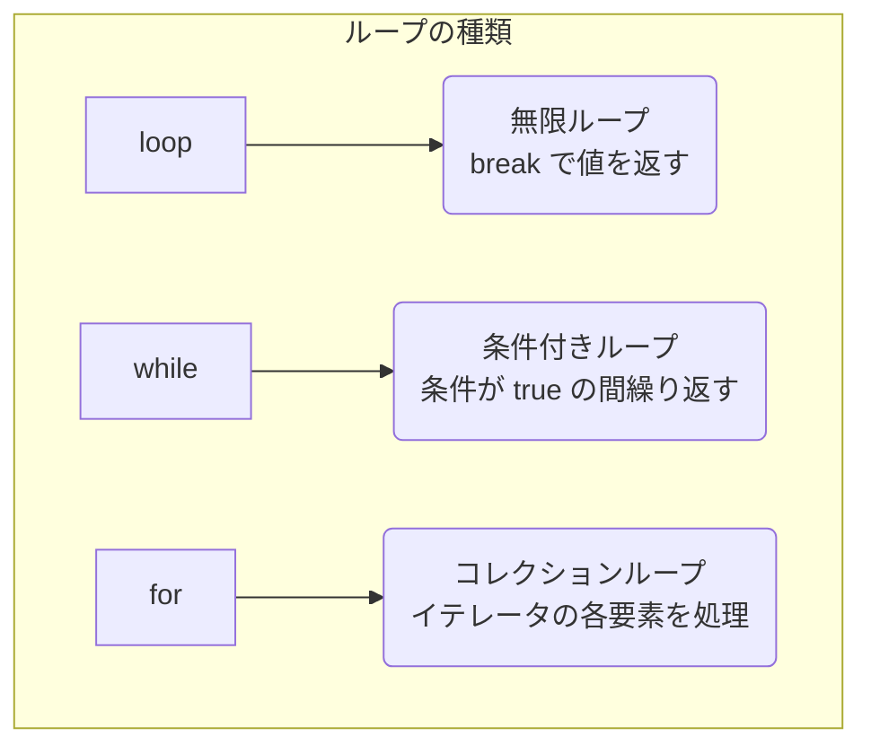

# 第 4 章：制御構文とパターンマッチング

## この章のゴール
- `if` が文ではなく式であることを理解し、`let` と組み合わせて使える。
- `loop`, `while`, `for` の基本的な使い方と、それぞれの使い分けを説明できる。
- `match` を使った網羅的なパターンマッチングを実装できる。
- `if let` を使って、特定のパターンにのみ一致する場合の処理を簡潔に書ける。

---

## 4.1 Python/Go ではこうやっていた

Python や Go における制御構文は、主に 文 (Statement) として機能しました。

- Python: `if`/`elif`/`else` 文や `for`/`while` ループを使って、プログラムの流れを制御していました。これらが値を返すことはありませんでした。
- Go: `if`/`else` 文、`switch` 文、そして `for` 文 (Go には `while` がありません) を使っていました。Go の `if` 文は、条件式の前に簡単な文を置けるという特徴がありました。

Rust の制御構文も見た目は似ていますが、一つ大きな違いがあります。それは、`if` や `match` が 式 (Expression) である、ということです。

## 4.2 `if` は文ではなく「式」

Python や Go との大きな違いは、Rust の `if` が文 (Statement) ではなく、値を返すことができる **式 (Expression)** である点です。

### 試してみよう：`if` の結果を変数に入れる

`if` が値を返すとはどういうことか、`cargo new controlflow` で新しいプロジェクトを作って試してみましょう。`src/main.rs` に以下を記述して `cargo run` してください。

```rust
fn main() {
    let condition = true;
    let number = if condition { 5 } else { 6 };

    println!("The value of number is: {}", number);
}
```
[Rust Playgroundで試す](https://play.rust-lang.org/?version=stable&mode=debug&edition=2021&code=fn%20main%28%29%20%7B%0A%20%20%20%20let%20condition%20%3D%20true%3B%0A%20%20%20%20let%20number%20%3D%20if%20condition%20%7B%205%20%7D%20else%20%7B%206%20%7D%3B%0A%0A%20%20%20%20println%21%28%22The%20value%20of%20number%20is%3A%20%7B%7D%22%2C%20number%29%3B%0A%7D)

結果として `5` が表示されたはずです。`if condition { 5 } else { 6 }` の部分全体が評価され、`condition` が `true` だったので `5` という値を返しました。その結果が `number` という変数に束縛されたのです。

これは、Python の三項演算子 (`5 if condition else 6`) のように使えますが、より読みやすく、複雑なロジックも記述できます。

### 試してみよう：コンパイラに型を怒られてみる

`if` 式が値を返すということは、その値には型がなければなりません。コンパイラは、`if` の両方のブロックから返される値の型が同じであることを要求します。

もし違う型の値を返そうとするとどうなるでしょうか？試してみましょう。

```rust
fn main() {
    let condition = true;
    // ❌ コンパイルエラー！
    // `if` ブロックは整数を、`else` ブロックは文字列を返そうとしている
    let number = if condition { 5 } else { "six" };

    println!("The value of number is: {}", number);
}
```
[Rust Playgroundで試す](https://play.rust-lang.org/?version=stable&mode=debug&edition=2021&code=fn%20main%28%29%20%7B%0A%20%20%20%20let%20condition%20%3D%20true%3B%0A%20%20%20%20//%20%E2%9D%8C%20%E3%82%B3%E3%83%B3%E3%83%91%E3%82%A4%E3%83%AB%E3%82%A8%E3%83%A9%E3%83%BC%EF%BC%81%0A%20%20%20%20//%20%60if%60%20%E3%83%96%E3%83%AD%E3%83%83%E3%82%AF%E3%81%AF%E6%95%B4%E6%95%B0%E3%82%92%E3%80%81%60else%60%20%E3%83%96%E3%83%AD%E3%83%83%E3%82%AF%E3%81%AF%E6%96%87%E5%AD%97%E5%88%97%E3%82%92%E8%BF%94%E3%81%9D%E3%81%86%E3%81%A8%E3%81%97%E3%81%A6%E3%81%84%E3%82%8B%0A%20%20%20%20let%20number%20%3D%20if%20condition%20%7B%205%20%7D%20else%20%7B%20%22six%22%20%7D%3B%0A%0A%20%20%20%20println%21%28%22The%20value%20of%20number%20is%3A%20%7B%7D%22%2C%20number%29%3B%0A%7D)

これを実行すると、`if` と `else` に `mismatched types` (型の不一致) があるとコンパイラが教えてくれます。

```text
error[E0308]: `if` and `else` have incompatible types
 --> src/main.rs:5:44
  |
5 |     let number = if condition { 5 } else { "six" };
  |                                 -          ^^^^^ expected integer, found `&str`
  |                                 |
  |                                 expected because of this
```

この制約のおかげで、私たちは `number` という変数の型が常に一つに定まることを確信でき、意図しない型のエラーを実行時まで持ち越すことがありません。

## 4.3 用途で使い分ける3種類のループ

Rust には 3 種類のループがあります。それぞれの目的と使い分けを理解することが重要です。



### 1. `loop`: 無限ループ
意図的に無限ループを作りたい場合や、ループからの脱出条件が複雑な場合に使用します。`break` キーワードでループを抜け、値を返すこともできます。

```rust
fn main() {
    let mut counter = 0;

    let result = loop {
        counter += 1;

        if counter == 10 {
            break counter * 2; // ループを抜け、値を返す
        }
    };

    println!("The result is {}", result); // => 20
}
```
[Rust Playgroundで試す](https://play.rust-lang.org/?version=stable&mode=debug&edition=2021&code=fn%20main%28%29%20%7B%0A%20%20%20%20let%20mut%20counter%20%3D%200%3B%0A%0A%20%20%20%20let%20result%20%3D%20loop%20%7B%0A%20%20%20%20%20%20%20%20counter%20%2B%3D%201%3B%0A%0A%20%20%20%20%20%20%20%20if%20counter%20%3D%3D%2010%20%7B%0A%20%20%20%20%20%20%20%20%20%20%20%20break%20counter%20%2A%202%3B%20//%20%E3%83%AB%E3%83%BC%E3%83%97%E3%82%92%E6%8A%9C%E3%81%91%E3%80%81%E5%80%A4%E3%82%92%E8%BF%94%E3%81%99%0A%20%20%20%20%20%20%20%20%7D%0A%20%20%20%20%7D%3B%0A%0A%20%20%20%20println%21%28%22The%20result%20is%20%7B%7D%22%2C%20result%29%3B%20//%20%3D%3E%2020%0A%7D)

### 2. `while`: 条件付きループ
特定の条件が `true` である間、ループを継続します。Go には `while` がありませんでしたが、Python 経験者にはお馴染みでしょう。

```rust
fn main() {
    let mut number = 3;

    while number != 0 {
        println!("{}!", number);
        number -= 1;
    }

    println!("LIFTOFF!!!");
}
```
[Rust Playgroundで試す](https://play.rust-lang.org/?version=stable&mode=debug&edition=2021&code=fn%20main%28%29%20%7B%0A%20%20%20%20let%20mut%20number%20%3D%203%3B%0A%0A%20%20%20%20while%20number%20%21%3D%200%20%7B%0A%20%20%20%20%20%20%20%20println%21%28%22%7B%7D%21%22%2C%20number%29%3B%0A%20%20%20%20%20%20%20%20number%20-%3D%201%3B%0A%20%20%20%20%7D%0A%0A%20%20%20%20println%21%28%22LIFTOFF%21%21%21%22%29%3B%0A%7D)

### 3. `for`: コレクションループ
Python の `for item in collection:` のように、配列やベクタなどのコレクションの各要素を順番に処理するのに最も適しています。安全でエラーが起きにくいため、最も一般的に使われるループです。

```rust
fn main() {
    let a = [10, 20, 30, 40, 50];

    for element in a {
        println!("the value is: {}", element);
    }
}
```
[Rust Playgroundで試す](https://play.rust-lang.org/?version=stable&mode=debug&edition=2021&code=fn%20main%28%29%20%7B%0A%20%20%20%20let%20a%20%3D%20%5B10%2C%2020%2C%2030%2C%2040%2C%2050%5D%3B%0A%0A%20%20%20%20for%20element%20in%20a%20%7B%0A%20%20%20%20%20%20%20%20println%21%28%22the%20value%20is%3A%20%7B%7D%22%2C%20element%29%3B%0A%20%20%20%20%7D%0A%7D)

`for` ループは、`.rev()` メソッドを使って逆順にイテレートすることもできます。

```rust
// 3, 2, 1, LIFTOFF!!! と出力
for number in (1..4).rev() {
    println!("{}!", number);
}
```
[Rust Playgroundで試す](https://play.rust-lang.org/?version=stable&mode=debug&edition=2021&code=//%203%2C%202%2C%201%2C%20LIFTOFF%21%21%21%20%E3%81%A8%E5%87%BA%E5%8A%9B%0Afor%20number%20in%20%281..4%29.rev%28%29%20%7B%0A%20%20%20%20println%21%28%22%7B%7D%21%22%2C%20number%29%3B%0A%7D)

## 4.4 強力な制御フロー：`match`

`match` は、Go の `switch` 文を遥かに強力にしたような機能です。値を取り、その値が成り立ちうる一連のパターンと比較し、一致したパターンのコードブロックを実行します。パターンには、リテラル値、変数名、ワイルドカード、その他多くのものがなり得ます。

### `match` の様々なパターン

`match` の真価は、その表現力豊かなパターンにあります。いくつか見てみましょう。

また、サンプルコードで出てくるタプル (Tuple) は、複数の異なる型の値を一つのまとまりとして扱うことができる複合型です。後の章で詳しく解説しますが、ここでは `(x, y)` のように値をカンマで区切って括弧で囲んだものだと理解してください。

```rust
fn main() {
    let x = 5;

    match x {
        1 => println!("one"),
        2 | 3 | 5 | 7 => println!("this is a prime"), // `|` で複数パターン
        13..=19 => println!("a teen"), // `..=` で範囲を指定
        _ => println!("ain't special"), // `_` で残りのすべてにマッチ
    }

    let point = (0, 5);
    match point {
        (0, 0) => println!("origin"),
        (0, y) => println!("On Y axis, y = {}", y), // 値を `y` に束縛
        (x, 0) => println!("On X axis, x = {}", x), // 値を `x` に束縛
        (x, y) => println!("On neither axis: ({}, {})", x, y),
    }
}
```
[Rust Playgroundで試す](https://play.rust-lang.org/?version=stable&mode=debug&edition=2021&code=fn%20main%28%29%20%7B%0A%20%20%20%20let%20x%20%3D%205%3B%0A%0A%20%20%20%20match%20x%20%7B%0A%20%20%20%20%20%20%20%201%20%3D%3E%20println%21%28%22one%22%29%2C%0A%20%20%20%20%20%20%20%202%20%7C%203%20%7C%205%20%7C%207%20%3D%3E%20println%21%28%22this%20is%20a%20prime%22%29%2C%20//%20%60%7C%60%20%E3%81%A7%E8%A4%87%E6%95%B0%E3%83%91%E3%82%BF%E3%83%BC%E3%83%B3%0A%20%20%20%20%20%20%20%2013..%3D19%20%3D%3E%20println%21%28%22a%20teen%22%29%2C%20//%20%60..%3D%60%20%E3%81%A7%E7%AF%84%E5%9B%B2%E3%82%92%E6%8C%87%E5%AE%9A%0A%20%20%20%20%20%20%20%20_%20%3D%3E%20println%21%28%22ain%27t%20special%22%29%2C%20//%20%60_%60%20%E3%81%A7%E6%AE%8B%E3%82%8A%E3%81%AE%E3%81%99%E3%81%B9%E3%81%A6%E3%81%AB%E3%83%9E%E3%83%83%E3%83%81%0A%20%20%20%20%7D%0A%0A%20%20%20%20let%20point%20%3D%20%280%2C%205%29%3B%0A%20%20%20%20match%20point%20%7B%0A%20%20%20%20%20%20%20%20%280%2C%200%29%20%3D%3E%20println%21%28%22origin%22%29%2C%0A%20%20%20%20%20%20%20%20%280%2C%20y%29%20%3D%3E%20println%21%28%22On%20Y%20axis%2C%20y%20%3D%20%7B%7D%22%2C%20y%29%2C%20//%20%E5%80%A4%E3%82%92%20%60y%60%20%E3%81%AB%E6%9D%9F%E7%B8%9B%0A%20%20%20%20%20%20%20%20%28x%2C%200%29%20%3D%3E%20println%21%28%22On%20X%20axis%2C%20x%20%3D%20%7B%7D%22%2C%20x%29%2C%20//%20%E5%80%A4%E3%82%92%20%60x%60%20%E3%81%AB%E6%9D%9F%E7%B8%9B%0A%20%20%20%20%20%20%20%20%28x%2C%20y%29%20%3D%3E%20println%21%28%22On%20neither%20axis%3A%20%28%7B%7D%2C%20%7B%7D%29%22%2C%20x%2C%20y%29%2C%0A%20%20%20%20%7D%0A%7D)

### コンパイラによる網羅性チェック

`match` の最も重要な性質は、**網羅性チェック (Exhaustiveness Checking)** です。コンパイラは、ありとあらゆる可能性が `match` のアーム (各 `=>` の分岐) で網羅されているかをチェックします。これにより、`_` (ワイルドカード) を使わずに数値 `x` のすべての可能性を網羅しなかったりすると、コンパイラがエラーを出してくれます。

この機能は、特に `enum` (列挙型、後の章で詳しく学びます) を扱う際に絶大な効果を発揮します。

```rust
enum Coin {
    Penny,
    Nickel,
    Dime,
    Quarter,
}

fn value_in_cents(coin: Coin) -> u8 {
    match coin {
        Coin::Penny => 1,
        Coin::Nickel => 5,
        Coin::Dime => 10,
        // わざと Quarter をコメントアウトしてみる
        // Coin::Quarter => 25,
    }
}

fn main() {
    let my_coin = Coin::Penny;
    println!("Value: {}", value_in_cents(my_coin));
}
```
[Rust Playgroundで試す](https://play.rust-lang.org/?version=stable&mode=debug&edition=2021&code=enum%20Coin%20%7B%0A%20%20%20%20Penny%2C%0A%20%20%20%20Nickel%2C%0A%20%20%20%20Dime%2C%0A%20%20%20%20Quarter%2C%0A%7D%0A%0Afn%20value_in_cents%28coin%3A%20Coin%29%20-%3E%20u8%20%7B%0A%20%20%20%20match%20coin%20%7B%0A%20%20%20%20%20%20%20%20Coin%3A%3APenny%20%3D%3E%201%2C%0A%20%20%20%20%20%20%20%20Coin%3A%3ANickel%20%3D%3E%205%2C%0A%20%20%20%20%20%20%20%20Coin%3A%3ADime%20%3D%3E%2010%2C%0A%20%20%20%20%20%20%20%20//%20%E3%82%8F%E3%81%96%E3%81%A8%20Quarter%20%E3%82%92%E3%82%B3%E3%83%A1%E3%83%B3%E3%83%88%E3%82%A2%E3%82%A6%E3%83%88%E3%81%97%E3%81%A6%E3%81%BF%E3%82%8B%0A%20%20%20%20%20%20%20%20//%20Coin%3A%3AQuarter%20%3D%3E%2025%2C%0A%20%20%20%20%7D%0A%7D%0A%0Afn%20main%28%29%20%7B%0A%20%20%20%20let%20my_coin%20%3D%20Coin%3A%3APenny%3B%0A%20%20%20%20println%21%28%22Value%3A%20%7B%7D%22%2C%20value_in_cents%28my_coin%29%29%3B%0A%7D)

このコードで `cargo run` を実行すると、コンパイルエラーになります。

```text
error[E0004]: non-exhaustive patterns: `Coin::Quarter` not covered
   --> src/main.rs:10:11
    |
10  |     match coin {
    |           ^^^^ pattern `Coin::Quarter` not covered
    |
    = note: the matched value is of type `Coin`
help: ensure that all possible cases are being handled by adding a match arm with a wildcard pattern or an arm for `Coin::Quarter`
```

「`non-exhaustive patterns` (網羅的でないパターン)」、つまり `Coin::Quarter` の可能性がカバーされていませんよ、とコンパイラが教えてくれました。

これにより、Go の `switch` で `default` を書き忘れたり、Python の `if`/`elif` で条件分岐が漏れたりするようなバグを、コンパイル段階で完全に防ぐことができます。

コメントアウトを外せば、正しくコンパイルできます。

```rust
fn value_in_cents(coin: Coin) -> u8 {
    match coin {
        Coin::Penny => 1,
        Coin::Nickel => 5,
        Coin::Dime => 10,
        Coin::Quarter => 25,
    }
}
```
[Rust Playgroundで試す](https://play.rust-lang.org/?version=stable&mode=debug&edition=2021&code=enum%20Coin%20%7B%0A%20%20%20%20Penny%2C%0A%20%20%20%20Nickel%2C%0A%20%20%20%20Dime%2C%0A%20%20%20%20Quarter%2C%0A%7D%0A%0Afn%20value_in_cents(coin%3A%20Coin)%20-%3E%20u8%20%7B%0A%20%20%20%20match%20coin%20%7B%0A%20%20%20%20%20%20%20%20Coin%3A%3APenny%20%3D%3E%201%2C%0A%20%20%20%20%20%20%20%20Coin%3A%3ANickel%20%3D%3E%205%2C%0A%20%20%20%20%20%20%20%20Coin%3A%3ADime%20%3D%3E%2010%2C%0A%20%20%20%20%20%20%20%20Coin%3A%3AQuarter%20%3D%3E%2025%2C%20//%20%E3%82%B3%E3%83%A1%E3%83%B3%E3%83%88%E3%82%A2%E3%82%A6%E3%83%88%E3%82%92%E5%A4%96%E3%81%97%E3%81%9F%0A%20%20%20%20%7D%0A%7D%0A%0Afn%20main()%20%7B%0A%20%20%20%20let%20my_coin%20%3D%20Coin%3A%3AQuarter%3B%20//%20Quarter%20%E3%82%92%E8%A9%A6%E3%81%99%0A%20%20%20%20println!(%22Value%3A%20%7B%7D%22%2C%20value_in_cents(my_coin))%3B%0A%7D)

## 4.5 `if let`：一つのパターンに注目する

`match` は網羅的で強力ですが、たくさんの可能性のうち、たった一つのパターンにだけ興味がある場合には、少し冗長になることがあります。

```rust
let config_max = Some(3u8);

// match を使った場合
match config_max {
    Some(max) => println!("The maximum is configured to be {}", max),
    _ => (), // 他のケースは何もしない
}
```
[Rust Playgroundで試す](https://play.rust-lang.org/?version=stable&mode=debug&edition=2021&code=let%20config_max%20%3D%20Some%283u8%29%3B%0A%0A//%20match%20%E3%82%92%E4%BD%BF%E3%81%A3%E3%81%9F%E5%A0%B4%E5%90%88%0Amatch%20config_max%20%7B%0A%20%20%20%20Some%28max%29%20%3D%3E%20println%21%28%22The%20maximum%20is%20configured%20to%20be%20%7B%7D%22%2C%20max%29%2C%0A%20%20%20%20_%20%3D%3E%20%28%29%2C%20//%20%E4%BB%96%E3%81%AE%E3%82%B1%E3%83%BC%E3%82%B9%E3%81%AF%E4%BD%95%E3%82%82%E3%81%97%E3%81%AA%E3%81%84%0A%7D)
`_ => ()` は「その他のすべてのケースにマッチし、何もしない」という意味ですが、少し回りくどいですね。

このような場合に、`if let` 構文が役立ちます。`if let` は `match` の糖衣構文 (シンタックスシュガー) で、値が特定のパターンに一致した場合にのみコードブロックを実行します。

```rust
// if let を使った場合
if let Some(max) = config_max {
    println!("The maximum is configured to be {}", max);
}
```
[Rust Playgroundで試す](https://play.rust-lang.org/?version=stable&mode=debug&edition=2021&code=//%20if%20let%20%E3%82%92%E4%BD%BF%E3%81%A3%E3%81%9F%E5%A0%B4%E5%90%88%0Aif%20let%20Some%28max%29%20%3D%20config_max%20%7B%0A%20%20%20%20println%21%28%22The%20maximum%20is%20configured%20to%20be%20%7B%7D%22%2C%20max%29%3B%0A%7D)

`match` で行っていた処理を、より簡潔に記述できました。`else` を組み合わせることも可能です。

## 4.6 まとめ

- ✓ Rust の `if` は 式 であり、値を返すことができる。各分岐の戻り値は同じ型でなければならない。
- ✓ ループには `loop` (無限)、`while` (条件付き)、`for` (コレクション) の 3 種類があり、目的に応じて使い分ける。
- ✓ `match` は、網羅性チェックを備えた非常に強力なパターンマッチング機能。
- ✓ `if let` は、単一のパターンにのみマッチさせたい場合に `match` を簡潔に書くための構文。

---

Rust の制御構文、特に `if` や `match` が式であるという性質は、関数型プログラミングから影響を受けており、より宣言的でバグの少ないコードを書くのに役立ちます。

次の章では、これらの制御構文を使ってロジックをカプセル化する「関数」と、さらに柔軟な処理を可能にする「クロージャ」について学びます。
