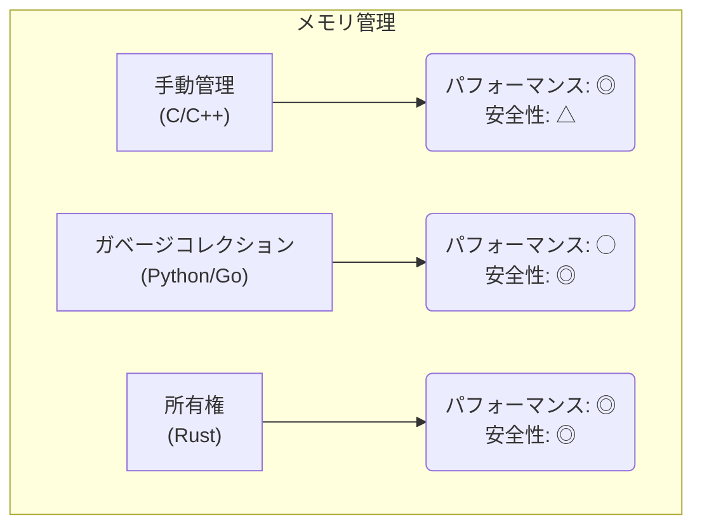
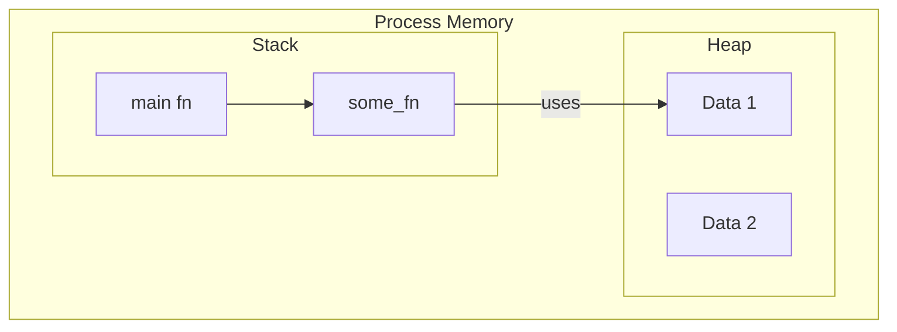

# 第 6 章：所有権の基本

## この章のゴール
- 所有権が、ガベージコレクションに代わる Rust のメモリ管理方法であることを説明できる。
- スタックとヒープの基本的な違いと、どのようなデータがどちらに置かれるかを理解する。
- 所有権の 3 つのルールを暗唱できる。
- `String` を使って所有権のムーブ (Move) を発生させ、コンパイラのエラーを読んで理解できる。
- `Copy` トレイトの役割と、なぜ `i32` などではムーブが起きないのかを説明できる。

---

## 6.1 なぜ所有権が必要なのか？

これまであなたが使ってきた Python や Go では、ガベージコレクタ (GC) がメモリ管理の大部分を自動的に行ってくれていました。GC は非常に便利ですが、実行時にどのメモリが不要になったかを判断するためのオーバーヘッドがあり、時にはプログラムの実行を一時停止 ("Stop the World") させてしまうこともあります。

C や C++ のような言語では、開発者が手動でメモリを確保 (`malloc`) し、解放 (`free`) する必要があります。これは最高のパフォーマンスを引き出せますが、解放漏れによるメモリリークや、解放済みのメモリにアクセスしてしまうダングリングポインタなど、深刻なバグの温床となってきました。

Rust は、これらとは全く異なる第 3 のアプローチを取ります。それが **所有権 (Ownership)** です。

所有権は、コンパイラがコンパイル時に一連のルールをチェックすることで、GC なしでメモリ安全性を保証する 仕組みです。実行時のオーバーヘッドなしに、C/C++ のような手動メモリ管理で発生しがちなバグをコンパイル段階で完全に排除します。



## 6.2 所有権の 3 つのルール

所有権システムの全体像は、以下の 3 つのシンプルなルールに基づいています。この章を終える頃には、このルールが実際にどう機能するかを体感的に理解できているはずです。

1.  Rust の各値は、**所有者 (Owner)** と呼ばれる変数を一つだけ持つ。
2.  一度に存在できる所有者は一人だけ。
3.  所有者がスコープから外れたら、値は破棄 (ドロップ) される。

## 6.3 メモリの舞台裏：スタックとヒープ

所有権を理解するには、まずプログラムがメモリをどのように利用するか、スタックとヒープの違いを知る必要があります。

- **スタック (Stack)**:
  - 関数の実行に必要なデータを積んでいく場所。高速にアクセスできる。
  - 積まれたデータは後入れ先出し (LIFO) で管理される。
  - 関数が終了すると、その関数で使われたデータは自動的に片付けられる。
  - **コンパイル時にサイズが確定している** データ (`i32`, `bool` など) が置かれる。

- **ヒープ (Heap)**:
  - プログラムの実行中に、必要に応じてデータを保存してもらう広大な場所。スタックよりはアクセスが少し遅い。
  - OS に「これくらいのサイズのメモリをください」とお願いして場所を確保し、その場所の住所 (ポインタ) を受け取る。
  - **コンパイル時にサイズがわからない、またはサイズが変わりうる**データ (`String` など) が置かれる。

所有権システムが主に管理するのは、この **ヒープ** 上のデータです。ヒープのデータを誰がいつ片付けるのか、という問題を解決するのが所有権の役割です。



## 6.4 所有権のムーブを体験する

それでは、所有権のルールが実際にどのように機能するか、`cargo new ownership` でプロジェクトを作って体験してみましょう。

### 試してみよう：`String` でエラーを起こす

ヒープにデータを格納する `String` 型は、所有権を学ぶ上で最も代表的な例です。`src/main.rs` に以下のコードを書いて `cargo run` してみましょう。

```rust
fn main() {
    let s1 = String::from("hello");
    let s2 = s1;

    // s1 はもう使えないはず...？
    println!("s1 is: {}", s1);
}
```
[Rust Playgroundで試す](https://play.rust-lang.org/?version=stable&mode=debug&edition=2021&code=fn%20main()%20%7B%0A%20%20%20%20let%20s1%20%3D%20String%3A%3Afrom(%22hello%22)%3B%0A%20%20%20%20let%20s2%20%3D%20s1%3B%0A%0A%20%20%20%20%2F%2F%20s1%20%E3%81%AF%E3%82%82%E3%81%86%E4%BD%BF%E3%81%88%E3%81%AA%E3%81%84%E3%81%AF%E3%81%9A...%EF%BC%9F%0A%20%20%20%20println!(%22s1%20is%3A%20%7B%7D%22%2C%20s1)%3B%0A%7D)

予想通り、これはコンパイルエラーになります。このエラーこそが、所有権システムの中核です。

```text
error[E0382]: borrow of moved value: `s1`
 --> src/main.rs:6:28
  |
2 |     let s1 = String::from("hello");
  |         -- move occurs because `s1` has type `String`, which does not implement the `Copy` trait
3 |     let s2 = s1;
  |              -- value moved here
...
6 |     println!("s1 is: {}", s1);
  |                            ^^ value borrowed here after move
```

`borrow of moved value: s1` (ムーブされた値 `s1` の借用) というエラーメッセージが出ています。詳しく見ていきましょう。

- `move occurs because s1 has type String`: `s1` の型である `String` でムーブが発生した、と書かれています。
- `let s2 = s1;`: この行で `value moved here` (値がここにムーブした) と示されています。
- `println!(...);`: そして、`value borrowed here after move` (ムーブ後にここで借用された) と、エラーの直接の原因を指摘しています。

### 何が起きたのか？：ムーブの図解

`let s2 = s1;` という行は、`s1` の値をコピーしているように見えますが、`String` 型の場合は挙動が異なります。

`String` 型のデータは、2つの部分から構成されています。
1.  **スタック上**: 文字列の実際のデータが保存されているヒープ上の場所 (ポインタ)、文字列の長さ (len)、ヒープに確保したメモリの容量 (capacity) が保存されています。
2.  **ヒープ上**: 文字列の実際のデータ (例: "hello") が保存されています。

`let s2 = s1;` を実行すると、スタック上のデータ (ポインタ、長さ、容量) だけが `s2` にコピーされます。ヒープ上の文字列データはコピーされません。

もしこの時点で `s1` と `s2` の両方が有効だとすると、両方が同じヒープ上のデータを指すことになります。そして、`s1` と `s2` がスコープを抜けるときに、両方が同じメモリを2回解放しようとしてしまい、メモリ破損などの深刻なバグを引き起こします (二重解放エラー)。

これを防ぐため、Rust は `let s2 = s1;` の後、`s1` はもはや有効ではないと見なします。これが **所有権のムーブ (Move)** です。`s1` の所有権が `s2` に「移動した」のです。

```mermaid
graph TD
    subgraph "Before Move: let s1 = String::from(\"hello\");"
        Stack1["Stack: s1<br>(ptr, len: 5, cap: 5)"] --> Heap1["Heap: \"hello\""];
    end
    subgraph "After Move: let s2 = s1;"
        Stack1_Moved["Stack: s1<br>INVALID"]
        Stack2["Stack: s2<br>(ptr, len: 5, cap: 5)"] --> Heap1;
    end
```

このムーブのおかげで、所有権のルール「一度に存在できる所有者は一人だけ」が守られ、二重解放の危険性がコンパイル時に完全に排除されるのです。

## 6.5 例外：スタックだけのデータと `Copy` トレイト

では、なぜ第3章で見た `i32` では、このようなムーブが起きなかったのでしょうか？

### 試してみよう：`i32` ではエラーにならない

`src/main.rs` を以下のように書き換えてみてください。

```rust
fn main() {
    let x = 5; // x は i32 型
    let y = x;

    // こちらは問題なく動作する！
    println!("x = {}, y = {}", x, y);
}
```
[Rust Playgroundで試す](https://play.rust-lang.org/?version=stable&mode=debug&edition=2021&code=fn%20main()%20%7B%0A%20%20%20%20let%20x%20%3D%205%3B%20%2F%2F%20x%20%E3%81%AF%20i32%20%E5%9E%8B%0A%20%20%20%20let%20y%20%3D%20x%3B%0A%0A%20%20%20%20%2F%2F%20%E3%81%93%E3%81%A1%E3%82%89%E3%81%AF%E5%95%8F%E9%A1%8C%E3%81%AA%E3%81%8F%E5%8B%95%E4%BD%9C%E3%81%99%E3%82%8B%EF%BC%81%0A%20%20%20%20println!(%22x%20%3D%20%7B%7D%2C%20y%20%3D%20%7B%7D%22%2C%20x%2C%20y)%3B%0A%7D)

これは問題なくコンパイルでき、`x = 5, y = 5` と表示されます。

この違いは、`i32` のような型が **`Copy` トレイト** を実装しているからです。`Copy` トレイトを持つ型は、代入時に所有権がムーブするのではなく、値が完全にビット単位で「コピー」されます。

`i32` のような数値は、ヒープ上のデータを指すポインタを持たず、その値のすべてがスタック上に存在します。そのため、コピーするコストが非常に安価であり、ムーブにする必要がないのです。

`Copy` トレイトを持つ主な型:
- `i32`, `u64` などの全ての整数型
- `f32`, `f64` などの浮動小数点数型
- `bool`
- `char`
- `Copy` トレイトを持つ型のみで構成されるタプル `(i32, bool)`

一般的に、ヒープにデータを確保する必要がある型 (例: `String`) や、何らかのリソースを管理する型は `Copy` トレイトを持ちません。

### 明示的なコピー：`clone()`

もし `String` のようなヒープデータを持つ型を本当に複製 (ディープコピー) したい場合は、`clone()` メソッドを明示的に呼び出す必要があります。

```rust
fn main() {
    let s1 = String::from("hello");
    let s2 = s1.clone();

    println!("s1 = {}, s2 = {}", s1, s2);
}
```
[Rust Playgroundで試す](https://play.rust-lang.org/?version=stable&mode=debug&edition=2021&code=fn%20main()%20%7B%0A%20%20%20%20let%20s1%20%3D%20String%3A%3Afrom(%22hello%22)%3B%0A%20%20%20%20let%20s2%20%3D%20s1.clone()%3B%0A%0A%20%20%20%20println!(%22s1%20%3D%20%7B%7D%2C%20s2%20%3D%20%7B%7D%22%2C%20s1%2C%20s2)%3B%0A%7D)
このコードは問題なく動作します。`s1.clone()` はヒープ上の `"hello"` というデータも複製し、全く新しい `String` を作成するため、`s1` と `s2` はそれぞれ別のデータを所有することになります。

## 6.6 関数と所有権

関数に値を渡したり、関数から値を返したりする際にも、所有権のルールは同じように適用されます。

- 関数に値を渡すことは、変数に代入するのと同じように、ムーブまたはコピーを引き起こします。
- 関数が値を返すとき、その所有権は呼び出し元の変数にムーブします。

### 試してみよう：関数による所有権の移動

```rust
fn main() {
    let s = String::from("hello");  // s がスコープに入る

    takes_ownership(s);             // s の値が関数にムーブされ...
                                    // ... この時点で s はもう有効ではない

    let x = 5;                      // x がスコープに入る

    makes_copy(x);                  // x は関数にコピーされるが、
                                    // i32 は Copy なので、この後も x を使える

} // ここで x がスコープを抜け、その後 s もスコープを抜ける。
  // s の値はムーブされているので、何も特別なことは起きない。

fn takes_ownership(some_string: String) { // some_string がスコープに入る
    println!("{}", some_string);
} // ここで some_string がスコープを抜け、`drop` が呼ばれる。
  // 後ろ盾のメモリも解放される。

fn makes_copy(some_integer: i32) { // some_integer がスコープに入る
    println!("{}", some_integer);
} // ここで some_integer がスコープを抜ける。何も特別なことは起きない。
```
[Rust Playgroundで試す](https://play.rust-lang.org/?version=stable&mode=debug&edition=2021&code=fn%20main()%20%7B%0A%20%20%20%20let%20s%20%3D%20String%3A%3Afrom(%22hello%22)%3B%20%20%2F%2F%20s%20%E3%81%8C%E3%82%B9%E3%82%B3%E3%83%BC%E3%83%97%E3%81%AB%E5%85%A5%E3%82%8B%0A%0A%20%20%20%20takes_ownership(s)%3B%20%20%20%20%20%20%20%20%20%20%20%20%20%2F%2F%20s%20%E3%81%AE%E5%80%A4%E3%81%8C%E9%96%A2%E6%95%B0%E3%81%AB%E3%83%A0%E3%83%BC%E3%83%96%E3%81%95%E3%82%8C...%0A%20%20%20%20%20%20%20%20%20%20%20%20%20%20%20%20%20%20%20%20%20%20%20%20%20%20%20%20%20%20%20%20%20%2F%2F%20...%20%E3%81%93%E3%81%AE%E6%99%82%E7%82%B9%E3%81%A7%20s%20%E3%81%AF%E3%82%82%E3%81%86%E6%9C%89%E5%8A%B9%E3%81%A7%E3%81%AF%E3%81%AA%E3%81%84%0A%0A%20%20%20%20let%20x%20%3D%205%3B%20%20%20%20%20%20%20%20%20%20%20%20%20%20%20%20%20%20%20%20%2F%2F%20x%20%E3%81%8C%E3%82%B9%E3%82%B3%E3%83%BC%E3%83%97%E3%81%AB%E5%85%A5%E3%82%8B%0A%0A%20%20%20%20makes_copy(x)%3B%20%20%20%20%20%20%20%20%20%20%20%20%20%20%20%20%20%2F%2F%20x%20%E3%81%AF%E9%96%A2%E6%95%B0%E3%81%AB%E3%82%B3%E3%83%94%E3%83%BC%E3%81%95%E3%82%8C%E3%82%8B%E3%81%8C%E3%80%81%0A%20%20%20%20%20%20%20%20%20%20%20%20%20%20%20%20%20%20%20%20%20%20%20%20%20%20%20%20%20%20%20%20%20%2F%2F%20i32%20%E3%81%AF%20Copy%20%E3%81%AA%E3%81%AE%E3%81%A7%E3%80%81%E3%81%93%E3%81%AE%E5%BE%8C%E3%82%82%20x%20%E3%82%92%E4%BD%BF%E3%81%88%E3%82%8B%0A%0A%7D%20%2F%2F%20%E3%81%93%E3%81%93%E3%81%A7%20x%20%E3%81%8C%E3%82%B9%E3%82%B3%E3%83%BC%E3%83%97%E3%82%92%E6%8A%9C%E3%81%91%E3%80%81%E3%81%9D%E3%81%AE%E5%BE%8C%20s%20%E3%82%82%E3%82%B9%E3%82%B3%E3%83%BC%E3%83%97%E3%82%92%E6%8A%9C%E3%81%91%E3%82%8B%E3%80%82%0A%20%20%2F%2F%20s%20%E3%81%AE%E5%80%A4%E3%81%AF%E3%83%A0%E3%83%BC%E3%83%96%E3%81%95%E3%82%8C%E3%81%A6%E3%81%84%E3%82%8B%E3%81%AE%E3%81%A7%E3%80%81%E4%BD%95%E3%82%82%E7%89%B9%E5%88%A5%E3%81%AA%E3%81%93%E3%81%A8%E3%81%AF%E8%B5%B7%E3%81%8D%E3%81%AA%E3%81%84%E3%80%82%0A%0Afn%20takes_ownership(some_string%3A%20String)%20%7B%20%2F%2F%20some_string%20%E3%81%8C%E3%82%B9%E3%82%B3%E3%83%BC%E3%83%97%E3%81%AB%E5%85%A5%E3%82%8B%0A%20%20%20%20println!(%22%7B%7D%22%2C%20some_string)%3B%0A%7D%20%2F%2F%20%E3%81%93%E3%81%93%E3%81%A7%20some_string%20%E3%81%8C%E3%82%B9%E3%82%B3%E3%83%BC%E3%83%97%E3%82%92%E6%8A%9C%E3%81%91%E3%80%81%60drop%60%20%E3%81%8C%E5%91%BC%E3%81%B0%E3%82%8C%E3%82%8B%E3%80%82%0A%20%20%2F%2F%20%E5%BE%8C%E3%82%8D%E7%9B%BE%E3%81%A6%E3%81%AE%E3%83%A1%E3%83%A2%E3%83%AA%E3%82%82%E8%A7%A3%E6%94%BE%E3%81%95%E3%82%8C%E3%82%8B%E3%80%82%0A%0Afn%20makes_copy(some_integer%3A%20i32)%20%7B%20%2F%2F%20some_integer%20%E3%81%8C%E3%82%B9%E3%82%B3%E3%83%BC%E3%83%97%E3%81%AB%E5%85%A5%E3%82%8B%0A%20%20%20%20println!(%22%7B%7D%22%2C%20some_integer)%3B%0A%7D%20%2F%2F%20%E3%81%93%E3%81%93%E3%81%A7%20some_integer%20%E3%81%8C%E3%82%B9%E3%82%B3%E3%83%BC%E3%83%97%E3%82%92%E6%8A%9C%E3%81%91%E3%82%8B%E3%80%82%E4%BD%95%E3%82%82%E7%89%B9%E5%88%A5%E3%81%AA%E3%81%93%E3%81%A8%E3%81%AF%E8%B5%B7%E3%81%8D%E3%81%AA%E3%81%84%E3%80%82)

`takes_ownership(s);` の後に `println!("{}", s);` を追加すると、先ほどと同じ `borrow of moved value` エラーが発生することを確かめてみてください。

## 6.7 まとめ

- ✓ 所有権は、GC なしでメモリ安全性を保証する Rust の革新的な仕組み。
- ✓ **3つのルール**: (1)各値に所有者が一人, (2)所有者は常に一人だけ, (3)所有者がスコープを抜けると値は破棄。
- ✓ ヒープにデータを持つ `String` のような型では、代入や関数呼び出しで所有権が **ムーブ** し、元の変数は無効になる。
- ✓ スタックのみで完結する `i32` のような単純な型は **`Copy` トレイト** を持ち、代入時に値がコピーされる。
- ✓ 所有権がムーブされた後に元の変数を使おうとすると、コンパイラが `borrow of moved value` エラーで教えてくれる。

---

所有権は Rust の最も難解な部分と言われますが、同時に最も強力な機能でもあります。この「ムーブ」という概念が、今後のエラーメッセージを理解する鍵となります。

次の章では、所有権をムーブさせずに、一時的に値を使わせてもらう「借用」という、もう一つの重要な概念について学びます。
