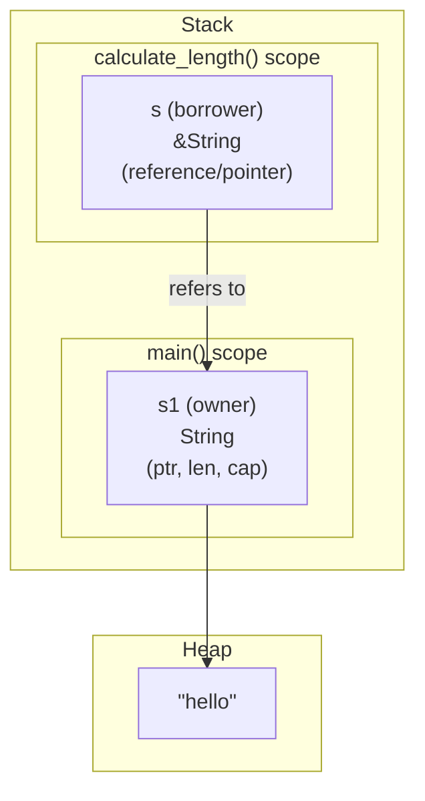
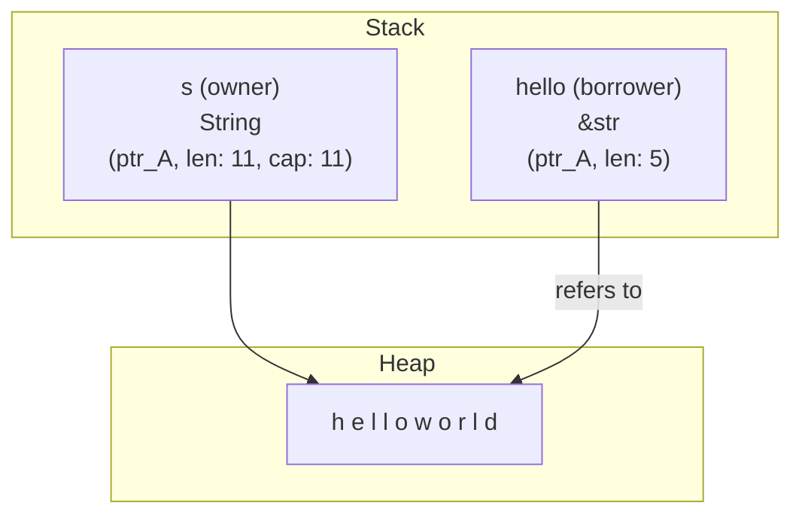

# 第 7 章：借用と参照

## この章のゴール
- 所有権をムーブさせずに関数にデータを渡す「借用」の必要性を説明できる。
- `&` を使って不変参照を、`&mut` を使って可変参照を作成できる。
- 「不変参照は複数 or 可変参照は一つだけ」というルールを、コンパイラのエラーを通して体験する。
- ダングリング参照がコンパイラによってどのように防止されるかを、エラーを通して体験する。
- スライス型 (`&[T]` や `&str`) を使って、コレクションの一部を安全に参照できる。

---

## 7.1 問題設定：所有権を渡さずに値を伝えたい

前の章で、関数に値を渡すと所有権がムーブすることを学びました。`cargo new borrowing` でプロジェクトを作り、前章のコードをもう一度見てみましょう。

```rust
// src/main.rs

fn main() {
    let s1 = String::from("hello");

    // calculate_length を呼び出すと、s1 の所有権がムーブする
    let len = calculate_lenth(s1);

    // この行のコメントを外すとコンパイルエラー！ s1はムーブ済み
    // println!("The length of '{}' is {}.", s1, len);
}

fn calculate_lenth(s: String) -> usize {
    s.len()
}
```
[Rust Playgroundで試す](https://play.rust-lang.org/?version=stable&mode=debug&edition=2021&code=//%20src/main.rs%0A%0Afn%20main%28%29%20%7B%0A%20%20%20%20let%20s1%20%3D%20String%3A%3Afrom%28%22hello%22%29%3B%0A%0A%20%20%20%20//%20calculate_length%20%E3%82%92%E5%91%BC%E3%81%B3%E5%87%BA%E3%81%99%E3%81%A8%E3%80%81s1%20%E3%81%AE%E6%89%80%E6%9C%89%E6%A8%A9%E3%81%8C%E3%83%A0%E3%83%BC%E3%83%96%E3%81%99%E3%82%8B%0A%20%20%20%20let%20len%20%3D%20calculate_lenth%28s1%29%3B%0A%0A%20%20%20%20//%20%E3%81%93%E3%81%AE%E8%A1%8C%E3%81%AE%E3%82%B3%E3%83%A1%E3%83%B3%E3%83%88%E3%82%92%E5%A4%96%E3%81%99%E3%81%A8%E3%82%B3%E3%83%B3%E3%83%91%E3%82%A4%E3%83%AB%E3%82%A8%E3%83%A9%E3%83%BC%EF%BC%81%20s1%E3%81%AF%E3%83%A0%E3%83%BC%E3%83%96%E6%B8%88%E3%81%BF%0A%20%20%20%20//%20println%21%28%22The%20length%20of%20%27%7B%7D%27%20is%20%7B%7D.%22%2C%20s1%2C%20len%29%3B%0A%7D%0A%0Afn%20calculate_lenth%28s%3A%20String%29%20-%3E%20usize%20%7B%0A%20%20%20%20s.len%28%29%0A%7D)
`s1` の長さを知りたいだけなのに、`calculate_length` 関数に所有権を丸ごと渡してしまい、`main` 関数ではもう `s1` が使えなくなってしまいました。

もちろん、以下のようにして所有権を返すこともできますが、値と所有権をタプルで返すのは、やりたいことに対して少し大げさで煩雑です。

```rust
// 煩雑な例
fn calculate_length(s: String) -> (String, usize) {
    let length = s.len();
    (s, length) // 所有権をタプルで返す
}
```
[Rust Playgroundで試す](https://play.rust-lang.org/?version=stable&mode=debug&edition=2021&code=//%20%E7%85%A9%E9%9B%91%E3%81%AA%E4%BE%8B%0Afn%20calculate_length%28s%3A%20String%29%20-%3E%20%28String%2C%20usize%29%20%7B%0A%20%20%20%20let%20length%20%3D%20s.len%28%29%3B%0A%20%20%20%20%28s%2C%20length%29%20//%20%E6%89%80%E6%9C%89%E6%A8%A9%E3%82%92%E3%82%BF%E3%83%97%E3%83%AB%E3%81%A7%E8%BF%94%E3%81%99%0A%7D)

もっと良い方法はないのでしょうか？あります。それが参照 (Reference) と借用 (Borrowing) です。

借用 とは、所有権をムーブさせることなく、値への参照 を渡すことです。参照とは、ある値が格納されているメモリアドレスを指すポインタのようなものですが、Rustのコンパイラによる安全保証が付いています。

## 7.2 参照で所有権の問題を解決する

`&` 演算子を使うことで、値への参照を作成できます。先ほどのコードを「借用」を使って書き換えてみましょう。

```rust
fn main() {
    let s1 = String::from("hello");

    // `&s1` で s1 への参照を作成し、関数に渡す
    // s1 の所有権はムーブしない！
    let len = calculate_length(&s1);

    // s1 はまだ有効なので、問題なく使える
    println!("The length of '{}' is {}.", s1, len);
}

// 関数の引数の型が `String` から `&String` に変わった
fn calculate_length(s: &String) -> usize { // s は String への参照
    s.len()
} // ここで s はスコープを抜けるが、所有権を持っていないので
  // s が参照する値は何も起きない
```
[Rust Playgroundで試す](https://play.rust-lang.org/?version=stable&mode=debug&edition=2021&code=fn%20main%28%29%20%7B%0A%20%20%20%20let%20s1%20%3D%20String%3A%3Afrom%28%22hello%22%29%3B%0A%0A%20%20%20%20//%20%60%26s1%60%20%E3%81%A7%20s1%20%E3%81%B8%E3%81%AE%E5%8F%82%E7%85%A7%E3%82%92%E4%BD%9C%E6%88%90%E3%81%97%E3%80%81%E9%96%A2%E6%95%B0%E3%81%AB%E6%B8%A1%E3%81%99%0A%20%20%20%20//%20s1%20%E3%81%AE%E6%89%80%E6%9C%89%E6%A8%A9%E3%81%AF%E3%83%A0%E3%83%BC%E3%83%96%E3%81%97%E3%81%AA%E3%81%84%EF%BC%81%0A%20%20%20%20let%20len%20%3D%20calculate_length%28%26s1%29%3B%0A%0A%20%20%20%20//%20s1%20%E3%81%AF%E3%81%BE%E3%81%A0%E6%9C%89%E5%8A%B9%E3%81%AA%E3%81%AE%E3%81%A7%E3%80%81%E5%95%8F%E9%A1%8C%E3%81%AA%E3%81%8F%E4%BD%BF%E3%81%88%E3%82%8B%0A%20%20%20%20println%21%28%22The%20length%20of%20%27%7B%7D%27%20is%20%7B%7D.%22%2C%20s1%2C%20len%29%3B%0A%7D%0A%0A//%20%E9%96%A2%E6%95%B0%E3%81%AE%E5%BC%95%E6%95%B0%E3%81%AE%E5%9E%8B%E3%81%8C%20%60String%60%20%E3%81%8B%E3%82%89%20%60%26String%60%20%E3%81%AB%E5%A4%89%E3%82%8F%E3%81%A3%E3%81%9F%0Afn%20calculate_length%28s%3A%20%26String%29%20-%3E%20usize%20%7B%20//%20s%20%E3%81%AF%20String%20%E3%81%B8%E3%81%AE%E5%8F%82%E7%85%A7%0A%20%20%20%20s.len%28%29%0A%7D%20//%20%E3%81%93%E3%81%93%E3%81%A7%20s%20%E3%81%AF%E3%82%B9%E3%82%B3%E3%83%BC%E3%83%97%E3%82%92%E6%8A%9C%E3%81%91%E3%82%8B%E3%81%8C%E3%80%81%E6%89%80%E6%9C%89%E6%A8%A9%E3%82%92%E6%8C%81%E3%81%A3%E3%81%A6%E3%81%84%E3%81%AA%E3%81%84%E3%81%AE%E3%81%A7%0A%20%20//%20s%20%E3%81%8C%E5%8F%82%E7%85%A7%E3%81%99%E3%82%8B%E5%80%A4%E3%81%AF%E4%BD%95%E3%82%82%E8%B5%B7%E3%81%8D%E3%81%AA%E3%81%84)
`&s1` という構文で、`s1` の値そのものではなく、`s1` を指す参照を作成しています。`calculate_length` 関数の引数 `s` は `&String` 型となり、`s1` の値を「借用」している状態になります。関数が終了すると参照は無効になりますが、所有者である `s1` には何の影響もありません。

この関係性を図で見てみましょう。



`calculate_length` 関数のスコープにある `s` は、`s1` が所有するヒープデータを直接指すのではなく、`s1` 自体を指す参照となっています。`s` はデータを「借りて」いるだけで、所有はしていないため、`calculate_length` が終わって `s` がスコープを抜けても、`s1` とそのデータは影響を受けません。

## 7.3 借用のルールをエラーで学ぶ

借用は非常に便利ですが、安全性を保証するためにコンパイラが厳密にチェックする2つの重要なルール（通称：貸し出しルール）があります。これは、C/C++で頻発したデータ競合（複数のポインタが同じデータにアクセスし、少なくとも一つが書き込みを行うことで発生するバグ）を防ぐためのものです。

ルールは以下の通りです。
- ルールA: 不変の参照 (`&T`) は、一度に複数持つことができる。
- ルールB: 可変の参照 (`&mut T`) は、一度に一つしか持つことができない。
- ルールC: 可変の参照を持っている間は、不変の参照を持つこともできない。

言葉で聞いてもピンとこないかもしれません。これもエラーを通して体験してみましょう。

### 試してみよう：可変の参照を2つ作ってみる

データを変更できる参照を 可変参照 (mutable reference) といい、`&mut` を使って作成します。

```rust
fn main() {
    let mut s = String::from("hello");

    let r1 = &mut s;
    let r2 = &mut s; // 2つ目の可変参照を作ろうとすると...？

    println!("{}, {}", r1, r2);
}
```
[Rust Playgroundで試す](https://play.rust-lang.org/?version=stable&mode=debug&edition=2021&code=fn%20main%28%29%20%7B%0A%20%20%20%20let%20mut%20s%20%3D%20String%3A%3Afrom%28%22hello%22%29%3B%0A%0A%20%20%20%20let%20r1%20%3D%20%26mut%20s%3B%0A%20%20%20%20let%20r2%20%3D%20%26mut%20s%3B%20//%202%E3%81%A4%E7%9B%AE%E3%81%AE%E5%8F%AF%E5%A4%89%E5%8F%82%E7%85%A7%E3%82%92%E4%BD%9C%E3%82%8D%E3%81%86%E3%81%A8...%EF%BC%9F%0A%0A%20%20%20%20println%21%28%22%7B%7D%2C%20%7B%7D%22%2C%20r1%2C%20r2%29%3B%0A%7D)

これを `cargo run` すると、コンパイラに怒られます。

```text
error[E0499]: cannot borrow `s` as mutable more than once at a time
 --> src/main.rs:5:14
  |
4 |     let r1 = &mut s;
  |              ------ first mutable borrow occurs here
5 |     let r2 = &mut s;
  |              ^^^^^^ second mutable borrow occurs here
6 |
7 |     println!("{}, {}", r1, r2);
  |                        -- first borrow later used here
```
`cannot borrow s as mutable more than once at a time` (一度に`s`を複数回可変として借用することはできません)という、非常に分かりやすいエラーです。これにより、二つの参照が同時にデータを変更しようとして競合する、という危険な状況を未然に防いでいます。

### 試してみよう：可変と不変の参照を混ぜてみる

では、可変参照があるときに、不変参照を作ろうとするとどうなるでしょうか。

```rust
fn main() {
    let mut s = String::from("hello");

    let r1 = &s; // 不変の参照
    let r2 = &s; // これもOK
    let r3 = &mut s; // 可変の参照

    println!("{}, {}, and {}", r1, r2, r3);
}
```
[Rust Playgroundで試す](https://play.rust-lang.org/?version=stable&mode=debug&edition=2021&code=fn%20main%28%29%20%7B%0A%20%20%20%20let%20mut%20s%20%3D%20String%3A%3Afrom%28%22hello%22%29%3B%0A%0A%20%20%20%20let%20r1%20%3D%20%26s%3B%20//%20%E4%B8%8D%E5%A4%89%E3%81%AE%E5%8F%82%E7%85%A7%0A%20%20%20%20let%20r2%20%3D%20%26s%3B%20//%20%E3%81%93%E3%82%8C%E3%82%82OK%0A%20%20%20%20let%20r3%20%3D%20%26mut%20s%3B%20//%20%E5%8F%AF%E5%A4%89%E3%81%AE%E5%8F%82%E7%85%A7%0A%0A%20%20%20%20println%21%28%22%7B%7D%2C%20%7B%7D%2C%20and%20%7B%7D%22%2C%20r1%2C%20r2%2C%20r3%29%3B%0A%7D)

これもコンパイルエラーになります。

```text
error[E0502]: cannot borrow `s` as mutable because it is also borrowed as immutable
 --> src/main.rs:6:14
  |
4 |     let r1 = &s;
  |              -- immutable borrow occurs here
...
6 |     let r3 = &mut s;
  |              ^^^^^^ mutable borrow occurs here
7 |
8 |     println!("{}, {}, and {}", r1, r2, r3);
  |                                -- immutable borrow later used here
```

誰かがデータを読んでいる最中（不変参照が存在する間）に、別の誰かがデータを書き換えてしまう（可変参照を作る）と、矛盾した状態が生まれる可能性があります。Rustのコンパイラは、この危険性も完全にブロックしてくれるのです。

## 7.4 ダングリング参照の防止

ダングリング参照とは、あるデータが解放された後も、そのメモリ位置を指し続けてしまう無効なポインタ (参照) のことです。Rustのコンパイラ (特にボローチェッカー) は、これもコンパイル時に防いでくれます。

### C言語では何が問題だったのか？

Python や Go のようにガベージコレクタ (GC) を持つ言語では、メモリが解放された後もその場所を指し続ける、という問題は基本的に起こりません。GC が、まだ使われている可能性のあるデータを誤って解放することがないためです。

しかし、C や C++ のように手動でメモリを管理する言語では、これは「ダングリングポインタ」として知られる、非常に危険なバグの原因となってきました。

例えば、以下のような C のコードを考えてみましょう。各 `printf` の後に `fflush(stdout)` を追加しているのは、プログラムがクラッシュする直前の出力まで確実に行うためのおまじないです。

```c
#include <stdio.h>
#include <stdlib.h> // fflush のために追加

int* dangle() {
    int x = 123;
    printf("Inside dangle(): Address of x = %p\n", (void*)&x);
    fflush(stdout); // 出力バッファを強制的にフラッシュ
    return &x; // x のメモリアドレスを返す
} // 関数が終わると x は破棄され、このメモリ領域は無効になる

int main() {
    int* ptr = dangle();
    printf("Inside main(): Pointer ptr = %p\n", (void*)ptr);
    fflush(stdout);

    // ptr が指すメモリは既に無効！
    printf("Dereferencing dangling pointer: *ptr = %d\n", *ptr);
    fflush(stdout);

    printf("\nAttempting to WRITE to the dangling pointer...\n");
    fflush(stdout);
    *ptr = 789; // 無効なメモリへの書き込み！ここでクラッシュする可能性が高い
    printf("Value after write attempt: *ptr = %d\n", *ptr); // この行は実行されないかもしれない
    fflush(stdout);

    return 0;
}
```

#### 試してみよう：Dockerで「痛み」を体験する

最近のコンパイラやOSは非常に賢くなっており、単純に危険なコードを実行しようとしても、安全のために挙動が変更されてしまい、「痛み」を体験しにくいことがあります。

そこで、Dockerコンテナの中で対話的にシェルを起動し、自分たちの手でCコードをコンパイル・実行することで、何が起きているのかをより詳しく見ていきましょう。

##### 1. Dockerコンテナを起動する

まず、以下のコマンドを実行して、C言語のコンパイラ (`gcc`) がインストールされたコンテナを起動し、その中のシェル (`bash`) を操作できるようにします。

```bash
docker run -it --rm gcc:9 bash
```
* `-it` は、対話的にシェルを操作するためのオプションです。
* `--rm` は、コンテナを終了したときに自動的に削除するためのオプションです。
* `gcc:9` は、使用するイメージ（少し前のバージョンのGCC）です。
* `bash` は、コンテナ内で起動するコマンドです。

コマンドを実行すると、`root@<コンテナID>:/#` のようなプロンプトが表示され、コンテナの中に入ったことがわかります。

##### 2. Cソースファイルを作成する

次に、コンテナの中で `dangle.c` ファイルを作成します。`cat` コマンドを使うと、ターミナルから直接ファイルに書き込めて便利です。

以下の `cat << 'EOF' > dangle.c` から `EOF` までのブロック全体をコピーして、ターミナルに貼り付けてEnterキーを押してください。

```bash
cat << 'EOF' > dangle.c
#include <stdio.h>
#include <stdlib.h>

int* dangle() {
    int x = 123;
    printf("Inside dangle(): Address of x = %p\n", (void*)&x);
    return &x;
}

int main() {
    int* ptr = dangle();
    printf("Inside main(): Pointer ptr = %p\n", (void*)ptr);

    // ptrが指すメモリは無効になっているはず
    printf("Dereferencing dangling pointer: *ptr = %d\n", *ptr);

    return 0;
}
EOF
```

`ls` コマンドを実行して `dangle.c` ファイルが作成されていることを確認しましょう。

##### 3. コンパイルして実行する

いよいよCコードをコンパイルし、実行します。最適化を無効にする `-O0` フラグを付けてコンパイルしてみましょう。

```bash
# コンパイル (-O0 で最適化を無効化, -Wallで警告を有効化)
gcc -O0 -o dangle dangle.c -Wall
```

コンパイルすると、GCCは賢明にも「ローカル変数のアドレスを返している」という危険性を検知し、警告を出力します。

```text
dangle.c: In function 'dangle':
dangle.c:7:12: warning: function returns address of local variable [-Wreturn-local-addr]
    7 |     return &x;
      |            ^~
```
この警告こそが、まさにダングリングポインタの危険性そのものです。しかし、C言語ではこれはエラーではなく、あくまで警告なので実行ファイルは作成されてしまいます。

では、実行してみましょう。

```bash
# 実行
./dangle
```

これを実行すると、今度こそ以下のような出力と共に `Segmentation fault` が発生するはずです。

```text
Inside dangle(): Address of x = 0x7ffee1f9b31c
Inside main(): Pointer ptr = (nil)
Segmentation fault
```

この結果は非常に興味深いものです。
1. `dangle`関数の中では`x`のアドレスが存在しましたが、それを返そうとしていることをコンパイラが検知しました。
2. コンパイラは危険を回避するためか、`main`関数には実際のアドレスではなく `(nil)` (ヌルポインタ) を返しました。
3. `main`関数は、そのヌルポインタにアクセスしようとした (`*ptr`) ため、OSによってプログラムが強制終了させられました。

結局、コンパイラが警告し、よしなに解釈しようと試みたにもかかわらず、プログラムはクラッシュしてしまいました。これこそが「未定義動作」の怖さであり、ダングリングポインタの危険性です。

この体験を通して、Rustのコンパイラがコンパイル時にこの危険を警告ではなくエラーとして完全に防いでくれることの価値を、より深く理解できたのではないでしょうか。

コンテナから抜けるには `exit` と入力してください。

Rust は、この種のバグをコンパイル時に完全に排除します。ボローチェッカーが、すべての参照が常に有効なデータを指していることを保証してくれるのです。では、Rust で同じことをしようとするとどうなるか、見てみましょう。

### 試してみよう：宙ぶらりんの参照を作ってみる

```rust
fn main() {
    let reference_to_nothing = dangle();
}

fn dangle() -> &String { // dangle は String への参照を返そうとする
    let s = String::from("hello"); // s は dangle 関数の中で作られる

    &s // s への参照を返すが...
} // ...ここで s はスコープを抜け、メモリが解放される！
```
[Rust Playgroundで試す](https://play.rust-lang.org/?version=stable&mode=debug&edition=2021&code=fn%20main%28%29%20%7B%0A%20%20%20%20let%20reference_to_nothing%20%3D%20dangle%28%29%3B%0A%7D%0A%0Afn%20dangle%28%29%20-%3E%20%26String%20%7B%20//%20dangle%20%E3%81%AF%20String%20%E3%81%B8%E3%81%AE%E5%8F%82%E7%85%A7%E3%82%92%E8%BF%94%E3%81%9D%E3%81%86%E3%81%A8%E3%81%99%E3%82%8B%0A%20%20%20%20let%20s%20%3D%20String%3A%3Afrom%28%22hello%22%29%3B%20//%20s%20%E3%81%AF%20dangle%20%E9%96%A2%E6%95%B0%E3%81%AE%E4%B8%AD%E3%81%A7%E4%BD%9C%E3%82%89%E3%82%8C%E3%82%8B%0A%0A%20%20%20%20%26s%20//%20s%20%E3%81%B8%E3%81%AE%E5%8F%82%E7%85%A7%E3%82%92%E8%BF%94%E3%81%99%E3%81%8C...%0A%7D%20//%20...%E3%81%93%E3%81%93%E3%81%A7%20s%20%E3%81%AF%E3%82%B9%E3%82%B3%E3%83%BC%E3%83%97%E3%82%92%E6%8A%9C%E3%81%91%E3%80%81%E3%83%A1%E3%83%A2%E3%83%AA%E3%81%8C%E8%A7%A3%E6%94%BE%E3%81%95%E3%82%8C%E3%82%8B%EF%BC%81)
`dangle` 関数が終了する時点で `s` の所有権は破棄され、ヒープ上のデータは解放されます。そのため、返されようとしている `&s` が指す先は無効になります。コンパイラはこの危険な状況を検知し、コンパイルを中断します。

```text
error[E0106]: missing lifetime specifier
 --> src/main.rs:5:16
  |
5 | fn dangle() -> &String {
  |                ^ expected named lifetime parameter
...
```
このエラーメッセージ（`missing lifetime specifier`）は、次の章で学ぶ「ライフタイム」という概念に繋がっていきます。今は、「Rustコンパイラが、無効になりうる参照をうまく検知してくれている」と理解しておけば十分です。

## 7.5 スライス型：コレクションの一部分への参照

スライスは、コレクション全体ではなく、その一部分を安全に参照するための型です。所有権は持たず、コレクションの一部を指す「窓」や「覗き穴」のようなものだと考えてください。

### 文字列スライス (`&str`)

最もよく使われるスライスが、`String` の一部分を指す文字列スライス で、型は `&str` と書きます。

実は、これまで何気なく使ってきた文字列リテラル (`"hello"`) の型は、この `&str` です。

では、`String` から文字列スライスをどうやって作るのか見てみましょう。

```rust
fn main() {
    let s = String::from("hello world");

    // [開始インデックス..終了インデックス] という形式で一部分を切り出す
    let hello = &s[0..5];
    let world = &s[6..11];

    // s の所有権は移動していないので、s もスライスも両方使える
    println!("元の文字列: {}", s);
    println!("スライス1: {}", hello);
    println!("スライス2: {}", world);
}
```
[Rust Playgroundで試す](https://play.rust-lang.org/?version=stable&mode=debug&edition=2021&code=fn%20main%28%29%20%7B%0A%20%20%20%20let%20s%20%3D%20String%3A%3Afrom%28%22hello%20world%22%29%3B%0A%0A%20%20%20%20%2F%2F%20%5B%E9%96%8B%E5%A7%8B%E3%82%A4%E3%83%B3%E3%83%87%E3%83%83%E3%82%AF%E3%82%B9..%E7%B5%82%E4%BA%86%E3%82%A4%E3%83%B3%E3%83%87%E3%83%83%E3%82%AF%E3%82%B9%5D%20%E3%81%A8%E3%81%84%E3%81%86%E5%BD%A2%E5%BC%8F%E3%81%A7%E4%B8%80%E9%83%A8%E5%88%86%E3%82%92%E5%88%87%E3%82%8A%E5%87%BA%E3%81%99%0A%20%20%20%20let%20hello%20%3D%20%26s%5B0..5%5D%3B%0A%20%20%20%20let%20world%20%3D%20%26s%5B6..11%5D%3B%0A%0A%20%20%20%20%2F%2F%20s%20%E3%81%AE%E6%89%80%E6%9C%89%E6%A8%A9%E3%81%AF%E7%A7%BB%E5%8B%95%E3%81%97%E3%81%A6%E3%81%84%E3%81%AA%E3%81%84%E3%81%AE%E3%81%A7%E3%80%81s%20%E3%82%82%E3%82%B9%E3%83%A9%E3%82%A4%E3%82%B9%E3%82%82%E4%B8%A1%E6%96%B9%E4%BD%BF%E3%81%88%E3%82%8B%0A%20%20%20%20println%21%28%22%E5%85%83%E3%81%AE%E6%96%87%E5%AD%97%E5%88%97%3A%20%7B%7D%22%2C%20s%29%3B%0A%20%20%20%20println%21%28%22%E3%82%B9%E3%83%A9%E3%82%A4%E3%82%B91%3A%20%7B%7D%22%2C%20hello%29%3B%0A%20%20%20%20println%21%28%22%E3%82%B9%E3%83%A9%E3%82%A4%E3%82%B92%3A%20%7B%7D%22%2C%20world%29%3B%0A%7D)

`&s[0..5]` のように、`&` と範囲 `[start..end]` を指定することで、`s` の一部を指すスライスを作成できます。この操作は所有権を移動させません。

スライスの実体は、元のデータを指すポインタとその長さを保持する、非常に軽量なデータ構造です。



### スライスの安全性

スライスがただの部分的なポインタだとすると、元のデータが変更された場合に危険な状況が生まれそうです。しかし、Rust の借用ルールがそれを防ぎます。

文字列スライスは不変の参照 (`&`) なので、有効なスライスが存在する間、元の `String` を変更（可変参照 `&mut` を取得）することはできません。

```rust
fn main() {
    let mut s = String::from("hello world");

    let hello = &s[0..5]; // s への不変の借用が発生

    // s.clear(); // ❌ コンパイルエラー！ 不変の借用がある間は変更できない

    println!("slice = {}", hello);
}
```

このおかげで、スライスがいつの間にか無効なデータを指してしまう、といったバグをコンパイル時に完全に防ぐことができます。

### その他のスライス
配列の一部を指す `&[i32]` など、他のコレクションに対してもスライスを作成できます。

```rust
let a = [1, 2, 3, 4, 5];
let slice = &a[1..3]; // [2, 3] を指すスライス
```

## 7.6 まとめ

- ✓ 借用 とは、所有権をムーブせずに、`&` を使って値への 参照 を渡すこと。
- ✓ 参照には 不変参照 (`&T`) と 可変参照 (`&mut T`) の 2 種類がある。
- ✓ 貸し出しルールをコンパイラが強制する:
  1. 不変参照は複数存在できる。
  2. 可変参照は一つしか存在できず、その間は他のいかなる参照も存在できない。
- ✓ コンパイラは、無効なメモリを指す ダングリング参照 をコンパイル時に防ぐ。
- ✓ スライス (`&str`, `&[T]`) は、コレクションの一部分への安全なビューを提供する。

---

借用は、所有権システムの厳しさを和らげ、効率的なプログラムを書くための重要な仕組みです。この「貸し出しルール」に慣れることが、Rustコードをスムーズに書くための次のステップです。

次の章では、コンパイラが参照の有効性をどのように判断しているのか、その裏側にある「ライフタイム」という概念について探求します。
