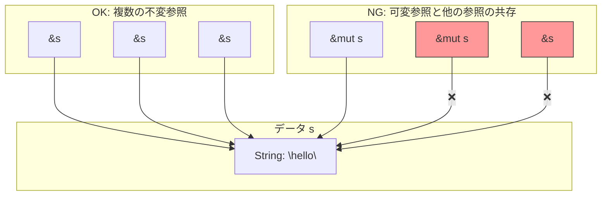

# 第 7 章：借用と参照

## この章のゴール
- 所有権をムーブさせずに関数にデータを渡す「借用」の必要性を説明できる。
- `&` を使って不変参照を、`&mut` を使って可変参照を作成できる。
- 借用の 2 つのルール (貸し出しルール) を説明できる。
- 参照が無効になる「ダングリング参照」が、Rust のコンパイラによってどのように防止されるかを理解する。
- スライス型 (`&[T]` や `&str`) を使って、コレクションの一部を安全に参照できる。

---

## 7.1 なぜ「借用」が必要なのか？

前の章で、所有権は関数呼び出しにおいてもムーブすることを学びました。

```rust
fn main() {
    let s1 = String::from("hello");

    // calculate_length を呼び出すと、s1 の所有権がムーブする
    let len = calculate_length(s1);

    println!("The length of '{}' is {}.", s1, len); // ❌ コンパイルエラー！s1 はムーブ済み
}

fn calculate_length(s: String) -> usize {
    s.len()
}
```

このコードでは、`s1` の長さを知りたいだけなのに、`calculate_length` 関数に所有権を渡してしまい、`main` 関数ではもう `s1` が使えなくなってしまいました。

これを解決するために、関数が所有権を返すようにすることもできますが、非常に煩雑です。

```rust
// 煩雑な例
fn calculate_length(s: String) -> (String, usize) {
    let length = s.len();
    return (s, length); // 所有権をタプルで返す
}
```

もっと良い方法はないのでしょうか？あります。それが 参照 (Reference) と借用 (Borrowing) です。

借用 とは、所有権をムーブさせることなく、値への 参照 を渡すことです。参照とは、ある値が格納されているメモリアドレスを指すポインタのようなものですが、Rust のコンパイラによる安全保証が付いています。

## 7.2 参照の作成と利用

参照を作成するには、`&` 演算子を使います。

```rust
fn main() {
    let s1 = String::from("hello");

    // `&s1` で s1 への参照を作成し、関数に渡す
    // s1 の所有権はムーブしない
    let len = calculate_length(&s1);

    // s1 はまだ有効なので、問題なく使える
    println!("The length of '{}' is {}.", s1, len);
}

// 引数の型が `&String` になっている
fn calculate_length(s: &String) -> usize {
    s.len()
}
```

`&s1` という構文で、`s1` の値そのものではなく、`s1` を指す参照を作成しています。`calculate_length` 関数の引数 `s` は `&String` 型となり、`s1` の値を「借用」している状態になります。

関数が終了すると、参照は無効になりますが、所有者である `s1` には何の影響もありません。

## 7.3 借用のルール：不変参照と可変参照

借用には、コンパイラが厳密にチェックする 2 つの重要なルールがあります。これは、C/C++ で頻発したデータ競合 (複数のポインタが同じデータにアクセスし、少なくとも一つが書き込みを行うことで発生するバグ) を防ぐためのものです。

### ルール 1：複数の不変参照 (`&T`) は OK
同じデータを指す **不変参照 (immutable reference)** は、いくつでも同時に存在できます。データを読み取るだけなので、競合は発生せず安全です。

```rust
fn main() {
    let s = String::from("hello");

    let r1 = &s; // OK
    let r2 = &s; // OK

    println!("{} and {}", r1, r2);
}
```

### ルール 2：可変参照 (`&mut T`) は一つだけ
データを変更できる **可変参照 (mutable reference)** は、そのスコープ内で **ただ一つしか存在できません**。また、可変参照が存在する間は、**不変参照も存在できません**。

```rust
fn main() {
    let mut s = String::from("hello");

    let r1 = &mut s; // OK

    // let r2 = &mut s; // ❌ コンパイルエラー！
    // let r3 = &s;     // ❌ コンパイルエラー！

    println!("{}", r1);
}
```

このルールにより、コンパイル時にデータ競合の可能性を 100% 排除できます。



## 7.4 ダングリング参照の防止

ダングリング参照とは、あるデータが解放された後も、そのメモリ位置を指し続けてしまう無効なポインタ (参照) のことです。Rust のコンパイラ (特にボローチェッカー) は、これもコンパイル時に防いでくれます。

```rust
// このコードはコンパイルできない！
fn main() {
    let reference_to_nothing = dangle();
}

fn dangle() -> &String { // dangle は String への参照を返そうとする
    let s = String::from("hello"); // s は dangle 関数の中で作られる

    &s // s への参照を返すが...
} // ...ここで s はスコープを抜け、メモリが解放される！
```

`dangle` 関数が終了する時点で `s` のメモリは解放されるため、`&s` が指す先は無効になります。コンパイラはこの状況を検知し、「この関数は借用された値を返しますが、値は関数内でドロップされます」というエラーを出してコンパイルを中断します。

## 7.5 スライス型：所有権のないビュー

スライスは、コレクション全体ではなく、その一部分への参照を可能にする型です。所有権は持たず、データへのビュー (眺め) として機能します。

### 文字列スライス (`&str`)
`String` の一部分を指す参照です。文字列リテラル (`"hello world"`) は、実は文字列スライスです。

```rust
fn first_word(s: &String) -> &str {
    let bytes = s.as_bytes();

    for (i, &item) in bytes.iter().enumerate() {
        if item == b' ' {
            return &s[0..i]; // 文字列スライスを返す
        }
    }

    &s[..] // 文字列スライスを返す
}
```

文字列スライスは不変参照なので、スライスが存在する間は元の `String` を変更することはできません。これにより、スライスが指すデータが意図せず変更されて無効になることを防ぎます。

### その他のスライス
配列の一部を指す `&[i32]` など、他のコレクションに対してもスライスを作成できます。

## 7.6 まとめ

- ✓ 借用 とは、所有権をムーブせずに、`&` を使って値への 参照 を渡すこと。
- ✓ 参照には 不変参照 (`&T`) と 可変参照 (`&mut T`) の 2 種類がある。
- ✓ 貸し出しルール:
  1. 不変参照は複数存在できる。
  2. 可変参照は一つしか存在できず、その間は他のいかなる参照も存在できない。
- ✓ コンパイラは、無効なメモリを指す ダングリング参照 をコンパイル時に防ぐ。
- ✓ スライス (`&str`, `&[T]`) は、コレクションの一部分への安全なビューを提供する。

---

借用は、所有権システムの厳しさを和らげ、効率的なプログラムを書くための重要な仕組みです。この「貸し出しルール」に慣れることが、Rust コードをスムーズに書くための次のステップです。

次の章では、コンパイラが参照の有効性をどのように判断しているのか、その裏側にある「ライフタイム」という概念について探求します。
