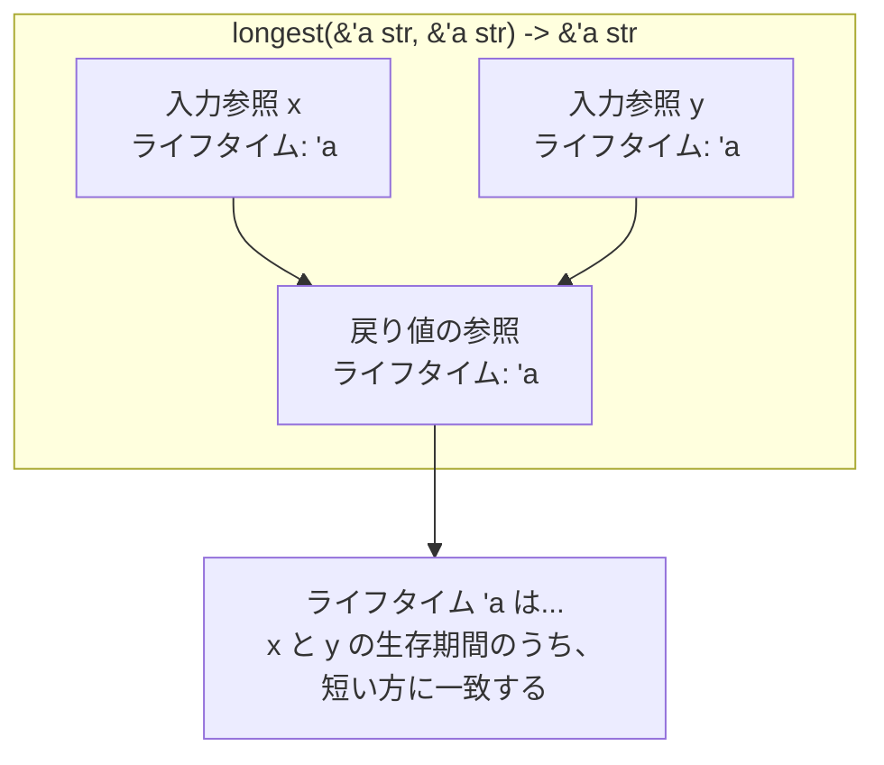

# 第 8 章：ライフタイム

## この章のゴール
- ライフタイムが、ダングリング参照を防ぐためにコンパイラが参照を検証する仕組みであることを説明できる。
- 複数の参照を扱う関数で発生するライフタイムエラーを、実際にコードを書いて体験する。
- ライフタイムアノテーション (`'a` など) を使って、コンパイラに参照の有効期間のヒントを与え、エラーを解決できる。
- ライフタイム省略規則の存在を知り、なぜ多くの関数でアノテーションが不要なのかを理解する。
- `'static` ライフタイムが何を意味するかを説明できる。

---

## 8.1 問題設定：コンパイラは未来をどう予測するのか？

前の章の最後で、コンパイラがダングリング参照（無効なメモリを指す参照）を見事に防いでくれるのを見ました。`cargo new lifetimes` でプロジェクトを作り、あのコードをもう一度見てみましょう。

```rust
// src/main.rs

fn main() {
    let reference_to_nothing = dangle();
}

fn dangle() -> &String {
    let s = String::from("hello");
    &s
} // `s` はここでスコープを抜け、破棄(drop)される
```
[Rust Playgroundで試す](https://play.rust-lang.org/?version=stable&mode=debug&edition=2021&code=//%20src/main.rs%0A%0Afn%20main%28%29%20%7B%0A%20%20%20%20let%20reference_to_nothing%20%3D%20dangle%28%29%3B%0A%7D%0A%0Afn%20dangle%28%29%20-%3E%20%26String%20%7B%0A%20%20%20%20let%20s%20%3D%20String%3A%3Afrom%28%22hello%22%29%3B%0A%20%20%20%20%26s%0A%7D%20//%20%60s%60%20%E3%81%AF%E3%81%93%E3%81%93%E3%81%A7%E3%82%B9%E3%82%B3%E3%83%BC%E3%83%97%E3%82%92%E6%8A%9C%E3%81%91%E3%80%81%E7%A0%B4%E6%A3%84%28drop%29%E3%81%95%E3%82%8C%E3%82%8B)

このコードに対して、コンパイラは `missing lifetime specifier` というエラーを出しました。これは「ライフタイム指定子が見つかりません」という意味です。

ここで疑問が湧きます。コンパイラは、なぜ `dangle` 関数の返り値 `&s` が危険だと判断できたのでしょうか？関数の中の `s` が関数の終わりでスコープを抜けることを、どうやって知っていたのでしょうか？

その答えが **ライフタイム (Lifetime)** です。

ライフタイムとは、参照が有効である **スコープ (生存期間)** のことです。ライフタイムは、プログラムの実行時間を長くしたり短くしたりするものではありません。むしろ、**ボローチェッカー (Borrow Checker)** というコンパイラの一部が、参照の有効範囲を分析し、すべての借用が有効であることを検証するための「目印」のようなものです。

ほとんどの場合、ライフタイムは暗黙的にコンパイラによって推論されます。しかし、複数の参照が絡み合い、コンパイラだけでは関係性が判断できない曖昧な状況では、私たちがコンパイラを手助けするために、明示的にライフタイムを注釈 (アノテーション) する必要があります。

## 8.2 ライフタイムエラーを体験する

ライフタイムアノテーションが必要になる最も一般的なケースは、複数の参照を入力として受け取り、そのうちの一つの参照を返す関数です。

### 試してみよう：コンパイラを困らせてみる

二つの文字列スライスを受け取り、長い方を返す `longest` 関数を書いてみましょう。

```rust
fn main() {
    let string1 = "abcd";
    let string2 = "xyz";

    let result = longest(string1, string2);
    println!("The longest string is {}", result);
}

// ❌ このコードはコンパイルできない！
fn longest(x: &str, y: &str) -> &str {
    if x.len() > y.len() {
        x
    } else {
        y
    }
}
```
[Rust Playgroundで試す](https://play.rust-lang.org/?version=stable&mode=debug&edition=2021&code=fn%20main%28%29%20%7B%0A%20%20%20%20let%20string1%20%3D%20%22abcd%22%3B%0A%20%20%20%20let%20string2%20%3D%20%22xyz%22%3B%0A%0A%20%20%20%20let%20result%20%3D%20longest%28string1%2C%20string2%29%3B%0A%20%20%20%20println%21%28%22The%20longest%20string%20is%20%7B%7D%22%2C%20result%29%3B%0A%7D%0A%0A//%20%E2%9D%8C%20%E3%81%93%E3%81%AE%E3%82%B3%E3%83%BC%E3%83%89%E3%81%AF%E3%82%B3%E3%83%B3%E3%83%91%E3%82%A4%E3%83%AB%E3%81%A7%E3%81%8D%E3%81%AA%E3%81%84%EF%BC%81%0Afn%20longest%28x%3A%20%26str%2C%20y%3A%20%26str%29%20-%3E%20%26str%20%7B%0A%20%20%20%20if%20x.len%28%29%20%3E%20y.len%28%29%20%7B%0A%20%20%20%20%20%20%20%20x%0A%20%20%20%20%7D%20else%20%7B%0A%20%20%20%20%20%20%20%20y%0A%20%20%20%20%7D%0A%7D)

これを `cargo run` すると、`dangle` 関数の時と同じ `missing lifetime specifier` エラーが出ます。エラーの詳細を読むと、非常に的確なヒントが書かれています。

```text
error: missing lifetime specifier
  --> src/main.rs:9:33
   |
9  | fn longest(x: &str, y: &str) -> &str {
   |                                 ^ expected named lifetime parameter
   |
   = help: this function's return type contains a borrowed value, but the signature does not say whether it is borrowed from `x` or `y`
   = help: consider introducing a named lifetime parameter
   |
9  | fn longest<'a>(x: &'a str, y: &'a str) -> &'a str {
   |           ^^^^    ^^^^^^^     ^^^^^^^     ^^^^^^^
```

`help` の一行目に注目してください。
`this function's return type contains a borrowed value, but the signature does not say whether it is borrowed from 'x' or 'y'`
(この関数の戻り値は借用された値を含んでいますが、シグネチャ(関数の定義)には、それが `x` から借用されたものなのか `y` から借用されたものなのか書かれていません)

まさにその通りです。`longest` 関数の中身を見れば、`x` か `y` のどちらかを返しているのは明らかですが、コンパイラは関数の **シグネチャだけを見て** 参照が有効かどうかを判断します。シグネチャだけでは、返される参照が `x` と `y` のどちらの生存期間に依存するのか、判断できないのです。この曖昧さがエラーの原因です。

## 8.3 解決策：ライフタイムアノテーション

この曖昧さを解決するために、私たちはライフタイムアノテーションを使って、コンパイラに「ヒント」を与えます。これは、コンパイラとの「約束」のようなものです。

エラーメッセージの `help` が提案してくれた通りに修正してみましょう。

```rust
fn longest<'a>(x: &'a str, y: &'a str) -> &'a str {
    if x.len() > y.len() {
        x
    } else {
        y
    }
}
```
[Rust Playgroundで試す](https://play.rust-lang.org/?version=stable&mode=debug&edition=2021&code=fn%20longest%3C%27a%3E%28x%3A%20%26%27a%20str%2C%20y%3A%20%26%27a%20str%29%20-%3E%20%26%27a%20str%20%7B%0A%20%20%20%20if%20x.len%28%29%20%3E%20y.len%28%29%20%7B%0A%20%20%20%20%20%20%20%20x%0A%20%20%20%20%7D%20else%20%7B%0A%20%20%20%20%20%20%20%20y%0A%20%20%20%20%7D%0A%7D)

- **`<'a>`**: ジェネリックライフタイムパラメータ `'a` を宣言しています。「これから `'a` という名前のライフタイムを使いますよ」という合図です。
- **`x: &'a str, y: &'a str`**: 引数 `x` と `y` は、両方とも同じライフタイム `'a` を持つ文字列スライスであることを示します。
- **`-> &'a str`**: この関数が返す文字列スライスも、引数と同じライフタイム `'a` を持つことを示します。

このシグネチャ全体で、私たちはコンパイラにこう約束していることになります。
「この関数が返す参照は、入力された参照 `x` と `y` のうち、**短い方の生存期間**と同じ期間だけ有効です」

これにより、コンパイラは `longest` 関数の戻り値の有効期間を明確に計算できるようになり、ダングリング参照を返す危険がないことを保証できるのです。



## 8.4 ライフタイム省略規則

「じゃあ、今まで書いてきた `fn calculate_length(s: &String) -> usize` や `fn first_word(s: &str) -> &str` はなぜライフタイム指定が要らなかったの？」と疑問に思うかもしれません。

歴史的に、Rustではすべての参照にライフタイムアノテーションが必要でした。しかし、多くの一般的なケースでは決まったパターンがあるため、Rustチームはコンパイラに **ライフタイム省略規則 (Lifetime Elision Rules)** を組み込みました。コンパイラがこれらのルールに合致するコードを検知した場合、プログラマが明示的にアノテーションを書く必要はありません。

省略規則は以下の3つです。（今は詳細を覚える必要はありません）
1.  **入力規則**: 参照である各引数に、それぞれ異なるライフタイムが割り当てられる。
2.  **出力規則1**: 入力ライフタイムが一つだけの場合、そのライフタイムが出力参照すべてに割り当てられる。(例: `first_word`)
3.  **出力規則2**: 入力に `&self` や `&mut self` がある場合、そのライフタイムが出力参照すべてに割り当てられる。(メソッドについては後の章で学びます)

`longest` 関数は、入力参照が2つ (`x` と `y`) あり、出力参照が1つあるため、どの規則にも当てはまりません。そのため、ライフタイムを明示する必要があったのです。

## 8.5 `static` ライフタイム

`'static` は特別なライフタイムで、プログラム全体の実行期間中ずっと生存することを示します。文字列リテラルは、プログラムのバイナリに直接格納されるため、`'static` ライフタイムを持ちます。

```rust
let s: &'static str = "I have a static lifetime.";
```
[Rust Playgroundで試す](https://play.rust-lang.org/?version=stable&mode=debug&edition=2021&code=let%20s%3A%20%26%27static%20str%20%3D%20%22I%20have%20a%20static%20lifetime.%22%3B)

`'static` ライフタイムをエラーメッセージで見かけた場合は、参照が期待よりも長く生存することを要求されているか、ダングリング参照を作ろうとしている可能性が高いです。

## 8.6 まとめ

- ✓ ライフタイムは、参照が有効なスコープをコンパイラが検証するための仕組み。
- ✓ 複数の参照が絡む関数など、コンパイラが参照の有効期間を自動で判断できない場合に、ライフタイムエラーが発生する。
- ✓ ライフタイムアノテーション (`'a`) は、複数の参照の生存期間の関係性をコンパイラに教え、エラーを解決するための「ヒント」。
- ✓ ライフタイム省略規則のおかげで、多くの一般的なケースではアノテーションを省略できる。
- ✓ `'static` は、プログラムの全実行期間を表す特別なライフタイム。

---

ライフタイムは、ボローチェッカーの仕組みを垣間見るための窓のようなものです。最初は難しく感じるかもしれませんが、ほとんどの場合はコンパイラがうまく処理してくれます。エラーが出たときに、コンパイラが何を伝えようとしているのかを理解するための概念だと捉えてください。

これで、Rustの所有権システムの3つの柱（所有権、借用、ライフタイム）すべてを学び終えました。お疲れ様でした！

次の部では、これらの基礎の上に、より複雑で実践的なデータ構造を構築していきます。最初のテーマは「構造体」です。
