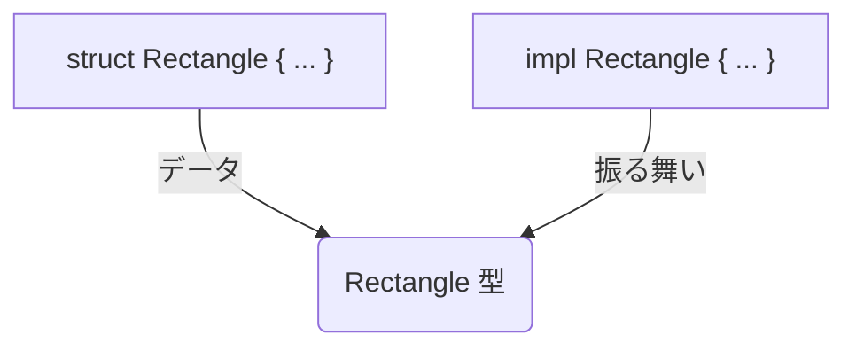

# 第 9 章：構造体とメソッド

## この章のゴール
- `struct` キーワードを使って、関連するデータをまとめた独自のデータ型を定義できる。
- フィールドを持つ通常の構造体、タプル構造体、ユニット様構造体の 3 種類を使い分けられる。
- `impl` ブロックを使って、構造体にメソッドや関連関数を定義できる。
- メソッドの第一引数 `&self`, `&mut self`, `self` の違いを、所有権の観点からエラーを通して体験する。

---

## 9.1 データと振る舞いを組み合わせる

Python や Go では、複数のデータを一つにまとめるための仕組みがありました。

- Python: `class` を使って、データ (属性) とそのデータを操作するメソッドを一緒にカプセル化していました。
- Go: `struct` を使って、異なる型のフィールドをまとめたデータ構造を定義していました。メソッドは、`func` キーワードとレシーバ引数を使って、`struct` とは別に定義するスタイルでした。

Rust のアプローチは、データ構造の定義 (`struct`) と、その振る舞いの定義 (`impl`) を分離するという点で、Go に似ています。この分離が、後の章で学ぶ「トレイト」という概念において重要な役割を果たします。

## 9.2 構造体 (`struct`) の定義

構造体は、関連する複数の値をまとめて意味のあるグループを作るためのカスタムデータ型です。
```sh
cargo new structs
```
でプロジェクトを作り、試していきましょう。

### 1. 通常の構造体
フィールドに名前を付けて定義する、最も一般的な構造体です。

```rust
// src/main.rs

struct User {
    active: bool,
    username: String,
    email: String,
    sign_in_count: u64,
}

fn main() {
    // 構造体のインスタンスを作成
    let mut user1 = User {
        email: String::from("someone@example.com"),
        username: String::from("someusername123"),
        active: true,
        sign_in_count: 1,
    };

    // ドット記法でフィールドにアクセス
    user1.email = String::from("anotheremail@example.com");

    println!("User email: {}", user1.email);
}
```
[Rust Playgroundで試す](https://play.rust-lang.org/?version=stable&mode=debug&edition=2021&code=%2F%2F%20src%2Fmain.rs%0A%0Astruct%20User%20%7B%0A%20%20%20%20active%3A%20bool%2C%0A%20%20%20%20username%3A%20String%2C%0A%20%20%20%20email%3A%20String%2C%0A%20%20%20%20sign_in_count%3A%20u64%2C%0A%7D%0A%0Afn%20main()%20%7B%0A%20%20%20%20%2F%2F%20%E6%A7%8B%E9%80%A0%E4%BD%93%E3%81%AE%E3%82%A4%E3%83%B3%E3%82%B9%E3%82%BF%E3%83%B3%E3%82%B9%E3%82%92%E4%BD%9C%E6%88%90%0A%20%20%20%20let%20mut%20user1%20%3D%20User%20%7B%0A%20%20%20%20%20%20%20%20email%3A%20String%3A%3Afrom(%22someone%40example.com%22)%2C%0A%20%20%20%20%20%20%20%20username%3A%20String%3A%3Afrom(%22someusername123%22)%2C%0A%20%20%20%20%20%20%20%20active%3A%20true%2C%0A%20%20%20%20%20%20%20%20sign_in_count%3A%201%2C%0A%20%20%20%20%7D%3B%0A%0A%20%20%20%20%2F%2F%20%E3%83%89%E3%83%83%E3%83%88%E8%A8%98%E6%B3%95%E3%81%A7%E3%83%95%E3%82%A3%E3%83%BC%E3%83%AB%E3%83%89%E3%81%AB%E3%82%A2%E3%82%AF%E3%82%BB%E3%82%B9%0A%20%20%20%20user1.email%20%3D%20String%3A%3Afrom(%22anotheremail%40example.com%22)%3B%0A%0A%20%20%20%20println!(%22User%20email%3A%20%7B%7D%22%2C%20user1.email)%3B%0A%7D)
インスタンス全体を可変 (`mut`) にすれば、フィールドの値を変更できます (フィールドがプライベートでない場合)。

### 試してみよう：フィールド更新構文

既存のインスタンスのいくつかの値を変更して、新しいインスタンスを作りたい場合があります。その際に便利なのが `..` 構文です。

```rust
// main 関数の続き
// 以下のコードは、上のコードブロックの main 関数内に追加して試してください。
let user2 = User {
    email: String::from("another@example.com"),
    // username は user1 と同じ値を使う
    ..user1
};

// ここで user1 の username を使おうとするとどうなる？
// println!("user1's username: {}", user1.username);
```
[Rust Playgroundで試す](https://play.rust-lang.org/?version=stable&mode=debug&edition=2021&code=struct%20User%20%7B%0A%20%20%20%20active%3A%20bool%2C%0A%20%20%20%20username%3A%20String%2C%0A%20%20%20%20email%3A%20String%2C%0A%20%20%20%20sign_in_count%3A%20u64%2C%0A%7D%0A%0Afn%20main()%20%7B%0A%20%20%20%20let%20mut%20user1%20%3D%20User%20%7B%0A%20%20%20%20%20%20%20%20email%3A%20String%3A%3Afrom(%22someone%40example.com%22)%2C%0A%20%20%20%20%20%20%20%20username%3A%20String%3A%3Afrom(%22someusername123%22)%2C%0A%20%20%20%20%20%20%20%20active%3A%20true%2C%0A%20%20%20%20%20%20%20%20sign_in_count%3A%201%2C%0A%20%20%20%20%7D%3B%0A%0A%20%20%20%20let%20user2%20%3D%20User%20%7B%0A%20%20%20%20%20%20%20%20email%3A%20String%3A%3Afrom(%22another%40example.com%22)%2C%0A%20%20%20%20%20%20%20%20%2F%2F%20username%20%E3%81%AF%20user1%20%E3%81%A8%E5%90%8C%E3%81%98%E5%80%A4%E3%82%92%E4%BD%BF%E3%81%86%0A%20%20%20%20%20%20%20%20..user1%0A%20%20%20%20%7D%3B%0A%0A%20%20%20%20%2F%2F%20%E3%81%93%E3%81%93%E3%81%A7%20user1%20%E3%81%AE%20username%20%E3%82%92%E4%BD%BF%E3%81%8A%E3%81%86%E3%81%A8%E3%81%99%E3%82%8B%E3%81%A8%E3%81%A9%E3%81%86%E3%81%AA%E3%82%8B%EF%BC%9F%0A%20%20%20%20%2F%2F%20println!(%22user1's%20username%3A%20%7B%7D%22%2C%20user1.username)%3B%0A%7D)
`..user1` は、`user2` で明示的に設定されていないフィールドの値を `user1` から持ってくる、という意味です。

ここで最後の `println!` のコメントを外して `cargo run` してみましょう。
`borrow of partially moved value: user1` というエラーが出ます。`username` フィールドの `String` は `Copy` トレイトを持たないため、`user2` の作成時に所有権が `user1` から `user2` に ムーブ してしまいました。そのため、`user1.username` にはもうアクセスできません。一方で、`active` や `sign_in_count` のような `Copy` トレイトを持つフィールドはコピーされるだけなので、`user1.active` にはアクセスできます。この挙動は所有権のルールそのものです。

### 2. タプル構造体とユニット様構造体

- タプル構造体: フィールド名はなく、型の定義だけを持つ構造体です。タプル全体に名前を付けたい場合に便利です。
  ```rust
  struct Color(i32, i32, i32);
  let black = Color(0, 0, 0);
  ```
[Rust Playgroundで試す](https://play.rust-lang.org/?version=stable&mode=debug&edition=2021&code=struct%20Color(i32%2C%20i32%2C%20i32)%3B%0A%0Afn%20main()%20%7B%0A%20%20%20%20let%20black%20%3D%20Color(0%2C%200%2C%200)%3B%0A%7D)
- ユニット様構造体: フィールドを一切持たない構造体です。ある型に対してトレイトを実装したいが、格納すべきデータがない場合に役立ちます。
  ```rust
  struct AlwaysEqual;
  let subject = AlwaysEqual;
  ```
[Rust Playgroundで試す](https://play.rust-lang.org/?version=stable&mode=debug&edition=2021&code=struct%20AlwaysEqual%3B%0A%0Afn%20main()%20%7B%0A%20%20%20%20let%20subject%20%3D%20AlwaysEqual%3B%0A%7D)

## 9.3 メソッド (`impl`) で振る舞いを定義する

メソッドは関数と似ていますが、構造体 (や enum) の文脈で定義される点が異なります。メソッドは、その構造体のインスタンスが何を行えるか、という「振る舞い」を定義します。メソッドは `impl` (implementation の略) ブロックの中に定義します。



```rust
struct Rectangle {
    width: u32,
    height: u32,
}

// Rectangle 構造体のための impl ブロック
impl Rectangle {
    // メソッド `area` の定義
    // 第一引数は常に `self` のいずれかの形式
    fn area(&self) -> u32 {
        self.width * self.height
    }
}

fn main() {
    let rect1 = Rectangle {
        width: 30,
        height: 50,
    };
    println!("The area is {}", rect1.area());
}
```
[Rust Playgroundで試す](https://play.rust-lang.org/?version=stable&mode=debug&edition=2021&code=struct%20Rectangle%20%7B%0A%20%20%20%20width%3A%20u32%2C%0A%20%20%20%20height%3A%20u32%2C%0A%7D%0A%0A%2F%2F%20Rectangle%20%E6%A7%8B%E9%80%A0%E4%BD%93%E3%81%AE%E3%81%9F%E3%82%81%E3%81%AE%20impl%20%E3%83%96%E3%83%AD%E3%83%83%E3%82%AF%0Aimpl%20Rectangle%20%7B%0A%20%20%20%20%2F%2F%20%E3%83%A1%E3%82%BD%E3%83%83%E3%83%89%20%60area%60%20%E3%81%AE%E5%AE%9A%E7%BE%A9%0A%20%20%20%20%2F%2F%20%E7%AC%AC%E4%B8%80%E5%BC%95%E6%95%B0%E3%81%AF%E5%B8%B8%E3%81%AB%20%60self%60%20%E3%81%AE%E3%81%84%E3%81%9A%E3%82%8C%E3%81%8B%E3%81%AE%E5%BD%A2%E5%BC%8F%0A%20%20%20%20fn%20area(%26self)%20-%3E%20u32%20%7B%0A%20%20%20%20%20%20%20%20self.width%20*%20self.height%0A%20%20%20%20%7D%0A%7D%0A%0Afn%20main()%20%7B%0A%20%20%20%20let%20rect1%20%3D%20Rectangle%20%7B%0A%20%20%20%20%20%20%20%20width%3A%2030%2C%0A%20%20%20%20%20%20%20%20height%3A%2050%2C%0A%20%20%20%20%7D%3B%0A%20%20%20%20println!(%22The%20area%20is%20%7B%7D%22%2C%20rect1.area())%3B%0A%7D)
### 試してみよう：`&self`, `&mut self`, `self` の違い

`impl` ブロック内のメソッドの第一引数は、常に `self` であり、これは `impl` の対象となっている型のインスタンスを指します。`self` には3つの主要な形式があり、所有権の扱いが異なります。これを体験的に学びましょう。

```rust
struct Point {
    x: f64,
    y: f64,
}

impl Point {
    // インスタンスを不変で借用する
    // データを読み取るだけ
    fn distance_from_origin(&self) -> f64 {
        (self.x.powi(2) + self.y.powi(2)).sqrt()
    }

    // インスタンスを可変で借用する
    // インスタンスの状態を変更する
    fn translate(&mut self, dx: f64, dy: f64) {
        self.x += dx;
        self.y += dy;
    }

    // インスタンスの所有権を奪う
    // インスタンスを消費して別のものを生成する
    fn to_tuple(self) -> (f64, f64) {
        (self.x, self.y)
    }
}

fn main() {
    let mut p = Point { x: 3.0, y: 4.0 };

    // &self を受け取るメソッドを呼ぶ
    println!("Distance from origin: {}", p.distance_from_origin());
    // 呼び出し後も p は有効
    println!("Point is at ({}, {})", p.x, p.y);

    // &mut self を受け取るメソッドを呼ぶ
    p.translate(1.0, 1.0);
    // 呼び出し後も p は有効（中身は変わっている）
    println!("Point is now at ({}, {})", p.x, p.y);

    // self を受け取るメソッドを呼ぶ
    let t = p.to_tuple();
    println!("Point as tuple: {:?}", t);

    // 呼び出し後、p はムーブしているのでもう使えない
    // 以下の行のコメントを外すとコンパイルエラー！
    // println!("Point is at ({}, {})", p.x, p.y);
}
```
[Rust Playgroundで試す](https://play.rust-lang.org/?version=stable&mode=debug&edition=2021&code=struct%20Point%20%7B%0A%20%20%20%20x%3A%20f64%2C%0A%20%20%20%20y%3A%20f64%2C%0A%7D%0A%0Aimpl%20Point%20%7B%0A%20%20%20%20%2F%2F%20%E3%82%A4%E3%83%B3%E3%82%B9%E3%82%BF%E3%83%B3%E3%82%B9%E3%82%92%E4%B8%8D%E5%A4%89%E3%81%A7%E5%80%9F%E7%94%A8%E3%81%99%E3%82%8B%0A%20%20%20%20%2F%2F%20%E3%83%87%E3%83%BC%E3%82%BF%E3%82%92%E8%AA%AD%E3%81%BF%E5%8F%96%E3%82%8B%E3%81%A0%E3%81%91%0A%20%20%20%20fn%20distance_from_origin(%26self)%20-%3E%20f64%20%7B%0A%20%20%20%20%20%20%20%20(self.x.powi(2)%20%2B%20self.y.powi(2)).sqrt()%0A%20%20%20%20%7D%0A%0A%20%20%20%20%2F%2F%20%E3%82%A4%E3%83%B3%E3%82%B9%E3%82%BF%E3%83%B3%E3%82%B9%E3%82%92%E5%8F%AF%E5%A4%89%E3%81%A7%E5%80%9F%E7%94%A8%E3%81%99%E3%82%8B%0A%20%20%20%20%2F%2F%20%E3%82%A4%E3%83%B3%E3%82%B9%E3%82%BF%E3%83%B3%E3%82%B9%E3%81%AE%E7%8A%B6%E6%85%8B%E3%82%92%E5%A4%89%E6%9B%B4%E3%81%99%E3%82%8B%0A%20%20%20%20fn%20translate(%26mut%20self%2C%20dx%3A%20f64%2C%20dy%3A%20f64)%20%7B%0A%20%20%20%20%20%20%20%20self.x%20%2B%3D%20dx%3B%0A%20%20%20%20%20%20%20%20self.y%20%2B%3D%20dy%3B%0A%20%20%20%20%7D%0A%0A%20%20%20%20%2F%2F%20%E3%82%A4%E3%83%B3%E3%82%B9%E3%82%BF%E3%83%B3%E3%82%B9%E3%81%AE%E6%89%80%E6%9C%89%E6%A8%A9%E3%82%92%E5%A5%AA%E3%81%86%0A%20%20%20%20%2F%2F%20%E3%82%A4%E3%83%B3%E3%82%B9%E3%82%BF%E3%83%B3%E3%82%B9%E3%82%92%E6%B6%88%E8%B2%BB%E3%81%97%E3%81%A6%E5%88%A5%E3%81%AE%E3%82%82%E3%81%AE%E3%82%92%E7%94%9F%E6%88%90%E3%81%99%E3%82%8B%0A%20%20%20%20fn%20to_tuple(self)%20-%3E%20(f64%2C%20f64)%20%7B%0A%20%20%20%20%20%20%20%20(self.x%2C%20self.y)%0A%20%20%20%20%7D%0A%7D%0A%0Afn%20main()%20%7B%0A%20%20%20%20let%20mut%20p%20%3D%20Point%20%7B%20x%3A%203.0%2C%20y%3A%204.0%20%7D%3B%0A%0A%20%20%20%20%2F%2F%20%26self%20%E3%82%92%E5%8F%97%E3%81%91%E5%8F%96%E3%82%8B%E3%83%A1%E3%82%BD%E3%83%83%E3%83%89%E3%82%92%E5%91%BC%E3%81%B6%0A%20%20%20%20println!(%22Distance%20from%20origin%3A%20%7B%7D%22%2C%20p.distance_from_origin())%3B%0A%20%20%20%20%2F%2F%20%E5%91%BC%E3%81%B3%E5%87%BA%E3%81%97%E5%BE%8C%E3%82%82%20p%20%E3%81%AF%E6%9C%89%E5%8A%B9%0A%20%20%20%20println!(%22Point%20is%20at%20(%7B%7D%2C%20%7B%7D)%22%2C%20p.x%2C%20p.y)%3B%0A%0A%20%20%20%20%2F%2F%20%26mut%20self%20%E3%82%92%E5%8F%97%E3%81%91%E5%8F%96%E3%82%8B%E3%83%A1%E3%82%BD%E3%83%83%E3%83%89%E3%82%92%E5%91%BC%E3%81%B6%0A%20%20%20%20p.translate(1.0%2C%201.0)%3B%0A%20%20%20%20%2F%2F%20%E5%91%BC%E3%81%B3%E5%87%BA%E3%81%97%E5%BE%8C%E3%82%82%20p%20%E3%81%AF%E6%9C%89%E5%8A%B9%EF%BC%88%E4%B8%AD%E8%BA%AB%E3%81%AF%E5%A4%89%E3%82%8F%E3%81%A3%E3%81%A6%E3%81%84%E3%82%8B%EF%BC%89%0A%20%20%20%20println!(%22Point%20is%20now%20at%20(%7B%7D%2C%20%7B%7D)%22%2C%20p.x%2C%20p.y)%3B%0A%0A%20%20%20%20%2F%2F%20self%20%E3%82%92%E5%8F%97%E3%81%91%E5%8F%96%E3%82%8B%E3%83%A1%E3%82%BD%E3%83%83%E3%83%89%E3%82%92%E5%91%BC%E3%81%B6%0A%20%20%20%20let%20t%20%3D%20p.to_tuple()%3B%0A%20%20%20%20println!(%22Point%20as%20tuple%3A%20%7B%3A%3F%7D%22%2C%20t)%3B%0A%0A%20%20%20%20%2F%2F%20%E5%91%BC%E3%81%B3%E5%87%BA%E3%81%97%E5%BE%8C%E3%80%81p%20%E3%81%AF%E3%83%A0%E3%83%BC%E3%83%96%E3%81%97%E3%81%A6%E3%81%84%E3%82%8B%E3%81%AE%E3%81%A7%E3%82%82%E3%81%86%E4%BD%BF%E3%81%88%E3%81%AA%E3%81%84%0A%20%20%20%20%2F%2F%20%E4%BB%A5%E4%B8%8B%E3%81%AE%E8%A1%8C%E3%81%AE%E3%82%B3%E3%83%A1%E3%83%B3%E3%83%88%E3%82%92%E5%A4%96%E3%81%99%E3%81%A8%E3%82%B3%E3%83%B3%E3%83%91%E3%82%A4%E3%83%AB%E3%82%A8%E3%83%A9%E3%83%BC%EF%BC%81%0A%20%20%20%20%2F%2F%20println!(%22Point%20is%20at%20(%7B%7D%2C%20%7B%7D)%22%2C%20p.x%2C%20p.y)%3B%0A%7D)
最後の `println!` のコメントを外して `cargo run` すると、`borrow of moved value: p` エラーが発生します。`to_tuple` メソッドが `p` の所有権を奪った（消費した）ため、`main` 関数ではもう `p` にアクセスできなくなるのです。このように、メソッドのシグネチャを見るだけで、そのメソッドがインスタンスに対して何をする（読み取るだけか、変更するか、消費するか）のかが明確にわかるのがRustの大きな利点です。

## 9.4 関連関数 (Associated Functions)

`impl` ブロックの中には、`self` を第一引数として取らない関数も定義できます。これを 関連関数 (associated function) と呼びます。これは、他の言語における「静的メソッド (static method)」と似ています。

関連関数は、構造体名と `::` 構文を使って呼び出します。構造体の新しいインスタンスを返すコンストラクタとしてよく使われます。

```rust
// Point の impl ブロックに追加
// 以下のコードは、上のコードブロックの impl Point { ... } 内に追加して試してください。
// self を取らないので関連関数
fn origin() -> Point {
    Point { x: 0.0, y: 0.0 }
}

// main 関数内で呼び出す
let origin_point = Point::origin();
```
[Rust Playgroundで試す](https://play.rust-lang.org/?version=stable&mode=debug&edition=2021&code=struct%20Point%20%7B%0A%20%20%20%20x%3A%20f64%2C%0A%20%20%20%20y%3A%20f64%2C%0A%7D%0A%0Aimpl%20Point%20%7B%0A%20%20%20%20%2F%2F%20self%20%E3%82%92%E5%8F%96%E3%82%89%E3%81%AA%E3%81%84%E3%81%AE%E3%81%A7%E9%96%A2%E9%80%A3%E9%96%A2%E6%95%B0%0A%20%20%20%20fn%20origin()%20-%3E%20Point%20%7B%0A%20%20%20%20%20%20%20%20Point%20%7B%20x%3A%200.0%2C%20y%3A%200.0%20%7D%0A%20%20%20%20%7D%0A%7D%0A%0Afn%20main()%20%7B%0A%20%20%20%20%2F%2F%20main%20%E9%96%A2%E6%95%B0%E5%86%85%E3%81%A7%E5%91%BC%E3%81%B3%E5%87%BA%E3%81%99%0A%20%20%20%20let%20origin_point%20%3D%20Point%3A%3Aorigin()%3B%0A%7D)
## 9.5 まとめ

- ✓ 構造体 (`struct`) は、関連するデータをまとめたカスタムデータ型。
- ✓ Rust では、データの定義 (`struct`) と振る舞いの定義 (`impl`) を分離する。
- ✓ フィールド更新構文 `..` は、一部のフィールドが `Copy` でない場合、所有権のムーブを引き起こす。
- ✓ メソッドの第一引数は、所有権の扱い方を決定する:
  - `&self`: 不変の借用 (読み取り)
  - `&mut self`: 可変の借用 (変更)
  - `self`: 所有権のムーブ (消費)
- ✓ `self` を引数に取らない `impl` 内の関数は、`::` で呼び出す関連関数となる。

---

構造体とメソッドは、プログラムを構成する基本的な部品です。特に `self` の扱いは、所有権システムがコードの隅々まで浸透していることを示しています。

次の章では、もう一つの重要なデータ構造である「enum (列挙型)」と、Go エンジニアには馴染み深い `nil` の問題を解決する `Option` 型について学びます。
