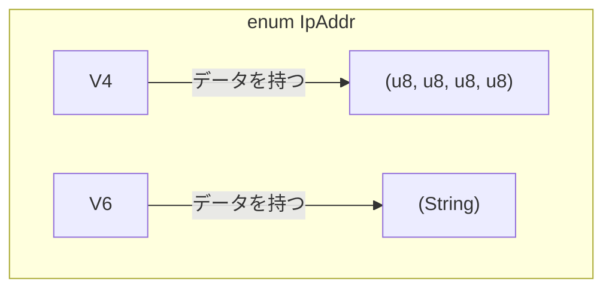

# 第 10 章：列挙型と Option

## この章のゴール
- `enum` キーワードを使って、とりうる値を列挙したカスタムデータ型を定義できる。
- `enum` の各バリアントが異なるデータを保持できることを理解する。
- Go の `nil` や Python の `None` が引き起こす問題を説明し、Rust の `Option<T>` がそれをどう解決するかを説明できる。
- `Option<T>` 型の値を直接使おうとしてコンパイルエラーを発生させ、`match` がなぜ必要かを体験する。

---

## 10.1 問題設定：`nil` ポインタという時限爆弾

Python や Go には、値が存在しない可能性を示すための便利な仕組みがありました。
- Python: `None`
- Go: `nil`

これらは非常に便利ですが、同時に多くのエンジニアを長年苦しめてきた「`null`ポインタ（`nil`ポインタ）」というバグの源泉でもあります。ある値が `None` や `nil` である可能性を忘れて操作しようとすると、実行時にプログラムはクラッシュします。

- Go: `panic: runtime error: invalid memory address or nil pointer dereference`
- Python: `AttributeError: 'NoneType' object has no attribute '...`

あなたも、このようなエラーに遭遇し、頭を抱えた経験が一度はあるのではないでしょうか？

### Go と Python で「痛み」を体験する

言葉だけでは実感が湧きにくいかもしれません。Go と Python、それぞれの言語でこの「`nil`/`None` チェック漏れ」が引き起こす問題を、オンラインの Playground で実際に体験してみましょう。

#### Go の例： nil ポインタの参照外し

以下のコードは、ユーザーを見つけられなかった場合に `nil` を返す可能性がある関数を呼び出します。`nil` である可能性をチェックし忘れるとどうなるでしょうか。

```go
package main

import "fmt"

type User struct {
    Name string
}

// findUser はユーザーを見つけられない場合に nil を返す可能性がある
func findUser(name string) *User {
    if name == "Alice" {
        return &User{Name: "Alice"}
    }
    return nil // Bob は見つからない
}

func main() {
    // "Bob" を探すが、見つからないため nil が返される
    u := findUser("Bob")

    // nil チェックを忘れてフィールドにアクセスしようとする
    // これがパニックを引き起こす！
    fmt.Println("User's name:", u.Name)
}
```
[このコードを Go Playground で試す](https://go.dev/play/)

このコードを Go Playground に貼り付けて実行すると、まさに先ほど見た `panic: runtime error: invalid memory address or nil pointer dereference` というエラーでプログラムがクラッシュするのが確認できます。

#### Python の例： NoneType への属性アクセス

Pythonでも同様です。`None` が返ってくる可能性を忘れると、`AttributeError` が発生します。

```python
class User:
    def __init__(self, name):
        self.name = name

# find_user はユーザーを見つけられない場合に None を返す可能性がある
def find_user(name):
    if name == "Alice":
        return User("Alice")
    return None # Bob は見つからない

# "Bob" を探すが、見つからないため None が返される
u = find_user("Bob")

# None チェックを忘れて属性にアクセスしようとする
# これが AttributeError を引き起こす！
print(f"User's name: {u.name}")
```
[このコードを Online Python Compiler で試す](https://www.online-python.com/)

こちらも同様に実行すると、`AttributeError: 'NoneType' object has no attribute 'name'` というお馴染みのエラーが発生します。

これらの「うっかり」による実行時エラーは、プロジェクトが大規模で複雑になるほど発見が難しくなり、深刻なバグの原因となります。

Rust は、この問題を **型システム** のレベルで解決します。「値が存在しないかもしれない」という可能性を、実行時ではなく **コンパイル時** にプログラマに強制的に意識させるのです。その中心的な役割を果たすのが、**列挙型 (`enum`)** と、その代表例である **`Option<T>`** です。

## 10.2 列挙型 (`enum`)：可能性を列挙する

`cargo new enums` でプロジェクトを作り、`enum` の基本から見ていきましょう。

`enum` は、ある型がとりうる値をすべて列挙して定義する方法です。

```rust
// src/main.rs

enum IpAddrKind {
    V4,
    V6,
}

fn main() {
    let four = IpAddrKind::V4;
    let six = IpAddrKind::V6;
}
```
[Rust Playgroundで試す](https://play.rust-lang.org/?version=stable&mode=debug&edition=2021&code=//%20src/main.rs%0A%0Aenum%20IpAddrKind%20%7B%0A%20%20%20%20V4%2C%0A%20%20%20%20V6%2C%0A%7D%0A%0Afn%20main%28%29%20%7B%0A%20%20%20%20let%20four%20%3D%20IpAddrKind%3A%3AV4%3B%0A%20%20%20%20let%20six%20%3D%20IpAddrKind%3A%3AV6%3B%0A%7D)
ここまでは他の言語と似ていますが、Rust の `enum` の真価は、**各バリアントがそれぞれ異なるデータを持てる** ことにあります。

```rust
enum IpAddr {
    V4(u8, u8, u8, u8),
    V6(String),
}

fn main() {
    let home = IpAddr::V4(127, 0, 0, 1);
    let loopback = IpAddr::V6(String::from("::1"));
}
```
[Rust Playgroundで試す](https://play.rust-lang.org/?version=stable&mode=debug&edition=2021&code=enum%20IpAddr%20%7B%0A%20%20%20%20V4%28u8%2C%20u8%2C%20u8%2C%20u8%29%2C%0A%20%20%20%20V6%28String%29%2C%0A%7D%0A%0Afn%20main%28%29%20%7B%0A%20%20%20%20let%20home%20%3D%20IpAddr%3A%3AV4%28127%2C%200%2C%200%2C%201%29%3B%0A%20%20%20%20let%20loopback%20%3D%20IpAddr%3A%3AV6%28String%3A%3Afrom%28%22%3A%3A1%22%29%29%3B%0A%7D)
このように、同じ `IpAddr` という型でありながら、`V4` バリアントは 4 つの `u8` を、`V6` バリアントは 1 つの `String` を持つことができます。これは、構造体(`struct`) を複数種類まとめて一つの型として扱えるようなもので、非常に強力です。


`enum` にも `impl` ブロックを使ってメソッドを定義できます。

## 10.3 `Option<T>`：`null` のない世界

Rust には `null` がありません。その代わりに、値が存在しないかもしれない状況を扱うのが、標準ライブラリで定義されている `Option<T>` です。

これは `enum` として、以下のように定義されています（実際の定義とは少し異なります）。

```rust
enum Option<T> {
    None,      // 値が存在しないことを示すバリアント
    Some(T),   // T 型の値が存在することを示すバリアント
}
```
[Rust Playgroundで試す](https://play.rust-lang.org/?version=stable&mode=debug&edition=2021&code=enum%20Option%3CT%3E%20%7B%0A%20%20%20%20None%2C%20%20%20%20%20%20//%20%E5%80%A4%E3%81%8C%E5%AD%98%E5%9C%A8%E3%81%97%E3%81%AA%E3%81%84%E3%81%93%E3%81%A8%E3%82%92%E7%A4%BA%E3%81%99%E3%83%90%E3%83%AA%E3%82%A2%E3%83%B3%E3%83%88%0A%20%20%20%20Some%28T%29%2C%20%20%20//%20T%20%E5%9E%8B%E3%81%AE%E5%80%A4%E3%81%8C%E5%AD%98%E5%9C%A8%E3%81%99%E3%82%8B%E3%81%93%E3%81%A8%E3%82%92%E7%A4%BA%E3%81%99%E3%83%90%E3%83%AA%E3%82%A2%E3%83%B3%E3%83%88%0A%7D)
`<T>` はジェネリック型パラメータで、`Some` バリアントが任意の型の値を保持できることを意味します。例えば `Option<i32>` なら `Some` は `i32` の値を持ち、`Option<String>` なら `String` の値を持ちます。

`Option<T>` を使うことで、コンパイラは「値が存在しないかもしれない」という可能性を常に認識できます。ある値が `i32` ではなく `Option<i32>` 型である場合、それは `None` である可能性があり、`Some` の中の値を取り出す前に、その可能性を **必ず** 処理しなければなりません。

### 試してみよう：コンパイラに `Option` の処理を強制させられる

`i32` と `Option<i32>` は全く異なる型です。もし `Option` 型の値を、あたかも中の値であるかのように直接使おうとすると、コンパイラがエラーを出します。試してみましょう。

```rust
// src/main.rs

fn main() {
    let x: i8 = 5;
    let y: Option<i8> = Some(5);

    // ❌ コンパイルエラー！
    // 異なる型同士の足し算はできない
    let sum = x + y;
}
```
[Rust Playgroundで試す](https://play.rust-lang.org/?version=stable&mode=debug&edition=2021&code=//%20src/main.rs%0A%0Afn%20main%28%29%20%7B%0A%20%20%20%20let%20x%3A%20i8%20%3D%205%3B%0A%20%20%20%20let%20y%3A%20Option%3Ci8%3E%20%3D%20Some%285%29%3B%0A%0A%20%20%20%20//%20%E2%9D%8C%20%E3%82%B3%E3%83%B3%E3%83%91%E3%82%A4%E3%83%AB%E3%82%A8%E3%83%A9%E3%83%BC%EF%BC%81%0A%20%20%20%20//%20%E7%95%B0%E3%81%AA%E3%82%8B%E5%9E%8B%E5%90%8C%E5%A3%AB%E3%81%AE%E8%B6%B3%E3%81%97%E7%AE%97%E3%81%AF%E3%81%A7%E3%81%8D%E3%81%AA%E3%81%84%0A%20%20%20%20let%20sum%20%3D%20x%20%2B%20y%3B%0A%7D)
`cargo run` を実行すると、`cannot add Option<i8> to i8` というエラーが出ます。`y` は `8` ではなく `Some(8)` という `Option` 型の値なので、`i8` の `x` とは足し算ができないのです。

このエラーこそが、`nil` や `None` である可能性を忘れて実行時エラーを引き起こすバグを、コンパイル時に完全に防いでくれる Rust の安全機能なのです。

## 10.4 `Option<T>` を安全に扱う `match`

では、`Option<T>` の中身を安全に取り出すにはどうすればよいのでしょうか？その答えが、`match` 式です。`match` を使えば、`Some` の場合と `None` の場合の両方を網羅的に処理できます。

```rust
fn plus_one(x: Option<i32>) -> Option<i32> {
    match x {
        None => None, // `None` の場合は何もしないで `None` を返す
        Some(i) => Some(i + 1), // `Some` の場合は中の値 i を取り出して 1 を足し、Some で包んで返す
    }
}

fn main() {
    let five = Some(5);
    let six = plus_one(five);
    let none = plus_one(None);
    
    // six は Some(6), none は None になる
}
```
[Rust Playgroundで試す](https://play.rust-lang.org/?version=stable&mode=debug&edition=2021&code=fn%20plus_one%28x%3A%20Option%3Ci32%3E%29%20-%3E%20Option%3Ci32%3E%20%7B%0A%20%20%20%20match%20x%20%7B%0A%20%20%20%20%20%20%20%20None%20%3D%3E%20None%2C%20//%20%60None%60%20%E3%81%AE%E5%A0%B4%E5%90%88%E3%81%AF%E4%BD%95%E3%82%82%E3%81%97%E3%81%AA%E3%81%84%E3%81%A7%20%60None%60%20%E3%82%92%E8%BF%94%E3%81%99%0A%20%20%20%20%20%20%20%20Some%28i%29%20%3D%3E%20Some%28i%20%2B%201%29%2C%20//%20%60Some%60%20%E3%81%AE%E5%A0%B4%E5%90%88%E3%81%AF%E4%B8%AD%E3%81%AE%E5%80%A4%20i%20%E3%82%92%E5%8F%96%E3%82%8A%E5%87%BA%E3%81%97%E3%81%A6%201%20%E3%82%92%E8%B6%B3%E3%81%97%E3%80%81Some%20%E3%81%A7%E5%8C%85%E3%82%93%E3%81%A7%E8%BF%94%E3%81%99%0A%20%20%20%20%7D%0A%7D%0A%0Afn%20main%28%29%20%7B%0A%20%20%20%20let%20five%20%3D%20Some%285%29%3B%0A%20%20%20%20let%20six%20%3D%20plus_one%28five%29%3B%0A%20%20%20%20let%20none%20%3D%20plus_one%28None%29%3B%0A%20%20%20%20%0A%20%20%20%20//%20six%20%E3%81%AF%20Some%286%29%2C%20none%20%E3%81%AF%20None%20%E3%81%AB%E3%81%AA%E3%82%8B%0A%7D)
`match` 式は網羅的であるため、`None` のケースを処理し忘れるとコンパイルエラーになります。これにより、`nil` チェックのし忘れというよくあるミスを型システムが防いでくれます。`if let` を使って `Some` の場合だけを簡潔に書くこともできます。

## 10.5 まとめ

- ✓ 列挙型 (`enum`) は、型がとりうる値をすべて列挙することで、コードの堅牢性を高める。
- ✓ Rust の `enum` のバリアントは、それぞれ異なる型のデータを持つことができる、強力な機能。
- ✓ Rust には `null` がなく、代わりに **`Option<T>`** を使うことで、値が存在しない可能性を型システムで表現する。
- ✓ `Option<T>` と `T` は別の型であり、`match` を使って `Some` と `None` の両方のケースを処理しないとコンパイルエラーになる。

---

`Option<T>` は、Rust の安全性哲学を象徴する重要な概念です。これに慣れることで、`null` ポインタエラーに悩まされることのない、新しいプログラミングの世界が開けます。

次の章では、`Option<T>` と対をなすもう一つの重要な列挙型、`Result<T, E>` を通じて、Rust のエラーハンドリング哲学について学びます。
