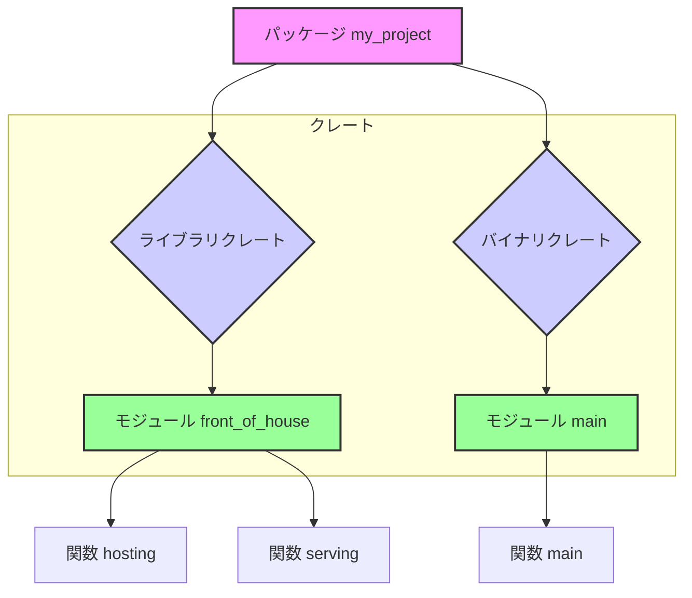
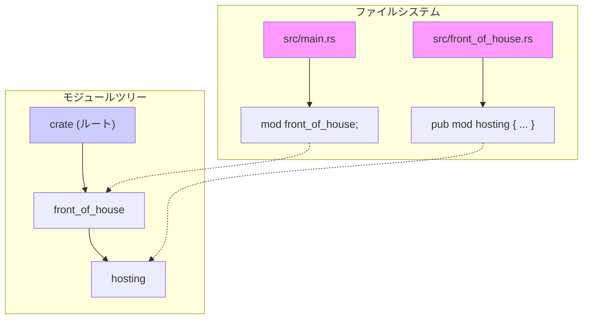

# 第 20 章：パッケージ、クレート、モジュール

## この章のゴール
- パッケージ、クレート、モジュールの違いと、それぞれの役割を説明できる。
- `mod` キーワードを使って、単一ファイル内のコードを整理したり、別ファイルに分割したりできるようになる。
- `pub` キーワードの必要性を、コンパイルエラー「function is private」を通して説明できる。
- `use` キーワードを使って、他のモジュールへのパスを短縮し、コードの可読性を上げられる。
- `super` キーワードを使って、親モジュールからの相対パスでアイテムを参照できる。
- `struct` や `enum` のフィールドを `pub` にして、外部からのアクセスを許可できる。

---

## 20.1 全体像：パッケージ > クレート > モジュール

Rust のコード構成の単位は、大きい順に「パッケージ」「クレート」「モジュール」となります。プロジェクトが大きくなるにつれて、これらの単位をうまく使い分けることがコードの整理とメンテナンス性の向上に繋がります。

-   **パッケージ (Package)**: `cargo new` で作られる、一つの機能（ライブラリや実行可能ファイル）を提供する単位です。`Cargo.toml` を一つ含み、一つ以上のクレート（ライブラリまたはバイナリ）を持ちます。
-   **クレート (Crate)**: コンパイルの単位です。`rustc` が一度にコンパイルするソースコードの集まりを指します。他のプログラムから利用される**ライブラリクレート**か、実行可能ファイルになる**バイナリクレート**のどちらかになります。
-   **モジュール (Module)**: クレート内のコードを整理し、名前空間を分割するための単位です。`mod` キーワードで定義し、アイテムの公開・非公開（プライバシー）を制御する境界にもなります。

これらの関係性を図で見てみましょう。



この図のように、一つのパッケージ（`my_project`）がライブラリとバイナリという二つのクレートを持つことができます。そして、各クレートはさらに複数のモジュールに分割され、具体的な関数などが実装されます。

## 20.2 パッケージとクレートの関係

`cargo new my_project` で作成されるのは **パッケージ** です。このとき、`src/main.rs` が自動的に作られますが、これは `my_project` という名前の **バイナリクレート** のルートになります。

一つのパッケージは、
-   最大 1 つのライブラリクレート
-   任意の数のバイナリクレート

を含むことができます。

もし `src/lib.rs` というファイルを作成すると、Cargo はそれをパッケージの **ライブラリクレート** のルートとして扱います。クレート名はパッケージ名と同じ `my_project` になります。

バイナリクレートは他のクレートから依存されることを意図していませんが、ライブラリクレートはまさにそのために存在します。

## 20.3 利用ケース1：単一ファイルでのモジュール化

プロジェクトの初期段階や、規模が小さい場合は、すべてのコードを `src/main.rs` に書くことが多いでしょう。しかし、関連する機能が増えてくると、`mod` ブロックを使ってファイルを分割せずにコードを論理的にグループ化できます。

レストランの厨房を例に考えてみましょう。注文を受け付ける `front_of_house`（ホール）と、調理をする `back_of_house`（厨房）という 2 つのモジュールを作成します。

```rust
// src/main.rs

// "front_of_house" という名前のモジュールを定義
mod front_of_house {
    // front_of_house モジュールに属する "hosting" モジュールを定義
    pub mod hosting {
        pub fn add_to_waitlist() {}
    }
}

// "eat_at_restaurant" 関数から "add_to_waitlist" を呼び出す
pub fn eat_at_restaurant() {
    // 絶対パスで指定
    crate::front_of_house::hosting::add_to_waitlist();
}

fn main() {
    eat_at_restaurant();
}
```
<a href="https://play.rust-lang.org/?version=stable&mode=debug&edition=2021&gist=627d35160875c7b370a2dd462b5826f0" target="_blank">Rust Playground で試す</a>

この例では、`front_of_house` と `hosting` という入れ子のモジュールを作成しました。`eat_at_restaurant` 関数から `add_to_waitlist` を呼び出すには、`crate::front_of_house::hosting::add_to_waitlist()` という **絶対パス** を使用しています。`crate` はクレートのルートを指すキーワードです。

### `pub` キーワードによる公開制御

ここで重要なのが `pub` キーワードです。Rust では、モジュール内のアイテム（関数、struct など）はデフォルトで **プライベート** になっています。つまり、そのモジュールの外からはアクセスできません。

もし `hosting` モジュールから `pub` を外すと、コンパイルエラーが発生します。

```text
error[E0603]: module `hosting` is private
 --> src/main.rs:13:5
  |
4 |     mod hosting {
  |     ----------- visibility of this module is private
...
13|     crate::front_of_house::hosting::add_to_waitlist();
  |     ^^^^^^^^^^^^^^^^^^^^^^^^^^^^^^^^ module `hosting` is private
```

これは、カプセル化（実装の詳細を隠蔽すること）という原則を強制するための仕組みです。モジュールの作者は、外部に公開する API を `pub` を使って明示的に選択する必要があります。

## 20.4 利用ケース2：モジュールを別ファイルに分割する

プロジェクトが成長し、`src/main.rs` が長くなってきたら、モジュールを別のファイルに分割しましょう。先ほどのレストランの例を、ファイル分割でリファクタリングします。

まず、プロジェクトのファイル構成はこのようになります。

```
.
├── Cargo.toml
└── src
    ├── main.rs
    └── front_of_house.rs
```

`src/main.rs` では、`mod front_of_house;` と宣言します。これにより、Rust コンパイラは `src/front_of_house.rs` というファイルを読み込み、その内容を `front_of_house` モジュールとして解釈します。

```rust
// src/main.rs

// `src/front_of_house.rs` ファイルを `front_of_house` モジュールとして宣言する
mod front_of_house;

pub fn eat_at_restaurant() {
    // パスは以前と同じ
    crate::front_of_house::hosting::add_to_waitlist();
}

fn main() {
    eat_at_restaurant();
}
```

そして、`front_of_house` モジュールの内容はすべて `src/front_of_house.rs` に移動します。

```rust
// src/front_of_house.rs

pub mod hosting {
    pub fn add_to_waitlist() {}
}
```

ファイルシステムとモジュールツリーがどのように対応しているか、図で確認しましょう。



このように、`mod` キーワードは、ファイルシステム上の構成を Rust のモジュールツリーにマッピングする役割を果たします。

<a href="https://play.rust-lang.org/?version=stable&mode=debug&edition=2021&gist=66a3d90595304193557e937d5ab86638" target="_blank">Rust Playground で試す（複数ファイルを1ファイルで表現）</a>

## 20.5 `use` キーワードでパスを短縮する

毎回 `crate::front_of_house::hosting::add_to_waitlist()` のようにフルパスを書くのは大変です。`use` キーワードを使うと、他のモジュールへのパスを現在のスコープに持ち込むことができ、コードが簡潔になります。

```rust
// src/main.rs
mod front_of_house;

// `hosting` モジュールをこのスコープに持ち込む
use crate::front_of_house::hosting;

pub fn eat_at_restaurant() {
    // 短縮されたパスで呼び出せる
    hosting::add_to_waitlist();
    hosting::add_to_waitlist();
}

fn main() {
    eat_at_restaurant();
}
```
<a href="https://play.rust-lang.org/?version=stable&mode=debug&edition=2021&gist=e18820c74b1e36093405b5f6a9645229" target="_blank">Rust Playground で試す</a>

慣例として、関数をスコープに持ち込む場合はその親モジュールまでを `use` で指定し（`use crate::front_of_house::hosting;`）、呼び出し時に `hosting::add_to_waitlist()` のようにモジュール名が残るようにします。これにより、その関数がどこで定義されたものなのかが分かりやすくなります。

一方、`struct` や `enum` の場合は、フルパスで `use` するのが一般的です。

```rust
use std::collections::HashMap;

fn main() {
    let mut map = HashMap::new();
    map.insert(1, 2);
}
```

## 20.6 `super` で親モジュールを参照する

モジュール階層が深くなると、兄弟モジュールや親モジュールのアイテムにアクセスしたくなることがあります。`super` キーワードは、現在のモジュールから見て一つ親のモジュールを指す相対パスです。ファイルシステムの `..` に似ています。

例えば、厨房（`back_of_house`）のコックが、お客さんの注文（`front_of_house` の管轄）を確認するケースを考えてみましょう。

```rust
// in src/lib.rs

mod front_of_house {
    pub mod hosting {
        pub fn add_to_waitlist() {}
    }
}

mod back_of_house {
    fn fix_incorrect_order() {
        cook_order();
        // `super` を使って親モジュール `crate` に戻り、
        // そこから `front_of_house` にアクセスする
        super::front_of_house::hosting::add_to_waitlist();
    }

    fn cook_order() {}
}

fn main() {}
```
<a href="https://play.rust-lang.org/?version=stable&mode=debug&edition=2021&gist=583321527fc6ef416c141d8e1363e803" target="_blank">Rust Playground で試す</a>

`fix_incorrect_order` 関数は `back_of_house` モジュール内にあります。ここから `front_of_house` モジュール内の関数を呼ぶために、`super::` で一段階上がり、そこから `front_of_house` を辿っています。これにより、モジュール構造が変更された場合でも、修正箇所を減らすことができます。

## 20.7 利用ケース3：Struct と Enum のフィールド公開

`struct` や `enum` も `pub` にすることで外部から利用可能になりますが、その中身の扱いには少し違いがあります。

### Struct のフィールド公開

`struct` を `pub` にしても、そのフィールドはデフォルトでプライベートのままです。フィールドにアクセスさせたい場合は、フィールドごとにも `pub` を付ける必要があります。

```rust
mod back_of_house {
    // 構造体は公開されている
    pub struct Breakfast {
        // このフィールドも公開
        pub toast: String,
        // このフィールドはプライベート
        seasonal_fruit: String,
    }

    impl Breakfast {
        // プライベートなフィールドを持つインスタンスを生成するための関連関数
        pub fn summer(toast: &str) -> Breakfast {
            Breakfast {
                toast: String::from(toast),
                seasonal_fruit: String::from("peaches"),
            }
        }
    }
}

pub fn eat_at_restaurant() {
    let mut meal = back_of_house::Breakfast::summer("Rye");
    // OK: toast フィールドは公開されているので変更可能
    meal.toast = String::from("Wheat");
    println!("I'd like {} toast please", meal.toast);

    // Error: seasonal_fruit はプライベートなのでアクセスできない
    // meal.seasonal_fruit = String::from("blueberries");
}

fn main() {
    eat_at_restaurant();
}
```
<a href="https://play.rust-lang.org/?version=stable&mode=debug&edition=2021&gist=f3d35dd4a22c53b22b07e54f732431d1" target="_blank">Rust Playground で試す</a>

このルールにより、構造体の内部表現を変更しても、その構造体を利用している外部のコードに影響を与えないようにすることができます。`seasonal_fruit` のようなフィールドは、`Breakfast::summer` のような関連関数を通してのみ設定できるように強制できるのです。

### Enum のバリアント公開

`enum` を `pub` にすると、そのすべてのバリアント（列挙子）も自動的に公開されます。

```rust
mod back_of_house {
    // enum が pub なので、Appetizer::Soup も Appetizer::Salad も公開される
    pub enum Appetizer {
        Soup,
        Salad,
    }
}

pub fn eat_at_restaurant() {
    let order1 = back_of_house::Appetizer::Soup;
    let order2 = back_of_house::Appetizer::Salad;
}

fn main() {
    eat_at_restaurant();
}
```
<a href="https://play.rust-lang.org/?version=stable&mode=debug&edition=2021&gist=346513364f77c3a078e47d10e0600ddb" target="_blank">Rust Playground で試す</a>

enum のバリアントを一部だけ非公開にする、という使い方はあまり一般的ではないため、このようなシンプルなルールになっています。

## 20.8 利用ケース4：ライブラリとバイナリの連携

最後に、より実践的なパッケージ構成を見てみましょう。ある程度の規模のアプリケーションでは、中心的なロジックをライブラリクレート（`src/lib.rs`）に実装し、コマンドラインツールや GUI アプリなどの具体的なエントリーポイントをバイナリクレート（`src/main.rs`）に実装する、という分離がよく行われます。

ファイル構成：
```
.
├── Cargo.toml
└── src
    ├── main.rs   (バイナリクレート)
    └── lib.rs    (ライブラリクレート)
```

`src/lib.rs` に、外部に公開したい関数を `pub` 付きで定義します。

```rust
// src/lib.rs

//! `art` クレートは、美術品をモデリングするためのライブラリです。

pub mod kinds {
    /// CMYK カラーモデル
    pub enum PrimaryColor {
        Red,
        Yellow,
        Blue,
    }
}
```

`src/main.rs` からは、パッケージ名（クレート名）を使ってライブラリクレートの機能を利用できます。

```rust
// src/main.rs

// パッケージ `my_project` (ライブラリクレート) の `kinds` モジュールを use で持ち込む
use my_project::kinds::PrimaryColor;

fn main() {
    let red = PrimaryColor::Red;
}
```
（この例は2つのクレートにまたがるため、Rust Playground では直接実行できません）

このようにロジックをライブラリクレートに分離することで、
-   ロジックの再利用性が高まる（他のバイナリからも利用できる）
-   `cargo test` を実行したときに、ライブラリ部分のテストが独立して実行される
-   関心事が分離され、コードの見通しが良くなる

といった多くのメリットがあります。

## 20.9 まとめ

-   **パッケージ**は `Cargo.toml` を持つビルド単位、**クレート**はコンパイル単位、**モジュール**はコードの整理と名前空間の単位。
-   `cargo new` で作成されるのはパッケージで、`src/main.rs` がバイナリクレートのルート、`src/lib.rs` がライブラリクレートのルートになる。
-   `mod` は、コードを整理・カプセル化するための名前空間を作成する。
    -   `mod my_module { ... }` は、インラインでモジュールを定義する。
    -   `mod my_module;` は、`src/my_module.rs` ファイルをモジュールとして読み込む。
-   デフォルトですべてのアイテムは**プライベート**。`pub` を付けることでモジュール外に公開される。
-   `use` は、他のモジュールへのパスを現在のスコープに持ち込み、コードを簡潔にする。
-   `super` は、親モジュールからの相対パスでアイテムを参照する。
-   `struct` はフィールドごとに、`enum` は全体で公開・非公開を設定できる。
-   実践的なプロジェクトでは、ロジックをライブラリクレートに、実行部分をバイナリクレートに分離することが多い。

---

これで、大規模なプロジェクトでもコードを整理し、メンテナンス性を高く保つための基本的なツールを学びました。次の章では、標準ライブラリが提供する便利なデータ構造、特にコレクションについて詳しく見ていきます。
