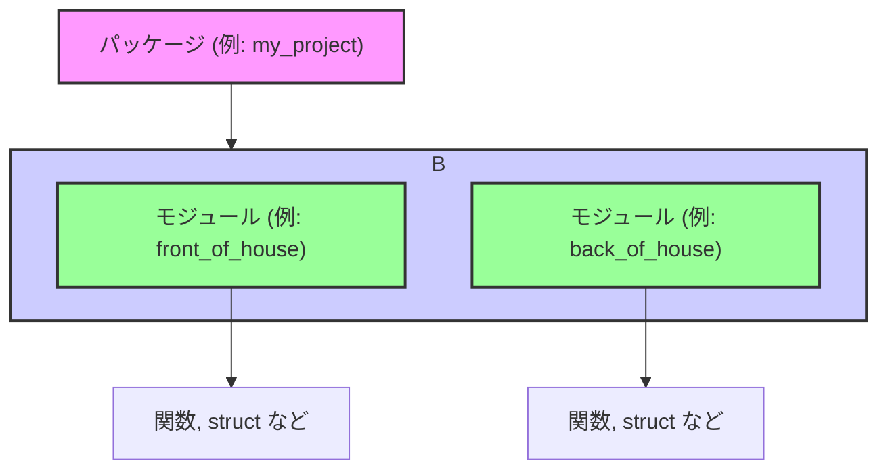

# 第 20 章：パッケージ、クレート、モジュールでコードを整理する

## この章のゴール
- パッケージ、クレート、モジュールの違いと、それぞれの役割を説明できる。
- `main.rs` が肥大化する問題点を理解し、コードを分割する必要性を説明できる。
- `mod` キーワードを使って、単一ファイル内のコードを論理的なグループに整理できる。
- モジュールのアイテムがデフォルトでプライベートである理由を理解し、`pub` キーワードで意図的に公開できる。
- `mod` 宣言を使って、モジュールを別のファイルに分割し、プロジェクトを整理できる。
- `use` キーワードを使って、他のモジュールへのパスを短縮し、コードの可読性を向上できる。
- `super` キーワードを使って、親モジュールからの相対パスでアイテムを参照できる。
- `struct` や `enum` のフィールドやバリアントの公開ルールを理解し、適切に設定できる。

---

## 20.1 全体像：パッケージ > クレート > モジュール

Rust のプロジェクトが大きくなるにつれて、コードを整理し、メンテナンスしやすく保つことが重要になります。そのために、Rust は 3 つの階層的な単位を提供しています。

-   **パッケージ (Package)**: `cargo new` で作られる、一つの機能（ライブラリや実行可能ファイル）を提供する単位です。`Cargo.toml` を一つ含み、一つ以上のクレートを持ちます。
-   **クレート (Crate)**: コンパイルの単位です。`rustc` が一度にコンパイルするソースコードの集まりを指します。他のプログラムから利用される**ライブラリクレート**か、実行可能ファイルになる**バイナリクレート**のどちらかになります。
-   **モジュール (Module)**: クレート内のコードを整理し、名前空間を分割するための単位です。`mod` キーワードで定義し、アイテムの公開・非公開（プライバシー）を制御する境界にもなります。

これらの関係性を図で見てみましょう。



この章では、特にクレート内のコードを整理するための「モジュール」システムに焦点を当てて、その使い方を段階的に学んでいきます。

## 20.2 なぜコードを分割する必要があるのか？ (動機)

プロジェクトの初期段階では、すべてのロジックを `src/main.rs` に書くのが最も簡単です。しかし、機能が増えるにつれてファイルは長くなり、どこに何が書かれているのかを把握するのが難しくなっていきます。

例えば、レストランを管理するプログラムを考えてみましょう。

```rust
// src/main.rs (機能追加前)
fn main() {
    println!("Hello, restaurant!");
}
```

ここに、ホールの機能（注文受付、席案内）と、厨房の機能（調理、在庫管理）を追加していくと、`src/main.rs` はあっという間に数百行、数千行になってしまうでしょう。

このような状況は、以下の問題を引き起こします。
-   **可読性の低下**: 関連するコードが散らばり、全体の流れを追うのが困難になる。
-   **メンテナンス性の悪化**: 一つの機能を修正するつもりが、無関係な別の機能に影響を与えてしまう（意図しない結合）。
-   **再利用性の欠如**: 特定の機能だけを別のプロジェクトで再利用することが難しい。

この問題を解決するのが、**モジュール** です。モジュールを使うことで、関連するコードを一つのグループにまとめ、論理的な単位でコードを整理できます。

## 20.3 `mod`: コードをグループ化する最初のステップ

まずは、ファイルを増やさずに `src/main.rs` の中でコードをグループ化する方法から学びましょう。`mod` キーワードを使い、波括弧 `{}` でブロックを作ることで、その中に新しい名前空間（モジュール）を定義できます。

```rust
// src/main.rs

mod front_of_house {
    mod hosting {
        fn add_to_waitlist() {}
    }

    mod serving {
        fn take_order() {}
    }
}

mod back_of_house {
    fn fix_incorrect_order() {
        cook_order();
    }

    fn cook_order() {}
}

fn eat_at_restaurant() {
    // まだモジュール内の関数を呼び出すことはできない
}

fn main() {
    eat_at_restaurant();
}
```

このコードでは、`front_of_house` と `back_of_house` という 2 つのモジュールを作成しました。さらに `front_of_house` の中には `hosting` と `serving` という入れ子のモジュールがあります。

これで、レストランに関連するコードが論理的にグループ化されました。しかし、このままではまだ `eat_at_restaurant` 関数から `add_to_waitlist` などの関数を呼び出すことはできません。なぜなら、モジュールは外部との間に明確な「壁」を作るからです。

## 20.4 `pub`: モジュールの壁を越える

Rust では、モジュール内のすべてのアイテム (関数、struct、enum など) は、デフォルトで **プライベート (private)** です。これは「カプセル化」という重要な原則のためです。モジュールの内部実装は隠蔽し、外部に公開したい機能だけを明示的に選択することで、安全でメンテナンスしやすいコードを書くことができます。

アイテムを公開するには `pub` キーワードを使います。

```rust
// src/main.rs

mod front_of_house {
    // hosting モジュールを公開する
    pub mod hosting {
        // add_to_waitlist 関数を公開する
        pub fn add_to_waitlist() {}
    }
}

fn eat_at_restaurant() {
    // 絶対パスでモジュール内の関数を呼び出す
    // `crate` はパッケージのルートを指す
    crate::front_of_house::hosting::add_to_waitlist();
}

fn main() {
    eat_at_restaurant();
}
```
[Rust Playground で試す](https://play.rust-lang.org/?version=stable&mode=debug&edition=2021&gist=fc37397b9148b59828d1dd034d618991)

`hosting` モジュールと `add_to_waitlist` 関数の両方に `pub` を付けたことで、`eat_at_restaurant` 関数から呼び出せるようになりました。`crate::` から始まるパスは **絶対パス** と呼ばれ、クレートのルートから階層を辿ります。

#### 試してみよう：コンパイルエラーの体験

もし `hosting` モジュールの `pub` を外して `mod hosting` にすると、どうなるでしょうか？コンパイラは以下のようなエラーを出します。

```text
error[E0603]: module `hosting` is private
 --> src/main.rs:13:5
  |
4 |     mod hosting {
  |     ----------- visibility of this module is private
...
13|     crate::front_of_house::hosting::add_to_waitlist();
  |     ^^^^^^^^^^^^^^^^^^^^^^^^^^^^^^^ module `hosting` is private
```

このエラーは、「`hosting` モジュールはプライベートなので、親モジュールである `front_of_house` の外からはアクセスできません」ということを教えてくれています。このように、`pub` はモジュールの公開 API を定義するための重要なキーワードです。

## 20.5 ファイル分割: `mod` 宣言

`src/main.rs` が十分に整理されてきましたが、モジュールの内容が大きくなると、やはりファイルを分割したくなります。Rust では、簡単な宣言でモジュールを別ファイルに切り出すことができます。

プロジェクトのファイル構成を以下のように変更します。

```
.
├── Cargo.toml
└── src
    ├── main.rs
    └── front_of_house.rs
```

`src/main.rs` の `mod front_of_house { ... }` ブロックを、`mod front_of_house;` という宣言に置き換えます。セミコロンで終わることに注意してください。

```rust
// src/main.rs

// Rustコンパイラに `src/front_of_house.rs` を探して読み込むよう指示する
mod front_of_house;

fn eat_at_restaurant() {
    crate::front_of_house::hosting::add_to_waitlist();
}

fn main() {
    eat_at_restaurant();
}
```

そして、`mod front_of_house` ブロックの中身全体を、新しいファイル `src/front_of_house.rs` に移動します。

```rust
// src/front_of_house.rs

// このファイルの中身は以前の mod ブロックの中身と同じ
pub mod hosting {
    pub fn add_to_waitlist() {}
}
```

これで、`src/main.rs` はすっきりと保たれたまま、プロジェクトの構造は論理的かつ物理的に整理されました。呼び出し側のコード (`eat_at_restaurant` 関数) は一切変更する必要がない点にも注目してください。これは、モジュールの内部実装がうまく隠蔽されている良い証拠です。

## 20.6 `use`: 長いパスを短縮する

`crate::front_of_house::hosting::add_to_waitlist()` のようなフルパスは、関数がどこで定義されているか明確で良い面もありますが、何度も書くのは冗長です。`use` キーワードを使うと、パスを現在のスコープに持ち込んで短縮できます。

```rust
// src/main.rs

mod front_of_house;

// `hosting` モジュールへのパスをスコープに持ち込む
use crate::front_of_house::hosting;

fn eat_at_restaurant() {
    // 短縮されたパスで呼び出せる
    hosting::add_to_waitlist();
    hosting::add_to_waitlist();
}

fn main() {
    eat_at_restaurant();
}
```
[Rust Playground で試す](https://play.rust-lang.org/?version=stable&mode=debug&edition=2021&gist=655047b1c312781b4f4c7d03a55b2d28)

慣例として、関数を `use` する場合は、その親モジュールまでをスコープに持ち込むのが一般的です (`hosting::add_to_waitlist()` のように呼び出す)。これにより、関数がローカルで定義されたものではないことが一目でわかります。

一方、`struct` や `enum`、その他のアイテムを `use` する場合は、フルパスで指定するのが慣例です。

```rust
use std::collections::HashMap;

fn main() {
    let mut map = HashMap::new();
    map.insert(1, 2);
}
```

## 20.7 `super`: 親モジュールへの道

時には、親モジュールや兄弟モジュールにあるアイテムにアクセスしたい場合があります。`super` キーワードは、ファイルシステムにおける `..` のように、現在のモジュールから見て一つ親のモジュールを指す相対パスを提供します。

例えば、厨房 (`back_of_house`) のコックが、注文を修正するためにホール (`front_of_house`) の機能を使うケースを考えてみましょう。

```rust
// in src/lib.rs (main.rsでも同様)

mod front_of_house {
    pub mod hosting {
        pub fn add_to_waitlist() {}
    }
}

mod back_of_house {
    fn fix_incorrect_order() {
        cook_order();
        // `super` で親モジュール (crate) に戻り、
        // 兄弟モジュールである `front_of_house` にアクセスする
        super::front_of_house::hosting::add_to_waitlist();
    }

    fn cook_order() {}
}
```
[Rust Playground で試す](https://play.rust-lang.org/?version=stable&mode=debug&edition=2021&gist=45d139618b7c3d1000632a85e4ac3e45)

`fix_incorrect_order` 関数の中から `super::` を使うことで、`back_of_house` の親 (この場合は `crate` ルート) に移動し、そこから `front_of_house` モジュールを辿ることができます。これにより、モジュール構造の変更に強いコードを書くことができます。

## 20.8 `struct` と `enum` のプライバシー

`struct` や `enum` を `pub` にしても、その中身のプライバシーの扱いは少し異なります。

-   **`struct`**: `struct` を `pub` にしても、そのフィールドはデフォルトでプライベートのままです。フィールドに外部からアクセスさせたい場合は、フィールドごとにも `pub` を付ける必要があります。
-   **`enum`**: `enum` を `pub` にすると、そのすべてのバリアントも自動的に公開されます。

```rust
mod back_of_house {
    // 構造体は公開されている
    pub struct Breakfast {
        // このフィールドも公開
        pub toast: String,
        // このフィールドはプライベート
        seasonal_fruit: String,
    }

    impl Breakfast {
        // プライベートなフィールドを持つインスタンスを生成するための関連関数
        pub fn summer(toast: &str) -> Breakfast {
            Breakfast {
                toast: String::from(toast),
                seasonal_fruit: String::from("peaches"),
            }
        }
    }

    // enum が pub なので、バリアントもすべて公開される
    pub enum Appetizer {
        Soup,
        Salad,
    }
}

pub fn eat_at_restaurant() {
    // Breakfast の toast フィールドにはアクセスできる
    let mut meal = back_of_house::Breakfast::summer("Rye");
    meal.toast = String::from("Wheat");

    // Appetizer のバリアントにはアクセスできる
    let order1 = back_of_house::Appetizer::Soup;
}
```
[Rust Playground で試す](https://play.rust-lang.org/?version=stable&mode=debug&edition=2021&gist=b0762391b15655ac5f9922e37466c5d0)

この `struct` のルールにより、構造体の内部実装（例えば `seasonal_fruit` の管理方法）を外部から隠蔽し、`summer` のようなコンストラクタ関数を通してのみインスタンスが作られるように強制できます。これはカプセル化の強力な例です。

## 20.9 Python/Go ではどうやっていたか？ (比較)

他の言語の経験者にとって、Rust のモジュールシステムは少し独特かもしれません。Python や Go の仕組みと比較してみましょう。

| 機能 | Rust | Python | Go |
| :--- | :--- | :--- | :--- |
| **コード分割の単位** | モジュール (`mod`) | ファイル (`.py`) | ディレクトリ (パッケージ) |
| **公開/非公開** | `pub` で明示的に公開 | `_` プレフィックス (慣習) | 先頭が大文字なら公開 |
| **名前空間の読み込み** | `use` 宣言 | `import` / `from ... import` | `import` |
| **パッケージ管理** | Cargo (`Cargo.toml`) | pip (`requirements.txt`) | Go Modules (`go.mod`) |

### Python との違い

Python では、すべての `.py` ファイルが自動的にモジュールになります。ディレクトリに `__init__.py` を置くことでパッケージとして扱われます。公開・非公開に厳密なルールはなく、アンダースコア `_` で始まる名前はプライベートなものとして扱う、という紳士協定 (慣習) に従います。

Rust はより厳格です。ファイルは自動的にはモジュールにならず、`mod` キーワードでクレートに含めることを明示的に宣言する必要があります。また、`pub` がなければアイテムは完全にプライベートであり、コンパイラがアクセスを強制的に防ぎます。

### Go との違い

Go では、同じディレクトリにあるすべての `.go` ファイルは、単一のパッケージに属します。公開 (Export) するかどうかは、関数や型の名前の先頭が大文字か小文字かで決まります。このルールは非常にシンプルです。

Rust のモジュールシステムは、Go よりも階層構造を細かく作れるという柔軟性があります。1 つのファイル内に複数の `mod` ブロックをネストさせたり、ディレクトリ構造とモジュール構造を対応させたりすることができます。公開範囲も `pub` を使ってより細かく制御できます。

## 20.10 練習問題

### 問題 1: `mod` ブロックでリファクタリング

以下のコードは、1 つの `main.rs` に複数の関数がまとまっています。これを `front_of_house` と `back_of_house` という 2 つのモジュールに分け、`eat_at_restaurant` 関数から正しく呼び出せるようにリファクタリングしてください。ただし、この問題では**ファイルを分割せず**、`main.rs` 内で `mod` ブロックを使用してください。

**開始コード:**
```rust
// main.rs
fn add_to_waitlist() {}
fn take_order() {}
fn cook_order() {}
fn fix_incorrect_order() {
    cook_order();
    // ホールのスタッフを呼ぶ (この部分は後で実装)
}

fn eat_at_restaurant() {
    // ここに呼び出しコードを書く
    add_to_waitlist();
    take_order();
    fix_incorrect_order();
}

fn main() {
    eat_at_restaurant();
}
```

**要件:**
- `add_to_waitlist` と `take_order` は `front_of_house` モジュールに含めること。
- `cook_order` と `fix_incorrect_order` は `back_of_house` モジュールに含めること。
- `eat_at_restaurant` から呼び出せるように、必要なアイテムに `pub` を付けること。
- `fix_incorrect_order` から `cook_order` を呼び出せるようにすること。

### 問題 2: ファイル分割

問題 1 で作成したコードを、さらにファイル分割して整理しましょう。

**要件:**
- `front_of_house` モジュールの中身を `src/front_of_house.rs` ファイルに移動すること。
- `back_of_house` モジュールの中身を `src/back_of_house.rs` ファイルに移動すること。
- `main.rs` を修正し、`mod` 宣言を使ってこれらのファイルを読み込むようにすること。
- `eat_at_restaurant` 関数の先頭で `use` を使い、関数呼び出しを簡潔にすること (例: `front_of_house::add_to_waitlist()`)。

---

## 20.11 まとめ

-   コードが大きくなったら、**モジュール**を使って関連する機能をグループ化し、整理する。
-   **`mod { ... }`** を使えば、1 つのファイル内でコードをグループ化できる。
-   モジュール内のアイテムはデフォルトで**プライベート**。**`pub`** を付けて、外部に公開する API を明示的に定義する。
-   **`mod my_module;`** と宣言することで、モジュールを `src/my_module.rs` のような別ファイルに分割できる。
-   **`use`** キーワードは、長いパスをスコープに持ち込み、コードを簡潔にする。
-   **`super`** キーワードは、親モジュールを指す相対パス (`..` のようなもの)。
-   **`struct`** はフィールドごとに公開範囲を設定でき、**`enum`** はバリアント全体が公開される。

---

これで、大規模なプロジェクトでもコードを整理し、メンテナンス性を高く保つための基本的なツールを学びました。次の章では、標準ライブラリが提供する便利なデータ構造、特にコレクションについて詳しく見ていきます。
